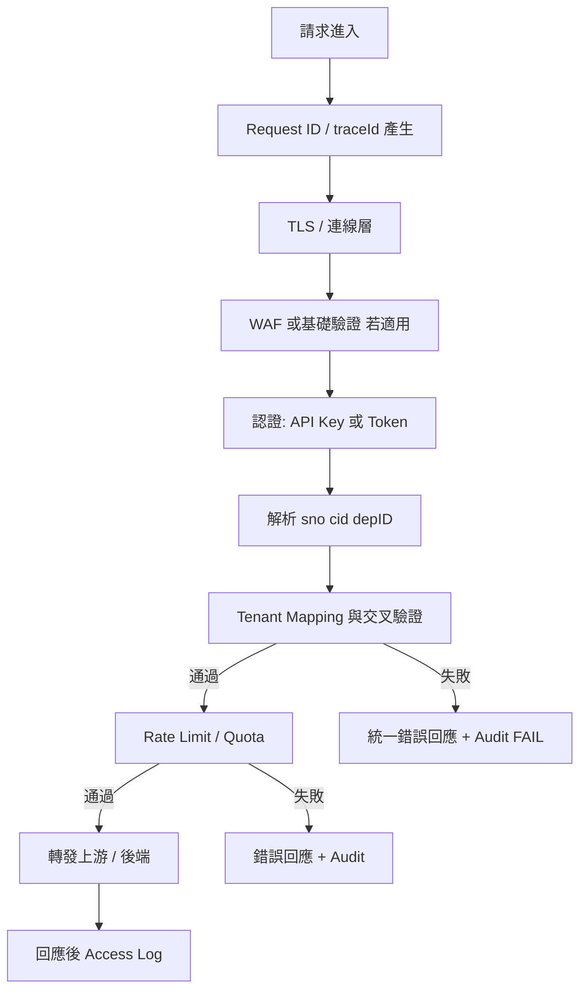

# API Gateway Middleware 流程與測試計畫

## 文件目的與範圍

本文件描述 API Gateway **Middleware 處理順序**、`sno` + `cid` **tenant mapping** 流程、**錯誤碼映射**、**Audit Log 寫入點**、**告警規則**、**E2E 測試矩陣**，以及建議之 **實作順序**。

**重要標示**

- **此階段只做規劃文件，不進入程式實作**（含 PHP / ASP / .NET 及 Gateway 實際程式碼）。
- **不執行 SQL**、不建立資料表、不進行 git 提交。

---

## API Gateway Middleware 流程（建議順序）

以下為邏輯順序；實作時可依既有基礎設施微調，但 **tenant 驗證應早於業務路由與上游轉發**。

1. **Request ID / traceId**：進入點即產生，貫穿回應標頭或 body。
2. **認證**：API Key 或 OAuth 等（與 tenant 正交，但失敗應記錄）。
3. **解析 `sno`、`cid`、`depID`**：從約定位置（header、path、signed body）讀取；缺失則 mapping 失敗。
4. **Tenant mapping 與交叉驗證**：依 `API_GATEWAY_TENANT_MAPPING_DESIGN.md` 之鏈路。
5. **Rate limit**：通過 tenant 後再限流，可支援「每租戶」配額。
6. **轉發與事後 Access Log**：成功請求記錄耗時與結果碼。

---

## `sno` + `cid` Tenant Mapping 流程（細部，凍結）

**前置**：本流程僅適用 **須 tenant mapping** 之路徑；健康檢查、metrics 等見「路徑白名單」。

1. 驗證 `cid` 格式（長度、字元集）；無效 → `GW_TENANT_MAPPING_FAILED`（可 `details.subCode`）。
2. 若缺少 **`cid`** 或 **`sno`**（含不允許僅 `cid`）→ `GW_TENANT_MAPPING_FAILED`。
3. 以 `cid` 對應 `bs_Coupon.seqNo`（**邏輯**；實作時由後端或授權查詢層執行）。若多筆 → `GW_TENANT_MAPPING_FAILED`（建議 `details.subCode` = `AMBIGUOUS_CID`）。
4. 若查無 → `GW_TENANT_CID_NOT_FOUND`。
5. 讀取該筆 coupon 之 `storeNo`、`depID`；與請求 `sno` 比對 → 不符則 `GW_TENANT_SNO_CID_MISMATCH`。
6. 以 `storeNo` 對應 `bs_store.uid`。若 **無列** → `GW_TENANT_STORE_NOT_FOUND`。
7. 比對 **`bs_Coupon.depID`** 與 **`bs_store.depID`**；若不一致 → `GW_TENANT_DEPID_VERIFICATION_FAILED`（coupon／store 資料不一致）。
8. 若請求**帶有** `depID`，須與 `bs_Coupon.depID` 及 `bs_store.depID` **皆相同**；否則 → `GW_TENANT_DEPID_VERIFICATION_FAILED`。
9. 全部通過：將解析後之 **租戶脈絡**（canonical `sno`、`depID`、內部 store uid 等）注入 request context，供後續 handler 使用。

---

## 路徑白名單（規劃凍結）

下列類型路徑 **不** 執行 `sno`／`cid`／`depID` tenant mapping（實作時以設定檔或程式常數維護）：

- 存活／健康檢查（如 `/health`、`/ready`）
- 監控 metrics（若暴露於同一 Gateway）
- 與 OAuth／公開 discovery 等 **明確公開** 且經資安核准之端點

白名單路徑仍應記錄 **Access Log**（`result`、`traceId` 等），並視需要套用 **認證** 或 **網路層 ACL**。

---

## 錯誤碼映射（Middleware 對外）

與 `API_GATEWAY_ERROR_AND_AUDIT_LOG_DESIGN.md` **凍結錯誤碼總表** 一致；HTTP Status 以總表為準。

| 內部判斷結果 | `errorCode` | HTTP |
|--------------|-------------|------|
| 缺少必要欄位、格式無效、`cid` 歧義多筆 | `GW_TENANT_MAPPING_FAILED` | 400 |
| `cid` 無對應 coupon | `GW_TENANT_CID_NOT_FOUND` | 404 |
| `sno` 與 coupon `storeNo` 不一致 | `GW_TENANT_SNO_CID_MISMATCH` | 403 |
| `bs_store` 無對應列 | `GW_TENANT_STORE_NOT_FOUND` | 503 |
| `depID` 交叉驗證失敗（含 coupon／store 內部不一致與請求 `depID` 不符） | `GW_TENANT_DEPID_VERIFICATION_FAILED` | 403 |
| 未帶或空白憑證 | `GW_AUTH_MISSING_CREDENTIALS` | 401 |
| 憑證無效 | `GW_AUTH_INVALID_CREDENTIALS` | 401 |
| 憑證過期 | `GW_AUTH_EXPIRED_CREDENTIALS` | 401 |
| 已認證但無權 | `GW_AUTH_FORBIDDEN` | 403 |
| 限流 | `GW_RATE_LIMITED` | 429 |
| Gateway 內部未預期錯誤 | `GW_INTERNAL_ERROR` | 500 |
| 上游連線／逾時／無法轉譯之失敗 | `GW_UPSTREAM_ERROR` | 502 |

**相容**：舊稱 `GW_AUTH_INVALID` → **`GW_AUTH_INVALID_CREDENTIALS`**。

HTTP status 與 `errorCode` 組合以總表為單一真相來源（見 `API_GATEWAY_ERROR_AND_AUDIT_LOG_DESIGN.md`）。

---

## Audit Log 寫入點

| 位置 | 行為 |
|------|------|
| Tenant mapping **失敗**當下 | 寫 `TENANT_MAP_FAIL`，含 `errorCode`、`traceId`、`sno`／`cid`／`depID`（遮罩）、`apiKeyFingerprint`、`clientIp`、`requestPath`、`result`=`FAILURE` |
| Tenant mapping **成功** | 可寫 `TENANT_MAP_OK` 或併入後續單筆 `API_ACCESS`（`result`=`SUCCESS`） |
| 認證失敗 | `AUTH_FAIL`，對應 `GW_AUTH_*` |
| 限流失敗 | `RATE_LIMIT`，`GW_RATE_LIMITED`，`result`=`FAILURE` |
| 內部／上游錯誤 | `GATEWAY_ERROR`，`GW_INTERNAL_ERROR` 或 `GW_UPSTREAM_ERROR`，`result`=`ERROR` |
| 回應送出前（Access） | 統計 `durationMs`、`httpStatus`；**Access Log** 使用 **`result`**，不使用 `success` 布林於 log 列（見 RESPONSE 文件） |

---

## 告警規則（建議）

| 規則 ID | 條件 | 嚴重度 | 行動 |
|---------|------|--------|------|
| AL-GW-001 | 單一 `clientIp` 在 5 分鐘內 `GW_TENANT_CID_NOT_FOUND` 超過 N 次 | 中 | 可能掃描或誤用；觀察＋必要時暫時封鎖 |
| AL-GW-002 | `GW_TENANT_SNO_CID_MISMATCH` 在短時間內集中於同一 apiKey | 高 | 金鑰洩漏或惡意偽造 |
| AL-GW-003 | `GW_TENANT_DEPID_VERIFICATION_FAILED` 突增 | 中～高 | 資料不一致或攻擊嘗試 |
| AL-GW-003b | `GW_TENANT_STORE_NOT_FOUND` 突增 | 高 | 資料完整性／同步問題 |
| AL-GW-004 | Gateway 5xx 比例超過閾值 | 高 | 容量或上游故障 |
| AL-GW-005 | 特定 `requestPath` 延遲 p99 超標 | 中 | 效能退化 |

閾值 N、時間窗由維運與 SRE 於實作後依流量校準。

---

## E2E 測試矩陣（規劃）

假設測試環境具可控測資（**本文件不要求現在建立測資或執行測試**）。

| # | 情境 | 輸入條件 | 預期 `errorCode` / HTTP | Audit |
|---|------|----------|-------------------------|-------|
| T1 | 完全有效 | 正確 `sno`、`cid`、`depID` | 成功 | `TENANT_MAP_OK` 或合併 ACCESS |
| T2 | 缺 `cid` | 無 `cid` | `GW_TENANT_MAPPING_FAILED`／400 | FAIL |
| T3 | 缺 `sno` | 無 `sno` | `GW_TENANT_MAPPING_FAILED`／400 | FAIL |
| T4 | `cid` 不存在 | 隨機 `cid` | `GW_TENANT_CID_NOT_FOUND`／404 | FAIL |
| T5 | `sno` 錯配 | 正確 `cid`、錯誤 `sno` | `GW_TENANT_SNO_CID_MISMATCH`／403 | FAIL |
| T6 | 請求 `depID` 錯誤 | 正確 `sno`／`cid`、錯誤請求 `depID` | `GW_TENANT_DEPID_VERIFICATION_FAILED`／403 | FAIL |
| T6b | coupon／store `depID` 資料不一致 | 測資人為使 `bs_Coupon.depID` ≠ `bs_store.depID` | `GW_TENANT_DEPID_VERIFICATION_FAILED`／403 | FAIL |
| T7 | 僅 `cid` 無 `sno` | **不允許**；僅帶 `cid` | `GW_TENANT_MAPPING_FAILED`／400 | FAIL |
| T8 | 無效 API Key | 任意 tenant | `GW_AUTH_INVALID_CREDENTIALS`／401 | AUTH_FAIL |
| T8b | 未帶憑證 | 無 Key／Token | `GW_AUTH_MISSING_CREDENTIALS`／401 | AUTH_FAIL |
| T9 | 重放相同請求 | 合法請求 | 行為依 idempotency 政策 | ACCESS |
| T10 | `bs_store` 查無 | coupon 有效但 store 無列 | `GW_TENANT_STORE_NOT_FOUND`／503 | FAIL |
| T11 | 限流 | 超過配額 | `GW_RATE_LIMITED`／429 | RATE_LIMIT |
| T12 | Gateway 內部錯誤 | 模擬未處理例外 | `GW_INTERNAL_ERROR`／500 | `result`=ERROR |
| T13 | 上游失敗 | 模擬上游連線失敗／502 | `GW_UPSTREAM_ERROR`／502 | `result`=ERROR |
| T14 | 白名單路徑 | `GET /health` | 無 tenant、200 | ACCESS |

---

## 實作順序（建議）

1. 凍結 **錯誤碼總表** 與 **統一 JSON**（見 `API_GATEWAY_ERROR_AND_AUDIT_LOG_DESIGN.md`、`API_GATEWAY_RESPONSE_AND_LOG_SCHEMA_DESIGN.md`；**已完成於 docs**）。
2. 實作 **traceId** 與 **結構化 log** 管線（不含業務 DB 時可先 mock）。
3. 實作 **Tenant mapping** 與錯誤映射（接上真實或 staging 讀取層）。
4. 補 **稽核寫入** 與 **遮罩政策**。
5. 接上 **告警** 與儀表板。
6. 跑通 **E2E 矩陣** 並納入 CI。

---

## 相關文件

- `API_GATEWAY_TENANT_MAPPING_DESIGN.md`
- `API_GATEWAY_ERROR_AND_AUDIT_LOG_DESIGN.md`
- `API_GATEWAY_RESPONSE_AND_LOG_SCHEMA_DESIGN.md`
- `API_GATEWAY_IMPLEMENTATION_PRECHECK.md`
