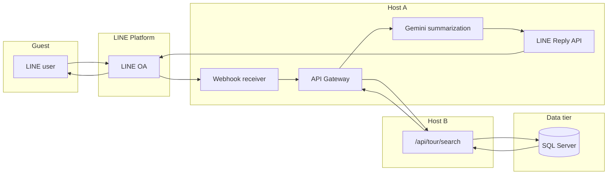

# API Gateway MVP Launch Plan

**Project root:** `C:\bbc-ai-bot`  
**Document version:** 2026-05-14  
**Type:** Planning and launch runbook (documentation only).

**Prerequisites:** Phase 6 completed; see `docs/API_GATEWAY_PHASE6_COMPLETION_REPORT.md`.

**Adopted strategy:** Phase 6 complete → **ship MVP immediately** → capture real traffic and product signals → progressively deliver **API Gateway Phase 7–10** (governance, commercialization, ecosystem, autonomous platform).

---

## 1. Document Purpose

This document defines the **minimum viable product (MVP)** for putting the API Gateway into **controlled production use** with:

- A **single** upstream Host B capability: **`/api/tour/search`** (staging/test host as currently agreed: `http://103.1.222.11:8080/api/tour/search` — production should move to HTTPS and approved network controls when ready).
- **Host A API Gateway** as the **only public-facing** integration surface for this flow (Host B not directly exposed to end customers).
- Clear **scope**, **enabled/disabled** capabilities, **launch steps**, **tests**, **rollback**, **monitoring**, and **security** expectations.

It does **not** implement code, change servers, or execute migrations. Implementation tasks are tracked separately after approval.

---

## 2. MVP Launch Objectives

| Objective | Description |
|-----------|-------------|
| **End-to-end path** | Validate the full chain: **LINE OA** → **Host A webhook** → **Host A API Gateway** → **Host B** `tour.search` → **SQL Server** → **Gemini** summarization → **LINE reply**. |
| **Single-service focus** | Prove gateway governance (tenant, API key, permission, trace) for **one** Host B service before expanding surface area. |
| **Traffic truth** | Collect latency, error codes, volume, and support tickets to prioritize Phase 7–10. |
| **Risk containment** | Keep blast radius small: one service, one upstream route, gateway-only public entry. |

---

## 3. In-Scope Components

| Layer | Component |
|-------|-----------|
| **Client** | LINE Official Account (OA) guest messages |
| **Host A** | LINE Webhook receiver |
| **Host A** | API Gateway HTTP entry (`C:\Web\xampp\htdocs\www\api\gateway\index.php` per deployment) |
| **Host A** | Gateway pipeline: trace, tenant mapping, API key verification, service permission |
| **Host A** | Host B proxy (MVP: forward to tour search only) |
| **Host B** | ASP.NET Web API — **`GET`/`POST` `/api/tour/search`** (exact contract per Swagger / backend team) |
| **Data** | SQL Server (business data for tour search — not gateway DDL unless separately approved) |
| **AI** | Gemini post-processing of search results for LINE-friendly reply |
| **Host A** | LINE Reply API |

---

## 4. Enabled Features (MVP)

The following are **in scope to enable** for MVP once implementation and ops sign-off are complete:

- **LINE Webhook** receive (existing Host A webhook path unchanged unless runbook says otherwise).
- **API Gateway HTTP Entry** (public gateway path on Host A).
- **Trace ID** generation/propagation and correlation to logs.
- **Tenant Mapping** (resolve `sno` / tenant context).
- **API Key Verification** (hashed key, prefix logging only per security policy).
- **Service Permission Check** (allowlist includes **`tour.search`** / project-standard service id for this route).
- **Host B Proxy** for the single mapped upstream.
- **Upstream:** `http://103.1.222.11:8080/api/tour/search` (MVP staging endpoint; **production must use approved HTTPS + ACL**).
- **Gemini** summarization/formatting of search results for LINE.
- **LINE Reply** to the guest.

---

## 5. Disabled Features (MVP — not enabled)

Defer to post-MVP or **log-only** where noted:

| Feature | MVP posture |
|---------|-------------|
| **Rate limiting** | **Not enforced** in MVP, or **log-only / soft-alert** if instrumentation exists — no hard 429 requirement until Phase 7 governance. |
| **Full audit dashboard** | Not required; minimal structured logs / DB audit optional later. |
| **Billing** | Off |
| **Usage metering** | Off (except coarse logs if needed for ops). |
| **Self-service API portal** | Off |
| **Developer portal** | Off |
| **Multiple Host B services** | Off — only **`/api/tour/search`** mapping. |
| **Auto-generation of all Host B APIs** | Explicitly **out of scope** (per decision). |
| **Commercial subscription SKUs** | Off until Phase 8 |

---

## 6. System Flow Diagram

**Narrative:** Guest asks on LINE → OA posts to Host A webhook → orchestration may call **API Gateway** for the secured tour search path → Gateway proxies to **Host B** `tour/search` → Host B reads/writes **SQL Server** as designed → response returns to Gateway → **Gemini** shapes the answer → **LINE Reply** delivers to the guest.

*Exact internal call sequence (webhook calls gateway vs. shared kernel) should match the implemented Host A routing; this diagram expresses logical dependencies.*

---

## 7. Production Launch Steps

1. **Pre-flight:** Confirm `docs/API_GATEWAY_PHASE6_COMPLETION_REPORT.md` items; run Phase 6 CLI tests + rollout readiness validator.  
2. **Config freeze:** Document `.env` / gateway keys for MVP (Host B base URL, timeouts, Gemini keys, LINE tokens) — **no secrets in repo**.  
3. **Upstream contract:** Freeze request/response JSON for `/api/tour/search` with Host B team; map **one** gateway `service` id to that route.  
4. **Network:** Ensure Host A → Host B:8080 path is allowed by firewall; plan **HTTPS** migration target.  
5. **Gateway wiring:** Enable **only** the tour-search proxy path; keep **rate/audit live** modes off unless separately approved.  
6. **Gemini:** Validate prompt/redaction rules (no PII leakage in prompts).  
7. **LINE:** Verify reply token flow under load; set conservative timeouts.  
8. **Pilot:** Enable for a **small allowlist** (internal testers or one pilot tenant).  
9. **Smoke:** Execute Section 8 checklist in staging, then production pilot.  
10. **Widen:** Increase allowlist or traffic weight per go/no-go after observation window.

---

## 8. Test Case Checklist

| # | Case | Expected |
|---|------|------------|
| 1 | Happy path: valid tenant + API key + `tour.search` | 200/2xx gateway response; LINE reply received; `traceId` present |
| 2 | Missing / invalid API key | 401/400 + stable `errorCode`; no key material in body |
| 3 | Tenant not found / disabled | 4xx per matrix; no cross-tenant data |
| 4 | Service not allowed (non-tour) | 403 + `SERVICE_NOT_ALLOWED` (or frozen equivalent) |
| 5 | Host B timeout / 5xx | Gateway mapped status; no internal stack in client JSON |
| 6 | Host B non-JSON | Safe error envelope + `traceId` |
| 7 | Gemini failure | Graceful fallback message to LINE; logged with `traceId` |
| 8 | LINE reply failure | Logged; user-visible apology per product copy |

---

## 9. Rollback Plan

| Step | Action |
|------|--------|
| 1 | **Disable** gateway route or feature flag so webhook uses **pre-MVP** path (e.g., direct legacy flow if applicable). |
| 2 | Set **Host B HTTP** / proxy to **off** in config if abnormal upstream behavior. |
| 3 | Revert **Apache rewrite / vhost** weight to 0% for gateway entry (ops-owned). |
| 4 | Communicate to support; preserve logs with `traceId` for RCA. |

Rollback must restore **prior guest-visible behavior** within the agreed RTO.

---

## 10. Operational Monitoring Checklist

- [ ] Gateway **success rate** and **p95 latency** (total and Host B segment).  
- [ ] **Error rate** by `errorCode` (4xx/5xx).  
- [ ] **Host B** availability and HTTP status distribution.  
- [ ] **SQL** slow query / timeout signals on Host B (not gateway DB unless shared).  
- [ ] **Gemini** error rate and token/latency.  
- [ ] **LINE** reply failures and webhook retry behavior.  
- [ ] **traceId** sampling: can correlate OA incident → gateway log → upstream id.  

---

## 11. Security Controls

- **Single public entry:** Host A API Gateway only; **no** direct customer access to Host B.  
- **Secrets:** API keys, LINE tokens, Gemini keys in **env/secret store** only; never logged in full.  
- **Tenant isolation:** Every request bound to resolved tenant; deny cross-tenant reuse of keys.  
- **Transport:** Prefer **TLS** end-to-end where available; MVP HTTP to Host B is a **known risk** — document compensating controls (private network, ACL, time-bound pilot).  
- **Output safety:** Gemini prompts/responses reviewed for PII; truncate and redact per policy.  
- **Observability:** No `Authorization`, full cookies, or raw bodies in audit fields (align with Phase 6 redaction/whitelist rules when persistence is enabled later).

---

## 12. Recommended First Implementation Step

**Freeze and implement the single service mapping:** `tour.search` (or project-standard id) → **`/api/tour/search`** on Host B with **server-side** base URL from configuration, **integration tests in staging**, and **Host B team sign-off** on request/response schema — before enabling any production traffic.

---

## 13. Success Criteria

- MVP path serves **real LINE guests** for **tour search** with acceptable **error rate** and **latency SLO** (define numerically in ops meeting).  
- **No** production incident of tenant cross-talk or API key leakage in first observation window.  
- **Rollback** executed successfully in a drill or real event.  
- **Decision record:** go/no-go to expand services or enter Phase 7 based on metrics.

---

## 14. Next Phases Roadmap (Phase 7–10)

| Phase | Name (recommended) | Focus |
|-------|-------------------|--------|
| **7** | Controlled Production Activation & Governance | Rate limit enforcement, audit persistence, SLOs, on-call, change management |
| **8** | SaaS Commercialization & Monetization | Billing, metering, plans, invoicing |
| **9** | Ecosystem & Platform Expansion | More Host B services, partner APIs, developer experience |
| **10** | Autonomous Platform & Strategic Intelligence | Automation, analytics, roadmap feedback loops |

MVP **informs** prioritization across 7–10; it does not block starting Phase 7 planning in parallel where safe.

---

## 15. Final Recommendation

Ship the **single-service MVP** quickly under **tight allowlists and monitoring**, treat **103.1.222.11:8080** as **non-production-grade transport** (plan HTTPS + governance), and use **real traffic learnings** to sequence **Phase 7 (governance)** before **Phase 8 (commercial)**. Keep **Host B private** and **Gateway public** as the long-term pattern.

---

## Document Control

| Item | Status |
|------|--------|
| Code / `config.php` / `.env` / server configs | **Not modified** by authoring this plan |
| SQL execution | **None** |
| Git | **No** `add` / `commit` / `push` required for this document |

**File path:** `C:\bbc-ai-bot\docs\API_GATEWAY_MVP_LAUNCH_PLAN.md`
