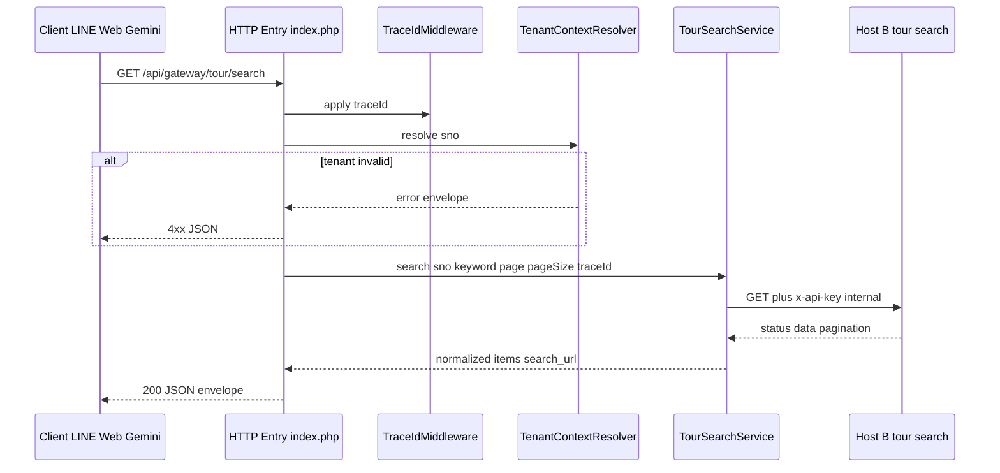

# API Gateway MVP — Public Entry Pre-Integration Plan (Stage 1-B-4)

**Project root:** `C:\bbc-ai-bot`  
**Branch:** `feature/api-gateway-mvp`  
**Document date:** 2026-05-15  
**Type:** Planning document only. **No code, `.env`, Apache, or SQL changes** in this delivery.

**Related:** `docs/API_GATEWAY_MVP_TOUR_SEARCH_CONTRACT.md`, `docs/API_GATEWAY_MVP_STAGE_1B3_LIVE_HOSTB_TEST_REPORT.md`, `docs/API_GATEWAY_PHASE5_STAGE1_HTTP_ENTRY_PLAN.md`, `docs/API_GATEWAY_RESPONSE_AND_LOG_SCHEMA_DESIGN.md`

---

## 1. Document Purpose

本文件為 **Stage 1-B-4** 產出，在 `TourSearchService` 已通過 **Host B Live HTTP** 驗證之後，規劃 Host A **對外正式 API 入口** 的整合方式，使下列消費者能以**同一契約**取得旅遊商品搜尋結果：

1. **LINE OA webhook**（`saas_router.php` 內部呼叫或內網轉發）
2. **Gemini AI**（僅消費結構化摘要，不接觸 API Key / SQL）
3. **Web 前端**（未來店家後台或行銷頁嵌入搜尋）
4. **其他 SaaS 模組**（內部服務對服務）

本文件**不實作** HTTP 入口、不修改 Apache、不啟用 production 流量；僅定義 URL、參數、回應契約、安全邊界與分階段路線圖。

---

## 2. Current Status

| 項目 | 狀態 |
|------|------|
| **MVP `TourSearchService`** | 已實作（`core/tour_search_service.php`） |
| **`TenantContextResolver`** | 已實作；staging `sno` 對照含 `provider_id_no=102` |
| **Host B Live HTTP** | 已通過（Stage 1-B-3 報告） |
| **MVP production client 元件** | `TourSearchRequestBuilder`、`HostBOutboundHeaderBuilder`、`MvpStagingHostBHttpClient`、`HostBResponseNormalizer` |
| **`GatewayKernel` / `TraceIdMiddleware`** | Phase 1 骨架存在；**尚未**接正式 `/api/gateway/*` 入口 |
| **LINE / Gemini 整合** | **未**接入 `TourSearchService` |

### Stage 1-B-3 實測摘要（staging）

| 項目 | 值 |
|------|-----|
| **sno** | `e1fd133c7e8e45a1` |
| **keyword** | `富國島` |
| **HTTP** | **200** |
| **pagination.total** | **2302** |
| **items（本頁）** | **5** |
| **第一筆 title** | 太陽航空、直飛富國島～珍珠雙樂園、跳島海景纜車五日 直售23,888起 💎 |
| **第一筆 price / tourDate** | `23888` / `2026/05/24` |
| **couponNo** | `11751` |

### 營運旗標（預設）

| 變數 | 建議預設 |
|------|----------|
| `GATEWAY_HOSTB_HTTP_ENABLED` | **`false`**（僅 staging 測試窗口暫時 `true`） |
| `GATEWAY_HOSTB_API_KEY` | 僅 `.env` / secret store，不進 repo |

---

## 3. Proposed Public API Endpoint

### 3.1 正式對外 URL（建議）

| 項目 | 值 |
|------|------|
| **Base path** | `/api/gateway` |
| **MVP 服務路徑** | **`GET /api/gateway/tour/search`** |
| **對應內部 service id** | `tour.search`（`config/api_gateway_services.php`） |
| **對應 Host B** | `GET /api/tour/search`（Host B 自有 base URL） |

**範例（Host A 對外）：**

```http
GET https://{host-a-public-host}/api/gateway/tour/search?sno=e1fd133c7e8e45a1&keyword=%E5%AF%8C%E5%9C%8B%E5%B3%B6&page=1&pageSize=20
```

### 3.2 與現有入口區隔

| 入口 | 用途 | 不得混淆 |
|------|------|----------|
| `/webhook/*` | LINE Messaging API | 非 Gateway 商品 API |
| `/bbc-ai-gateway-test/*` | Phase 2 isolated 測試 | 非 production 契約 |
| `/api/gateway/*` | **本規劃之正式 Gateway** | 新前綴，獨立 front controller |

### 3.3 部署位置（實作階段決策）

依 `docs/API_GATEWAY_PHASE5_STAGE1_HTTP_ENTRY_PLAN.md`：

- **版本化來源（建議）：** `public/api/gateway/index.php`（repo）
- **執行目錄（常見）：** `C:\Web\xampp\htdocs\www\api\gateway\index.php` + 局部 `.htaccess` rewrite  
- **本文件不修改** Apache / `.htaccess`

---

## 4. Request Parameters

僅允許下列 **query** 參數（MVP 與 `docs/API_GATEWAY_MVP_TOUR_SEARCH_CONTRACT.md` 對齊）：

| 參數 | 類型 | 必填 | 說明 |
|------|------|------|------|
| **`sno`** | string | **是** | 對外租戶／店碼（加密字串）；Gateway 用於 `TenantContextResolver` + Host B `TenantResolver` |
| **`keyword`** | string | **是**（MVP） | 搜尋關鍵字；與 storefront 行為一致（無 keyword 不搜尋） |
| **`page`** | int | 否 | 預設 `1`，最小 `1` |
| **`pageSize`** | int | 否 | 預設 `20`；上限建議 `50`（與 `TourSearchRequestBuilder` 一致） |

**禁止** client 傳入：`depID`、`storeNo`、`store_uid`、`provider_id_no`、任意 SQL 片段、自訂 upstream URL。

**HTTP 方法：** MVP 僅 **`GET`**（與 Host B 及 `ServiceRegistry` 一致）。

---

## 5. Request Validation Rules

| # | 規則 | 失敗時建議 `errorCode` | HTTP |
|---|------|------------------------|------|
| V1 | `REQUEST_METHOD` 必須為 `GET` | `METHOD_NOT_ALLOWED` | 405 |
| V2 | `sno` 不可空、格式符合 SaaS 規格 | `MISSING_SNO` / `INVALID_SNO_FORMAT` | 400 |
| V3 | `keyword` trim 後不可空 | `KEYWORD_REQUIRED` | 400 |
| V4 | `page` ≥ 1 | `INVALID_PAGE` | 400 |
| V5 | `1 ≤ pageSize ≤ 50` | `INVALID_PAGE_SIZE` | 400 |
| V6 | 未知 query key | `UNKNOWN_QUERY_PARAM`（建議拒絕） | 400 |
| V7 | `sno` 在 `TenantContextResolver` 無 mapping | `TENANT_NOT_FOUND` | 404 |
| V8 | tenant 停用 / suspended | `TENANT_DISABLED` / `TENANT_SUSPENDED` | 403 |
| V9 | 未來：缺少或無效 `X-BBC-API-Key` | `GW_API_KEY_MISSING` / `GW_API_KEY_INVALID` | 401 |
| V10 | Host B HTTP 未啟用或設定缺失 | `HOSTB_HTTP_DISABLED` / `HOSTB_CONFIG_MISSING` | 503 |

**內部 tenant 欄位** 僅由 `TenantContextResolver` 注入，**不得**信任 client query 覆寫。

---

## 6. Internal Flow

下列為 **建議執行鏈**（實作時可由單一 `TourSearchGatewayHandler` 編排，不必暴露多層給 client）：



| 步驟 | 元件 | 職責 |
|------|------|------|
| 1 | **HTTP Entry** | 載入 bootstrap、解析 method/path/query、設定 `Content-Type: application/json` |
| 2 | **`TraceIdMiddleware`** | 接受或產生 `traceId`；回應 header `X-Trace-Id` |
| 3 | **`TenantContextResolver`** | `sno` → `depID` / `storeNo` / `store_uid` / `provider_id_no`（僅 Host A 內部） |
| 4 | **`TourSearchService`** | 驗證 keyword、組 Host B 請求、HTTP、映射 `items` / `pagination` / `search_url` |
| 5 | **Host B API** | `GET /api/tour/search` + internal `x-api-key` |
| 6 | **`HostBResponseNormalizer`** | 去敏上游 JSON（在 `TourSearchService` 內已呼叫） |
| 7 | **JSON Output** | 包裝為對外 **Gateway envelope**（見第 7、8 節） |

**說明：** 規劃中的 **ProductionGatewayClient** 可實作為薄封裝：對外穩定介面 + 對內委派 `TourSearchService::search()`，並於未來掛載 `GatewayKernel::execute()` pipeline（API Key、Rate Limit、Audit）。MVP 可先用 `TourSearchService` 直連，Phase 5+ 再抽換。

---

## 7. Standard JSON Response Contract

對外成功回應建議採 **envelope**（與 `docs/API_GATEWAY_RESPONSE_AND_LOG_SCHEMA_DESIGN.md` 對齊），並映射 `TourSearchService` 結果：

```json
{
  "success": true,
  "traceId": "20260515_120000_a1b2c3d4",
  "timestamp": "2026-05-15T12:00:00.000Z",
  "data": {
    "service": "tour.search",
    "pagination": {
      "page": 1,
      "pageSize": 20,
      "total": 2302
    },
    "items": [
      {
        "title": "…",
        "price": 23888,
        "tourDate": "2026/05/24",
        "couponNo": 11751,
        "tourSeqNo": 187424,
        "areaNames": "東南亞",
        "departureStr": "台北",
        "storeName": "…"
      }
    ],
    "search_url": "https://bonusmee.com/view/cloud/cloud_store_tourdate.php?…"
  }
}
```

| 欄位 | 來源 | 說明 |
|------|------|------|
| `data.pagination` | Host B `pagination` | `page`、`pageSize`、`total` |
| `data.items[]` | Host B `data[]` 經 `TourSearchService` 映射 | `couponName` → `title` 等 |
| `data.search_url` | Host A 組裝 | 前台搜尋頁；**不**來自 Host B |
| `data.service` | 常數 `tour.search` | 便於多服務路由 |

**HTTP：** `200`；header **`X-Trace-Id`** = body `traceId`。

---

## 8. Error Response Contract

錯誤時 **`success: false`**，建議統一欄位：

| 欄位 | 必填 | 說明 |
|------|------|------|
| `success` | 是 | `false` |
| `errorCode` | 是 | 穩定機讀碼（Gateway 或 `TourSearchService` 轉譯） |
| `message` | 是 | 安全說明文字 |
| `traceId` | 是 | 與 log 一致 |
| `timestamp` | 是 | ISO-8601 UTC |
| `details` | 否 | 白名單附註（如 `hint`） |

**`TourSearchService` → Gateway 錯誤碼對照（建議）：**

| Service `errorCode` | 建議 HTTP | 對外 `errorCode` |
|---------------------|-----------|------------------|
| `KEYWORD_REQUIRED` | 400 | `KEYWORD_REQUIRED` |
| `TENANT_NOT_FOUND` | 404 | `TENANT_NOT_FOUND` |
| `TENANT_MAPPING_INCOMPLETE_*` | 503 | `TENANT_MAPPING_INCOMPLETE` |
| `HOSTB_HTTP_DISABLED` | 503 | `HOSTB_UNAVAILABLE` |
| `HOSTB_401` / `HOSTB_403` | 502 或 503 | `HOSTB_AUTH_FAILED` / `HOSTB_FORBIDDEN` |
| `HOSTB_500` | 502 | `HOSTB_UPSTREAM_ERROR` |
| `HOSTB_TIMEOUT` | 504 | `HOSTB_TIMEOUT` |

**禁止** 在錯誤 body 回傳：SQL、stack trace、完整 API Key、Host B 內部 URL。

---

## 9. Security Considerations

| 主題 | MVP | 未來 |
|------|-----|------|
| **`sno` 驗證** | `TenantContextResolver` + 格式檢查；禁止 client 傳 `depID` 等 | `api_gateway_tenant_mapping` SQL 表 |
| **Client → Host A `X-BBC-API-Key`** | **規劃啟用**；參考 `ApiKeyVerifier`（isolated 已有測試） | Production middleware |
| **Host A → Host B `x-api-key`** | 已實作；僅 `GATEWAY_HOSTB_API_KEY` | 輪替、IP allowlist |
| **Rate Limit** | 未接 production | `RateLimiter` + persistence（Phase 5/6 計畫） |
| **Audit Log** | 未接 production | `AuditLogger` + `provider_id_no` / `sno` 遮罩 |
| **Gemini / LINE** | 不可將 Host B internal key 或 raw Host B URL 放入 prompt | 僅傳 `items` 摘要 + `search_url` |
| **HTTPS** | 對外 API 應強制 TLS | WAF / ACL |
| **CORS** | Web 前端整合時另訂 allowlist | 非 MVP |

---

## 10. Integration with Gemini

**原則：** Gemini **不**呼叫 Gateway HTTP；由 **`saas_router.php`**（或內部 PHP）先呼叫 `TourSearchService`，再組 prompt。

**可傳入 Gemini 的結構化資料：**

| 欄位 | 用途 |
|------|------|
| `items[]` | 商品摘要（`title`、`price`、`tourDate`、`areaNames`、`departureStr`） |
| `pagination.total` | 「共找到 N 筆」 |
| `search_url` | 引導使用者至前台完整列表 |
| `keyword` | 使用者原始搜尋意圖 |

**禁止：** SQL、表名、`GATEWAY_HOSTB_API_KEY`、`X-BBC-API-Key`、完整 Host B response blob。

**建議 prompt 區塊：** 見 Stage 1-B 規劃 — 僅根據 `items` 與 `total` 回答，不得捏造庫存。

---

## 11. Integration with LINE OA

| 項目 | 建議 |
|------|------|
| **觸發** | `IntentRouter` 判定 `tour_query` + 抽出 `keyword` |
| **租戶 `sno`** | `TenantResolver`（LINE `destination` → `tenant_profiles.sno`） |
| **資料取得** | 直接 `TourSearchService::search($sno, $keyword, …)`（同進程，無需對外 HTTP） |
| **回覆** | `AiPromptBuilder` 消費結果 → `callGemini()` → `LineService::replyToLine()` |
| **錯誤** | `KEYWORD_REQUIRED` → 引導使用者輸入目的地；Host B 失敗 → 友善訊息 + 仍可附 `search_url` |
| **本階段** | **不**修改 `saas_router.php`（Stage 1-B-7） |

**可選架構：** LINE 與 Web 共用同一 `TourSearchService`；僅 Web 走 `/api/gateway/tour/search` HTTP。

---

## 12. Recommended File Structure

```
C:\bbc-ai-bot\
├── public\api\gateway\              # 建議新增（實作 Stage 1-B-5+）
│   └── index.php                    # 唯一 HTTP front controller
├── core\
│   ├── tour_search_service.php      # ✅ 已有
│   ├── tenant_context_resolver.php  # ✅ 已有
│   ├── api_gateway\
│   │   ├── GatewayKernel.php        # ✅ Phase 1；未接入口
│   │   ├── TraceIdMiddleware.php
│   │   └── production\              # ✅ MVP Host B client
│   └── api_gateway\handlers\        # 建議新增
│       └── TourSearchGatewayHandler.php
├── config\
│   ├── tenant_context_map.php       # ✅ staging 對照
│   └── api_gateway_services.php
├── tests\
│   ├── test_tour_search_service.php # ✅ 已有
│   ├── test_tenant_context_resolver.php
│   └── api_gateway\
│       ├── test_public_tour_search_entry.php   # Stage 1-B-5
│       └── test_public_tour_search_http.php    # Stage 1-B-6
└── docs\
    └── API_GATEWAY_MVP_PUBLIC_ENTRY_PLAN.md    # 本文件
```

**分層：**

| 層 | 職責 |
|----|------|
| **public entry** | HTTP、路由、header、JSON encode |
| **handler / kernel** | 驗證、trace、auth、rate limit、audit |
| **service** | `TourSearchService` 業務編排 |
| **tests** | CLI 單元 + isolated HTTP + 可選 live（需 env 旗標） |

---

## 13. Phase Roadmap

| 階段 | 名稱 | 交付 | 不變更 |
|------|------|------|--------|
| **1-B-4** | **本文件** | 對外入口規劃 | 無程式 |
| **1-B-5** | Isolated HTTP entry test | `TourSearchGatewayHandler` + CLI 測試；可 mock `TourSearchService` | LINE、Apache |
| **1-B-6** | HTTP endpoint test | `public/api/gateway/index.php` 或 `bbc-ai-gateway-test` 子路徑；curl 驗證 JSON envelope | production 預設流量 |
| **1-B-7** | LINE / Gemini integration | `saas_router.php` + `AiPromptBuilder` 串接 | 可選仍不公開外網 Gateway |
| **Phase 5+** | API Key + Audit + Rate limit | `GatewayKernel` pipeline 接滿 | — |
| **Go-live** | `GATEWAY_HOSTB_HTTP_ENABLED=true` + 營運簽核 | 參考 staging smoke checklist | — |

---

## 14. Conclusion

1. **`TourSearchService` 已具備 Host B 實際查詢能力**（Stage 1-B-3：`sno=e1fd133c7e8e45a1`、`keyword=富國島`、`total=2302`）。
2. **對外正式入口** 建議為 **`GET /api/gateway/tour/search`**，參數與契約與現有 MVP 文件一致。
3. **實作順序** 應先 **HTTP 邊界 + 測試**（1-B-5/6），再 **LINE / Gemini**（1-B-7），避免未驗證的 public 面與 AI 路徑同時上線。
4. **安全預設** 維持 `GATEWAY_HOSTB_HTTP_ENABLED=false` 於 production，直至獨立 go-live 批准。

---

## Change Statement

| Item | Status |
|------|--------|
| File created | `docs/API_GATEWAY_MVP_PUBLIC_ENTRY_PLAN.md` |
| PHP / `.env` / Apache / SQL / git | **Not modified** |

**File path:** `C:\bbc-ai-bot\docs\API_GATEWAY_MVP_PUBLIC_ENTRY_PLAN.md`
