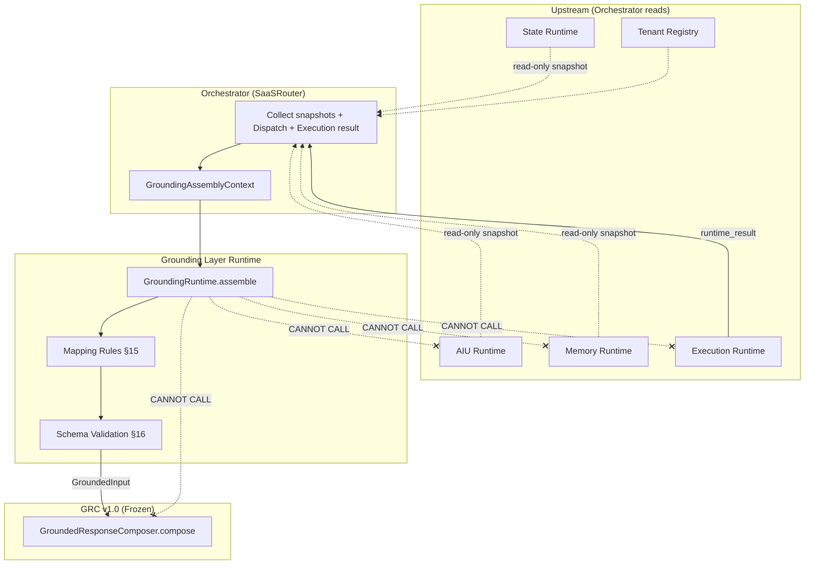

# BATS AI Grounding Layer Runtime

**專案：** BBC AI SaaS / BATS
**定位：** L3 架構 SSOT — **Grounding Layer Runtime** 唯一正式依據（組裝 `GroundedInput`）
**版本：** v1.0 Freeze
**狀態：** ✅ Architecture Freeze（Phase 2-F-0）— 後續 Coding 之唯一架構依據
**主機參考：** 103.1.222.14（主機 A · `C:\bbc-ai-bot`）
**Branch：** feature/api-gateway-mvp

> 本文件定義 **Grounding Layer Runtime** 的職責、邊界、Public Contract、組裝政策與 `GroundedInput` 產出規格。
> 本文件**不**討論 NLG、Persona、Output Validation、Channel 傳輸、Coding 實作細節。
>
> **衝突處理：**
> - 統一 Pipeline / CA-008 → `BATS_AI_CONVERSATION_ARCHITECTURE.md`（L2）為準
> - `GroundedInput` / `GroundedOutput` **唯一欄位表** → `BATS_AI_GROUNDED_RESPONSE_COMPOSER.md` §8.5 / §9.5（**Frozen**；本文件**不重定義**）
> - AIU 契約 → `BATS_AI_INTENT_UNDERSTANDING_V2.md`
> - Memory Card → `BATS_AI_CONVERSATION_MEMORY.md`
> - Composer 行為 → `BATS_AI_GROUNDED_RESPONSE_COMPOSER.md` v1.0 Freeze

> **Architecture Freeze（Phase 2-F-0）：** 本文件已凍結 Responsibilities、Out of Scope、Public Contract（§11）、`GroundingAssemblyContext`（§12）、Runtime Boundary（§13）、`GroundedInput` Ownership（§14）、Mapping Rules（§15）、Grounding Schema Validation（§16）。後續 Phase 2-F Coding **不得**反向修改本文件之架構決策；不一致時依 SSOT Authority 修正程式。

---

## 文件目錄

| 章節 | 標題 |
|------|------|
| §0 | BBC Core Principles 對映 |
| §1 | Document Purpose |
| §2 | Phase Goal |
| §3 | Architecture Position |
| §4 | Responsibilities |
| §5 | Out of Scope |
| §6 | Golden Rules |
| §7 | Runtime Boundary |
| §8 | Input Sources |
| §9 | Output Contract |
| §10 | GroundedInput Assembly Policy |
| **§11** | **Grounding Runtime Public Contract** |
| **§12** | **GroundingAssemblyContext Contract** |
| **§13** | **Grounding Runtime Boundary（Allowed / Cannot Call）** |
| **§14** | **GroundedInput Ownership** |
| **§15** | **Grounding Mapping Rules** |
| **§16** | **Grounding Schema Validation** |
| §17 | Tenant Context Mapping |
| §18 | Knowledge Facts Mapping |
| §19 | Product Result Mapping |
| §20 | Conversation Context Mapping |
| §21 | Resume Context Mapping |
| §22 | Reply Policy Mapping |
| §23 | Next Best Action Mapping |
| §24 | Human Takeover Boundary |
| §25 | Composer Integration |
| §26 | Failure / Fallback Policy |
| §27 | Future Extension |
| §28 | Phase 2-F Roadmap |
| 附錄 A | Cross-Reference Index |
| 附錄 B | Freeze Checklist（2-F-0） |

---

## 0. BBC Core Principles 對映

| Principle | Grounding 落地 |
|-----------|----------------|
| **#1 AI Intent Understanding Before Runtime** | Grounding 在 Execution **之後**；不取代 AIU / Dispatch |
| **#2 Grounded Response Only** | 只組裝已授權來源之事實與上下文；**不產生** `reply_text` |
| **#3 Protect Before Extend** | Orchestrator 既有 `composeFromXResult` 過渡路徑保留至 F-2 漸進替換 |

---

## 1. Document Purpose

建立 **Grounding Layer Runtime** 的 L3 SSOT，作為 Orchestrator 與 **Grounded Response Composer v1.0** 之間的**唯一正式組裝層**。

解決現況缺口：Orchestrator 直接將 Execution 結果傳入 Composer 便利方法，**未**統一注入 `conversation_context`、`resume_context`、`reply_policy.next_best_action_hint` 等 Composer 已可消費的欄位。

---

## 2. Phase Goal

> **將 Execution Runtime 已產出之事實與唯讀上下文，組裝為 Composer 可直接消費的完整 `GroundedInput`；不組句、不決策、不寫入狀態。**

---

## 3. Architecture Position

```
Customer Message
  → AI Intent Understanding Runtime
  → Conversation Memory / State Runtime（唯讀）
  → Runtime Dispatch
  → Execution Runtime
  → ★ Grounding Layer Runtime ★
  → Grounded Response Composer v1.0
  → Channels
```

**設計信條：** `Facts are assembled here. Language is composed elsewhere.`

對齊 L2 **CA-008**：Grounding 為正式架構層；Composer 不得直接查詢 Runtime。

---

## 4. Responsibilities

| ID | 職責 |
|----|------|
| **GL-001** | 產出符合 GRC §8.5 的 `GroundedInput` |
| **GL-002** | 彙整 Execution `grounded_facts` / `product_list` / `external_links` |
| **GL-003** | 注入 `tenant` / `tone`（Registry） |
| **GL-004** | 組裝 `conversation_context`（Memory + entity enrichment） |
| **GL-005** | 投影 `resume_context`（State） |
| **GL-006** | 映射 `reply_policy` |
| **GL-007** | 映射 `next_best_action_hint`（Optional） |
| **GL-008** | 組裝 `metadata`（`customer_query`, `trace_id`, `conversation_id`） |
| **GL-009** | 標記 `runtime_type` / `source_type`（來自 Dispatch 結果） |
| **GL-010** | **Grounding Schema Validation**（§16） |

---

## 5. Out of Scope

| ID | Out of Scope | 負責層 |
|----|--------------|--------|
| **GL-OOS-001** | Intent Detection | AIU Runtime |
| **GL-OOS-002** | Runtime Dispatch | Orchestrator |
| **GL-OOS-003** | Knowledge / Product Retrieval | Execution Runtime |
| **GL-OOS-004** | NLG / Persona / Layout | Composer |
| **GL-OOS-005** | Output Validation | `GroundedOutputValidator` |
| **GL-OOS-006** | Human Takeover **決策** | Orchestrator + State |
| **GL-OOS-007** | Memory / State **寫入** | Memory / State Runtime |
| **GL-OOS-008** | Channel Dispatch | SaaSRouter |
| **GL-OOS-009** | 產生 `reply_text` | Composer |
| **GL-OOS-010** | 重新定義 `GroundedInput` 欄位表 | GRC §8.5 |

---

## 6. Golden Rules

| ID | 規則 |
|----|------|
| **GR-GL-001** | Assembly Only — 不生成 NLG |
| **GR-GL-002** | Contract Consumer — 產出對齊 GRC §8.5 |
| **GR-GL-003** | Context Injection Only — 上游資料經 `GroundingAssemblyContext` 注入 |
| **GR-GL-004** | No Upstream Runtime Calls — 不得呼叫 Knowledge / Product / AIU / Memory API |
| **GR-GL-005** | Mapping ≠ Inventing |
| **GR-GL-006** | Single Producer — 僅 Grounding 建立 `GroundedInput`（§14） |
| **GR-GL-007** | Schema ≠ Output — Grounding Validation ≠ Composer Validator（§16） |

---

## 7. Runtime Boundary（概覽）

詳細邊界見 **§13**。Grounding 為 **組裝層**，非 Execution、非 Composer。

---

## 8. Input Sources（經 Assembly Context 注入）

| 來源 | 注入至 `GroundingAssemblyContext` |
|------|-------------------------------------|
| Orchestrator | `trace_id`, `conversation_id`, `customer_query`, dispatch labels |
| Execution Runtime | `runtime_result` |
| AIU（投影） | `aiu_projection`（entity, context_snapshot；**非** raw dispatch_plan） |
| Memory（快照） | `memory_snapshot` |
| State（快照） | `state_snapshot` |
| Registry | `tenant`, `tone` |

---

## 9. Output Contract

| 項目 | 規格 |
|------|------|
| **唯一產出** | `GroundedInput`（`schema_version = 1`） |
| **權威表** | `BATS_AI_GROUNDED_RESPONSE_COMPOSER.md` §8.5 |
| **禁止產出** | `GroundedOutput`, `reply_text`, `dispatch_plan`, raw `execution_hint` |

---

## 10. GroundedInput Assembly Policy

組裝順序：

1. 驗證 `GroundingAssemblyContext` 必填欄位
2. 依 `runtime_type` 選擇 Mapper（Knowledge / Product / Human / Clarification / Waiting）
3. 執行 §15 Mapping Rules（含 Slot Priority）
4. 組裝 `metadata` / `conversation_context` / `reply_policy`
5. 執行 §16 Grounding Schema Validation
6. 輸出 `GroundedInput`

**北海道 8月 五天 範例（組裝結果，非 NLG）：**

```yaml
metadata:
  customer_query: "北海道 8月 五天"
runtime_type: product_search
conversation_context:
  destination: "北海道"          # AIU entity
  travel_dates: "8月"            # AIU entity
  duration: "五天"               # AIU entity（presentation slot）
  current_requirement: "北海道 8月 五天"  # entity 合併字串
reply_policy:
  mode: clarification            # 或 recommend（視 Execution）
  grounded_only: true
  next_best_action_hint: ask_travel_dates | null
```

Composer CEL 可 echo `current_requirement`；**Grounding 不產生該句**。

---

## 11. Grounding Runtime Public Contract

### 11.1 Runtime Name

| 項目 | 定案 |
|------|------|
| **Architecture 名稱** | Grounding Layer Runtime |
| **實作類別名（Coding 期）** | `GroundingRuntime` |
| **命名空間（建議）** | `core/grounding/GroundingRuntime.php` |

### 11.2 Public API

```php
GroundingRuntime::assemble(
    GroundingAssemblyContext $context
): GroundedInput
```

| 項目 | 規格 |
|------|------|
| **方法** | `assemble()` — 唯一 Public 入口 |
| **輸入** | `GroundingAssemblyContext` — 唯一 Input |
| **輸出** | `GroundedInput` — 唯一 Output |
| **副作用** | 無寫入；無 Channel；無 NLG |
| **冪等性** | 相同 Context → 相同 `GroundedInput`（deterministic mapping） |

### 11.3 Runtime Responsibility

| 負責 | 不負責 |
|------|--------|
| 映射 Execution → `GroundedInput` 欄位 | 呼叫 Execution Runtime |
| Schema Validation（§16） | Output fact fidelity（Composer Validator） |
| Slot merge（§15） | 決定 Dispatch 路由 |
| Advisory → `reply_policy` / NBA hint 映射 | 產生 `reply_text` |

### 11.4 Exception Policy

| 例外 | 條件 | 行為 |
|------|------|------|
| `GroundingAssemblyException` | Context 必填欄位缺失 | Fail closed；不產出 `GroundedInput` |
| `GroundingSchemaValidationException` | §16 驗證失敗 | Fail closed；不呼叫 Composer |
| `GroundingMappingException` | 無法映射之 `runtime_type` | Fail closed；Orchestrator fallback |
| **禁止** | 驗證失敗時 silent pass 空殼 Input | — |
| **禁止** | 例外時自行產生 `reply_text` | — |

Orchestrator 負責 catch 並走既有 fallback（human / error ack / legacy path）。

### 11.5 與 Composer 的單向契約

```
GroundingRuntime.assemble()  →  GroundedInput  →  GroundedResponseComposer.compose()
         唯一 Producer                    唯一 Consumer Input
```

---

## 12. GroundingAssemblyContext Contract

### 12.1 定位

`GroundingAssemblyContext` 是 **Grounding Runtime 唯一 Input**。

Grounding Runtime **不得**直接依賴或呼叫：

- Knowledge Runtime
- Product Runtime
- Memory Runtime
- AIU Runtime
- Conversation State Runtime
- Search Runtime

所有上游資料由 **Orchestrator 唯讀收集後注入** Context。

### 12.2 必要欄位（MVP Required）

| 欄位 | 型別 | 說明 |
|------|------|------|
| `trace_id` | string | 稽核追蹤 |
| `conversation_id` | string | 對話識別（LINE / channel 正規化 ID） |
| `tenant_sno` | string | Host B authority |
| `customer_query` | string | 本輪客戶原文（不改寫） |
| `runtime_type` | string | GRC §8.5 enum；來自 Dispatch 結果 |
| `source_type` | string | Legacy label；由 `runtime_type` 映射 |
| `runtime_result` | array | Execution Runtime 輸出（facts payload） |
| `dispatch_result` | array | Dispatch 標籤（**不含** raw `dispatch_plan` 進 Composer 路徑） |

### 12.3 建議欄位（Optional / 路徑依賴）

| 欄位 | 型別 | 說明 |
|------|------|------|
| `tenant` | array | `{ tenant_key, tenant_sno, company_name, industry_code? }` |
| `tone` | array | `{ persona, allow_emoji }` |
| `memory_snapshot` | array | Customer Memory Card 唯讀投影 |
| `state_snapshot` | array | `{ conversation_owner, conversation_status, resume_context? }` |
| `aiu_projection` | array | `{ entity, context_snapshot, clarification?, execution_hint? }` |
| `bats_search_intent` | array \| null | Product 路徑語意信號（Optional） |
| `assembled_at` | string \| null | ISO8601（audit） |

### 12.4 `dispatch_result` 允許子集

| 欄位 | 說明 |
|------|------|
| `runtime_type` | 與 Context 頂層一致 |
| `clarification_required` | bool |
| `intent_type` | legacy label（audit） |
| `reply_purpose` | `knowledge_reply` \| `product_reply` |

**禁止**將 `dispatch_plan` 原樣轉發至 `GroundedInput`。

### 12.5 `aiu_projection` 允許子集

| 欄位 | 說明 |
|------|------|
| `entity` | AIU entity（destination, dates, …） |
| `context_snapshot` | Memory 唯讀投影副本（可與 memory_snapshot 對照） |
| `clarification` | clarification 結構 |
| `execution_hint` | **僅供 Grounding 映射** NBA / reply_policy；**不得**進 `GroundedInput` raw |

### 12.6 Context 不變式

| ID | 不變式 |
|----|--------|
| **CTX-001** | `customer_query` 必須為本輪原文 |
| **CTX-002** | `runtime_type` 必須為 GRC §8.5 合法值 |
| **CTX-003** | `runtime_result` 必須來自 Execution，Grounding 不補造 facts |
| **CTX-004** | Context 為值物件；Grounding 不修改上游 Runtime 狀態 |

---

## 13. Grounding Runtime Boundary

### 13.1 Allowed Read（經 Context 注入之資料）

| 資料 | 來源 | 用途 |
|------|------|------|
| AIU Result（投影） | `aiu_projection` | entity → conversation slots |
| Memory Snapshot | `memory_snapshot` | conversation_context base |
| State Snapshot | `state_snapshot` | owner / status / resume |
| Runtime Result | `runtime_result` | grounded_facts / product_list |
| Tenant Registry | `tenant`, `tone` | 呈現設定 |
| Dispatch Labels | `dispatch_result` | reply_policy mode 輔助 |

### 13.2 Cannot Call（硬性禁止）

| 目標 | 原因 |
|------|------|
| Knowledge Runtime | 違反 CA-008；Execution 已完成 |
| Product Runtime | 同上 |
| Search Runtime | Grounding 不搜尋 |
| AIU Runtime | 理解已完成；僅消費投影 |
| Memory Runtime API | 僅消費 Orchestrator 注入之 snapshot |
| State Runtime API | 同上 |
| Grounded Response Composer | 單向：Grounding → Composer |
| Channel / LineService | 非 Grounding 職責 |

### 13.3 Boundary Diagram



---

## 14. GroundedInput Ownership

### 14.1 角色定義

| 角色 | 定義 |
|------|------|
| **Producer（唯一）** | **Grounding Runtime** — 透過 `assemble()` 建立 `GroundedInput` |
| **Consumer（唯一）** | **Grounded Response Composer** — `compose(GroundedInput)` |
| **Owner（架構）** | **Grounding Layer** — 對 `GroundedInput` 組裝正確性負責 |
| **Authority（契約）** | **GRC §8.5** — 欄位語意與必填規則 |

### 14.2 硬性規定

| ID | 規定 |
|----|------|
| **OWN-001** | `GroundedInput` **只能**由 `GroundingRuntime::assemble()` 建立（Production path） |
| **OWN-002** | Composer **只能** Consume；不得 mutate 上游 facts |
| **OWN-003** | Knowledge / Product / Human / AIU / Memory Runtime **不得** `new GroundedInput()` 作為對外契約 |
| **OWN-004** | Orchestrator **不得**手動拼裝 §8.5 欄位繞過 Grounding（目標態；過渡期見 §25） |
| **OWN-005** | 測試 Fixture 可使用 `GroundedInput::fromArray()`；**不**構成 Production Producer |

### 14.3 過渡期例外（Protect Before Extend）

| 路徑 | 狀態 | 收斂 |
|------|------|------|
| `GroundedInput::fromKnowledgeRuntimeResult()` | 過渡 Helper | F-2 內部移至 Grounding Mapper |
| `GroundedInput::fromProductRuntimeResult()` | 過渡 Helper | 同上 |
| `composeFromKnowledgeResult($result, $tenant)` | Orchestrator 捷徑 | F-2 改為 `assemble()` |

過渡 Helper **不**改變 Ownership 規則：Production 目標態仍為 Grounding 唯一 Producer。

---

## 15. Grounding Mapping Rules

### 15.1 Mapping Principle

```
One Source  →  One Mapping  →  One Slot
```

每個 `GroundedInput` 欄位（或 `conversation_context` slot）必須有**唯一權威來源**；禁止多來源無規則覆寫。

### 15.2 映射管線

```
Execution Result (runtime_result)
        ↓
Grounding Mapping (runtime-type mappers)
        ↓
GroundedInput (+ conversation_context enrichment)
        ↓
GroundedResponseComposer
```

### 15.3 Slot Priority（衝突時）

適用於 `conversation_context` enrichment slots：

| 優先序 | 來源 | 說明 |
|--------|------|------|
| **P1** | `memory_snapshot`（已確認欄位） | Customer Memory Card 優先 |
| **P2** | `aiu_projection.entity` | 本輪 AIU 萃取 |
| **P3** | `aiu_projection.context_snapshot` | AIU 讀取之 Memory 投影 |
| **P4** | 空 / omit | 不補洞 |

### 15.4 Merge Rules

| ID | 規則 |
|----|------|
| **MAP-001** | **Scalar slot**（如 `destination`）：依 Slot Priority 取**第一個非空**值 |
| **MAP-002** | **List slot**（如 `outstanding_issues`）：僅來自 Memory；AIU **不得**追加 |
| **MAP-003** | **`current_requirement`**：Memory `current_requirement` 優先；否則 entity 合併字串（見 §20） |
| **MAP-004** | **`metadata.customer_query`**：永遠 = `context.customer_query`（P0，不受 Priority 影響） |
| **MAP-005** | **Execution facts**：僅來自 `runtime_result`；AIU entity **不得**寫入 `grounded_facts[]` |
| **MAP-006** | **`next_best_action_hint`**：僅來自映射表（§23）；禁止 Grounding 自創 |

### 15.5 Conflict Rules

| 衝突 | 處理 |
|------|------|
| Memory `destination=東京` vs AIU `destination=北海道`（同輪） | **P1 Memory 勝**；記錄 `grounding_notes: slot_conflict:destination`（internal audit） |
| 兩個來源皆空 | Slot omit；不填預設值 |
| `runtime_type` 與 `runtime_result` 不一致 | **Fail closed**（`GroundingMappingException`） |
| raw `execution_hint` 與 `reply_policy.mode` 矛盾 | `reply_policy.mode` 以 Execution 為準；NBA hint 可為 null |

### 15.6 Runtime-Type Mapper 一覽

| `runtime_type` | 主要映射 |
|----------------|----------|
| `knowledge_private` | §18 Knowledge Mapper |
| `knowledge_shared` | §18（shared facts） |
| `product_search` | §19 Product Mapper |
| `human_service` | Human fallback facts |
| `clarification` | 空 facts + `reply_policy.mode=clarification` |
| `waiting_ack` | 空 facts + `reply_policy.mode` = waiting |

---

## 16. Grounding Schema Validation

### 16.1 定位

| 項目 | 規格 |
|------|------|
| **名稱** | Grounding Schema Validation |
| **時機** | `assemble()` 完成映射後、回傳 `GroundedInput` 前 |
| **職責** | **僅**驗證 Input 契約結構與必填欄位 |
| **不負責** | fact fidelity、NLG 正確性、Persona、Policy Safety |

### 16.2 與 GroundedOutputValidator 分工

| 驗證器 | 驗證對象 | 驗證內容 |
|--------|----------|----------|
| **Grounding Schema Validation** | `GroundedInput`（組裝後） | schema_version、必填欄位、enum、null policy |
| **GroundedOutputValidator** | `GroundedOutput`（NLG 後） | fact traceability、count bound、reply_type 一致性 |

**硬性規定：** 兩者**不得重疊**；Grounding Validator **不得**檢查 `reply_text`。

### 16.3 驗證項目

| 類別 | 檢查 |
|------|------|
| **schema_version** | 必須為 `1`（當前 Freeze） |
| **required fields** | §8.5 標記 🧊 ✅ 欄位齊全 |
| **enum** | `runtime_type`, `conversation_owner`, `conversation_status`, `reply_policy.mode` |
| **null policy** | `resume_context` 可 null；`knowledge_type` 可 null；`next_best_action_hint` 可 null |
| **empty collection** | `grounded_facts=[]` 合法；`product_list.items=[]` 合法 |
| **forbidden fields** | 不得含 `dispatch_plan`、raw `execution_hint` |
| **grounded_only** | `reply_policy.grounded_only` 必須為 `true` |

### 16.4 失敗策略

驗證失敗 → `GroundingSchemaValidationException` → Orchestrator fallback；**不**呼叫 Composer。

---

## 17. Tenant Context Mapping

| 來源 | `GroundedInput` 欄位 |
|------|----------------------|
| Registry `tenant_key` | `tenant.tenant_key` |
| Context `tenant_sno` | `tenant.tenant_sno` |
| Registry `company_name` | `tenant.company_name` |
| Registry `industry_code` | `tenant.industry_code` |
| Tone config `persona` | `tone.persona` |
| Tone config `allow_emoji` | `tone.allow_emoji` |

---

## 18. Knowledge Facts Mapping

將 `runtime_result`（Knowledge Runtime 輸出）映射至：

- `grounded_facts[]`（`qa_id` / `price_id` / `service_id` / `link_id` / `shared_item_id`）
- `external_links[]`（若 query_type 為 external links）
- `knowledge_type`（`query_type`）
- `raw_runtime_result`（transitional；Composer Layout 用）

語意對齊現有 `GroundedInput::fromKnowledgeRuntimeResult()`；**欄位不改**。

---

## 19. Product Result Mapping

將 `runtime_result` 映射至：

- `product_list.items[]`
- `recommendation_summary`
- `grounded_facts[]`（product_row from titles）
- `external_links[]`（from product URLs）

語意對齊 `GroundedInput::fromProductRuntimeResult()`。

---

## 20. Conversation Context Mapping

### 20.1 Memory Card → `conversation_context`

| Memory Card 欄位 | `conversation_context` 鍵 |
|------------------|---------------------------|
| `current_requirement` | `current_requirement` |
| `conversation_stage` | `conversation_stage` |
| `completed_items` | `completed_items` |
| `outstanding_issues` | `outstanding_issues` |
| `recently_recommended_products` | `recently_recommended_products` |
| `ai_summary` | `ai_summary` |

### 20.2 AIU Entity → enrichment slots

| Entity 鍵（建議） | `conversation_context` 鍵 |
|-------------------|---------------------------|
| `destination` | `destination` |
| `travel_dates` / `dates` | `travel_dates` |
| `party_size` | `party_size` |
| `duration` / `days` | `duration` |
| `budget` | `budget` |

### 20.3 `current_requirement` 合併

若 Memory 無 `current_requirement`：將 P2 entity 中非空 scalar 以**空格**連接為一字串（不做語意推論）。

---

## 21. Resume Context Mapping

| 來源 | 目標 |
|------|------|
| `state_snapshot.resume_context` | `GroundedInput.resume_context` |
| 非 Resume 情境 | `null` |

---

## 22. Reply Policy Mapping

| 條件 | `reply_policy.mode` |
|------|---------------------|
| Product `result_count > 0` | `recommend` |
| Product 空結果 | `no_results` |
| Clarification path | `clarification` |
| Human service | `human_handoff` |
| Waiting ack | `acknowledge` |

`grounded_only` 固定 `true`。`max_products` 預設 `3`（registry override 可選）。

---

## 23. Next Best Action Mapping

| 信號（execution_hint / Runtime） | `reply_policy.next_best_action_hint` |
|----------------------------------|--------------------------------------|
| 缺日期 | `ask_travel_dates` |
| 缺人數 | `ask_party_size` |
| 有 product URL | `view_product` / `view_tour` |
| Human path | `contact_human_service` |
| 無映射 | `null` |

**禁止** Grounding 自創 hint。映射後 raw `execution_hint` **不得**進入 `GroundedInput`。

---

## 24. Human Takeover Boundary

| 層級 | 行為 |
|------|------|
| **Orchestrator Primary Guard** | `conversation_owner=HUMAN` → 不送 LINE outbound |
| **Grounding** | 可組裝 `GroundedInput`（含 owner=HUMAN）供測試或 defense-in-depth |
| **Composer** | Human Guard 短路（§15 GRC） |

Grounding **不決定**是否呼叫 Composer。

---

## 25. Composer Integration

**目標態：**

```php
$context = GroundingAssemblyContext::fromOrchestrator(...);
$groundedInput = $groundingRuntime->assemble($context);
$groundedOutput = $composer->compose($groundedInput);
```

**過渡期：** `composeFromKnowledgeResult` / `composeProductReply` 保留至 Phase 2-F-2。

---

## 26. Failure / Fallback Policy

| 情境 | 政策 |
|------|------|
| Schema Validation 失敗 | Fail closed；Orchestrator fallback |
| Memory snapshot 缺失 | 空 `conversation_context`；繼續組裝 |
| Mapping 不支援之 runtime_type | Exception |
| 不得 silent pass 不完整 Input | — |

---

## 27. Future Extension

- `grounding_trace` audit envelope
- Multi-runtime advisory merge（非 MVP）

> **Post-Freeze / Companion Refinement（Phase 2-F-1）：** 以下項目**未凍結為架構決策**，留待 Phase 2-F-1 或 companion 文件細化；**不得**反向修改 §4～§16 之 Frozen Boundary：
> - `duration` enrichment slot 正式化（GRC §8.5 Optional 或 presentation-only keys 白名單）
> - `grounding_notes` audit 欄位歸屬（`metadata` vs log-only）
> - `bats_search_intent` 與 `aiu_projection` 之 Slot Priority 關係

---

## 28. Phase 2-F Roadmap

| Phase | 一句話目標 |
|-------|------------|
| **2-F-0** | ✅ **Frozen** — Grounding 架構、Public Contract、Ownership、Mapping、Schema Validation |
| **2-F-1** | 實作 Grounding Context Builder（snapshot → context view） |
| **2-F-2** | 實作 Grounding Pipeline Runtime（`assemble()` 取代 Orchestrator 分散組裝） |
| **2-F-3** | Grounding Runtime Validation（E2E pilot gate） |

---

## 附錄 A. Cross-Reference Index

| 主題 | SSOT |
|------|------|
| Pipeline / CA-008 | `BATS_AI_CONVERSATION_ARCHITECTURE.md` |
| GroundedInput / GroundedOutput | `BATS_AI_GROUNDED_RESPONSE_COMPOSER.md` §8.5 / §9.5 |
| Composer v1.0 | `BATS_AI_GROUNDED_RESPONSE_COMPOSER.md` |
| AIU | `BATS_AI_INTENT_UNDERSTANDING_V2.md` |
| Memory Card | `BATS_AI_CONVERSATION_MEMORY.md` |
| Persona Principles | `BATS_AI_PERSONA.md` §0 |

---

## 附錄 B. Freeze Checklist（2-F-0）

| ID | 決策 | 狀態 |
|----|------|------|
| **F-GL-1** | Grounding 為唯一 `GroundedInput` Producer（Production） | ✅ Frozen |
| **F-GL-2** | Public API = `assemble(GroundingAssemblyContext): GroundedInput` | ✅ Frozen |
| **F-GL-3** | 不得呼叫上游 Runtime API | ✅ Frozen |
| **F-GL-4** | GroundedInput Ownership（§14） | ✅ Frozen |
| **F-GL-5** | Mapping Rules + Slot Priority（§15） | ✅ Frozen |
| **F-GL-6** | Schema Validation ≠ Output Validator（§16） | ✅ Frozen |
| **F-GL-7** | 不重定義 GRC §8.5 欄位表 | ✅ Frozen |
| **F-GL-8** | Phase 2-F-1～2-F-3 Roadmap | ✅ Frozen |

**Freeze 日期：** 2026-07-01  
**Freeze Phase：** Phase 2-F-0  
**下一階段：** Phase 2-F-1 Grounding Context Builder Coding（待指令）

---

## Revision History

| 版本 | 日期 | 狀態 | 說明 |
|------|------|------|------|
| **1.0** | 2026-07-01 | **Freeze** | Phase 2-F-0 Architecture Freeze：凍結 Public Contract、Assembly Context、Runtime Boundary、Ownership、Mapping Rules、Schema Validation |

---

*本文件為 Grounding Layer Runtime 唯一 L3 SSOT（v1.0 Freeze）。不涉及程式實作。*
