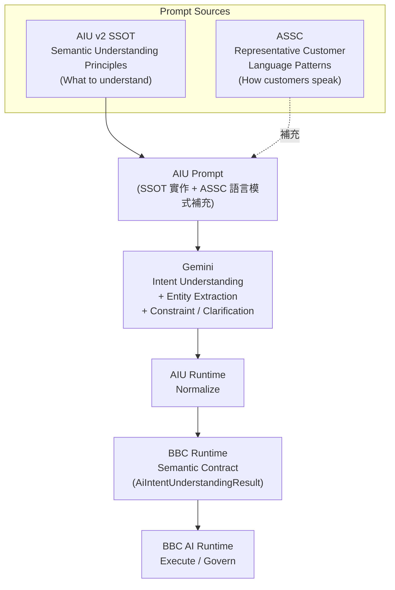
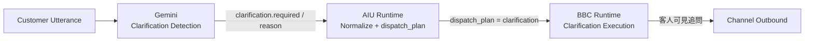
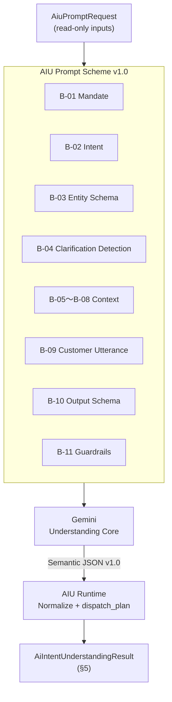

# BATS AI Intent Understanding v2

**專案：** BBC AI SaaS / BATS / Phase 2-D
**定位：** L3 架構 SSOT — **AI Intent Understanding Runtime（v2）** 唯一正式依據（Runtime 定位 / 職責 / Boundary / `AiIntentUnderstandingResult` Contract / Integration）
**版本：** v1.7（AIU v2 Understanding Core + AIU Prompt Scheme v1.0）
**狀態：** ✅ Architecture Freeze（Phase 2-D-0 + v1.2～v1.3 Understand Refinement + v1.4～v1.5 ASSC Gold + v1.6 AIU Prompt Design Principles + **v1.7 Understanding Core + Prompt Scheme**）— 後續 Coding 之唯一架構依據
**主機參考：** 103.1.222.14（主機 A · `C:\bbc-ai-bot`）
**Branch：** feature/api-gateway-mvp

> 本文件為 AI Intent Understanding v2 之 **L3 實作 SSOT**。它在 `BATS_AI_CONVERSATION_ARCHITECTURE.md`（L2）所定義之統一 Pipeline 下，正式定位 **AI Intent Understanding Runtime** 的職責、邊界、流程與輸出契約（`AiIntentUnderstandingResult`）。
>
> 本文件 **不新增任何新架構**，僅整合 Phase 2-D Proposal、Architecture Refinement、Architecture Review 之已確認結論，並予以 Freeze。本文件 **不定義**：意圖類別本體（見 L2 §3 / CA-009）、搜尋語意欄位（見 `BATS_AI_SEMANTIC_SEARCH.md`）、回覆話術（見 `BATS_AI_PERSONA.md` / `BATS_AI_TRAVEL_CONSULTANT_POLICY.md`）、Grounded 回覆契約（見 `PHASE_9C2C_GROUNDED_RESPONSE_COMPOSER.md`）、程式實作。

---

## 上層 / 關聯文件

| 層級 | 文件 | 關係 |
|------|------|------|
| L0 | `CO_WORK_POLICY.md`、`DOCUMENTATION_GOVERNANCE_POLICY.md` | 協作與文件治理 |
| L0 | `BATS_AI_PERSONA.md` §0 | BBC Core Principles（**Core Principle #1** 為本文件最高設計信條來源） |
| L2 | `BATS_AI_CONVERSATION_ARCHITECTURE.md` | 統一 Conversation Architecture / Pipeline（CA-001）/ Intent 類別（CA-009）/ State 唯一管理者（CA-010）/ Grounding（CA-008） |
| L3 | **本文件** | **AI Intent Understanding Runtime（v2）職責 / Boundary / `AiIntentUnderstandingResult` Contract** 唯一 SSOT |
| L3 | `BATS_AI_SEMANTIC_SEARCH.md` | Product Search 子意圖與語意欄位（`BatsSearchIntent`） |
| L3 | `BATS_AI_CONVERSATION_MEMORY.md` | Customer Memory Card（context_snapshot / resume_context 之讀取來源） |
| L3 | `BATS_AI_RUNTIME_DESIGN.md` | Runtime 接入順序 / Legacy Governance / Engineering Governance |
| L3 | `PHASE_9C2C_GROUNDED_RESPONSE_COMPOSER.md` | Grounding 之後的 presentation 契約 |
| L3 | `ASSC_GOLD_BENCHMARK_v1.md` | **ASSC Gold 正式 Benchmark Corpus**（案例原文；本文件 §13 引用，不內嵌複製） |

**衝突處理：** 統一 Pipeline / Owner / Status / State Runtime / Grounding 一律以 L2（`BATS_AI_CONVERSATION_ARCHITECTURE.md`）為準；意圖類別以 L2 §3 / CA-009 為準；Core Principles 以 `BATS_AI_PERSONA.md` §0 為準。**AI Intent Understanding Runtime 之定位、職責、Boundary、`AiIntentUnderstandingResult` 契約以本文件為準。**

---

## Adopted Decisions（Phase 2-D Freeze）

| ID | 決策 |
|----|------|
| **IU-001** | **AI Intent Understanding Runtime**（短名 AIU Runtime）為統一 Pipeline 之 **L1 Decision Layer**：唯一的「理解＋規劃 dispatch」入口，位於 Customer Message 之後、Runtime Dispatch 之前 |
| **IU-002** | AIU Runtime 為 **唯讀聚合器（Read-only Aggregator）**：讀取 Conversation Memory / Conversation State 之 snapshot，**絕不**變更 Owner / Status / Memory（Owner First；State 唯一管理者見 L2 CA-010） |
| **IU-003** | AIU Runtime 輸出單一結構化結果 **`AiIntentUnderstandingResult`**（9 欄位，§5）；`dispatch_plan` 為唯一權威路由依據 |
| **IU-004** | **`execution_hint`** 為 **非綁定（advisory）** 之扁平字串、封閉 enum、可空；僅承載 AIU 階段合法可推導之子模式，**不得**編碼 Execution Runtime 內部解析鏈（CEP） |
| **IU-005** | 本 Runtime 對映 **Core Principle #1（AI Intent Understanding Before Runtime）**；設計信條為「**AI Understand First, Runtime Execute Second**」。**不新增**任何新的 Core Principle |
| **IU-006** | 全面 **Additive**：不修改任何既有 Runtime 行為、不修改其他 SSOT 之架構本體 |

---

## 文件目錄

| 章節 | 標題 |
|------|------|
| §1 | Document Purpose |
| §2 | Architecture Overview |
| §3 | AI Intent Understanding Runtime（定位 / 職責 / Boundary） |
| §3.4 | Semantic Understanding Core Policy（含 Semantic Entity Extraction Clarification） |
| §4 | AI Intent Understanding Runtime Flow |
| §5 | `AiIntentUnderstandingResult` 正式 Contract |
| §6 | Runtime Components |
| §7 | Runtime Boundary（屬於 / 不屬於） |
| §8 | Integration |
| §9 | Success Scope |
| §10 | Out of Scope |
| §11 | BBC AI Core Principle |
| §12 | Architecture Freeze Result（F-1～F-6） |
| §13 | ASSC Gold（AI Semantic Scenario Collection） |
| §13.14 | ASSC Gold Architecture Freeze Result（AG-1～AG-12） |
| §14 | AIU Prompt Design Principles |
| §14.8 | AIU Prompt Architecture Diagram |
| §15 | AIU v2 Understanding Core |
| §16 | AIU Prompt Scheme v1.0 |

---

## 1. Document Purpose

本文件完成 **AI Intent Understanding v2** 的 L3 SSOT 凍結，作為 Phase 2-D 後續所有 Coding（自 Phase 2-D-1 Contract Foundation 起）之 **唯一架構依據**。

| 目的 | 說明 |
|------|------|
| **收斂** | 整合 Phase 2-D Proposal / Architecture Refinement / Review 之已確認結論為單一 SSOT |
| **凍結** | Freeze Layer 命名、Layer 位置、`AiIntentUnderstandingResult` 契約、`execution_hint`、Core Principle 對映（F-1～F-5，§12） |
| **約束** | 後續實作須完全依本文件；不一致時依 SSOT Authority（`BATS_AI_PERSONA.md` §0.7）修正程式，不得反向改本 SSOT |
| **非目的** | 不新增新架構、不重複定義 L2 Pipeline / 意圖類別 / 語意欄位 / 話術 / Grounded 契約 / 程式實作 |
| **ASSC Gold** | 本文件 §13 定義 **ASSC Gold** 架構、Schema、治理與 Golden Rules；正式 Benchmark Cases 見 `ASSC_GOLD_BENCHMARK_v1.md` |
| **AIU Prompt** | 本文件 §14 定義 **AIU Prompt Design Principles** — SSOT × ASSC 如何形成 Gemini Prompt；四元件責任分工 |

---

## 2. Architecture Overview

AI Intent Understanding Runtime 在 L2 統一 Pipeline（CA-001）中的位置 **不變**，本文件僅將其第一級「AI Intent Understanding」正式具名化、結構化：

```
Customer Message
   ↓
AI Intent Understanding Runtime        ← 本文件（L1 Decision Layer）
   │  讀取 snapshot：Conversation Memory（context）、Conversation State（owner）
   │  產出：AiIntentUnderstandingResult（intent / entity / …/ dispatch_plan / execution_hint）
   ↓
Runtime Dispatch                        只路由（依 dispatch_plan），不判斷意圖、不管狀態
   ↓
Execution Runtime                       Product / Knowledge / Clarification / Human / Future
   ↓
Grounding                               彙整 grounded facts → GroundedInput
   ↓
Grounded Response Composer              只組句；不得直接查 Runtime（CA-008）
   ↓
LINE / Web / Future Channels
```

**設計信條（IU-005）：** `AI Understand First, Runtime Execute Second`（＝操作化 Core Principle #1）。

---

## 3. AI Intent Understanding Runtime

### 3.1 正式定位（F-1 / F-2）

| 項目 | 規格 |
|------|------|
| **正式名稱** | **AI Intent Understanding Runtime**（短名 **AIU Runtime**） |
| **Pipeline 位置** | **L1 Decision Layer** — Customer Message 之後、Runtime Dispatch 之前的唯一理解入口 |
| **型態** | **Read-only Aggregator + Decision Layer**（唯讀聚合 + 決策；不持有、不變更狀態） |
| **命名理由** | 保留 L2／Core Principle #1 之 frozen 詞「AI Intent Understanding」；`Runtime` 後綴對齊 Runtime family（Memory / State / Human Service / Industry Shared） |

### 3.2 正式職責

| 職責 | 說明 |
|------|------|
| **Intent Understanding** | 判定意圖類別（Product Search / Knowledge / Ambiguous，CA-009） |
| **Entity Extraction** | **語意實體萃取（Semantic Entity Extraction）**；由 Gemini Semantic Understanding 產出；語意欄位本體引用 `BATS_AI_SEMANTIC_SEARCH.md`（詳 §3.4） |
| **Context Snapshot** | **讀取** Conversation Memory（Customer Memory Card）作為理解上下文 |
| **Owner Snapshot** | **讀取** Conversation State 之有效 Owner（AI / HUMAN） |
| **Conversation Stage** | 取得對話階段（與 Memory / Lifecycle 對齊；唯讀） |
| **Resume Context** | AI Resume 情境下，提供延續所需上下文（讀取，不改 Owner；Owner 轉移由 State Runtime 執行，CA-006 / CA-010） |
| **Clarification** | 判定 `clarification.required` 與 `reason`（Ambiguous → 必須 Clarification，CA-009） |
| **Dispatch Planning** | 產出權威 `dispatch_plan` 與非綁定 `execution_hint` |

### 3.3 Runtime Boundary（摘要，詳見 §7）

- **唯讀**：對 Memory / State 僅讀 snapshot；**絕不**寫入或變更（IU-002 / Owner First）。
- **不執行業務**：不搜尋、不查知識庫、不組句、不送任何 Channel 訊息。
- **不路由執行**：只產出 `dispatch_plan`；實際路由由 Runtime Dispatch、實際執行由 Execution Runtime。

### 3.4 Semantic Understanding Core Policy

> **本節定位：** 補強 AI Intent Understanding v2 之 **Understand** 核心能力；**不**修改 F-1～F-5 契約、**不**新增 Runtime 架構、**不**新增 Runtime Flow。

**Semantic Understanding Core：**

| 項目 | 規格 |
|------|------|
| **唯一核心** | **Gemini**（或未來等效 LLM）為 AI Intent Understanding v2 **唯一** Semantic Understanding Core |
| **目標** | 理解客人**真正意圖**，非字面關鍵字命中 |

**語意解析面向（Clarification）：**

AI Intent Understanding v2 解析使用者輸入中之語意資訊，作為理解與 `dispatch_plan` 規劃之依據。下列面向 **均屬 Understand 範疇**，**不**新增契約欄位、**不**改變 §5 之 9 欄位 Freeze：

| 語意面向 | 說明 | 契約投影（§5） |
|----------|------|----------------|
| **Intent** | 意圖類別（Product Search / Knowledge / Ambiguous，CA-009） | `intent` |
| **Semantic Meaning** | 自然語言之整體語意理解（含隱含需求、口語改述、多輪指代） | 內化於 Gemini 理解；投影至 `intent` / `entity` / `clarification` |
| **Entities** | Gemini 語意理解後萃取之結構化語意資訊（§3.4 Semantic Entity Extraction） | `entity` |
| **Context** | Customer Memory Card、tenant / 場景上下文 | `context_snapshot` |
| **Conversation State** | 多輪對話階段、有效 Owner、Resume 延續 | `conversation_stage` / `owner_snapshot` / `resume_context` |
| **Confidence** | 理解信心；低信心或 Ambiguous → 要求 Clarification | `clarification` |

**理解依據（五要素）：**

> 下列五要素為 Semantic Understanding Core 之 **設計依據**；上表六面向為其 **語意解析產出之 Clarification**，兩者並列、互補，**不**構成架構變更。

| 要素 | 說明 |
|------|------|
| **Semantic** | 自然語言語意理解（含 Semantic Meaning） |
| **Context** | Customer Memory Card、tenant / 場景上下文 |
| **Conversation** | 多輪對話階段、prior message、Resume 延續（含 Conversation State） |
| **Intent** | 意圖類別（CA-009）與 Entity 萃取 |
| **Confidence** | 理解信心；低信心或 Ambiguous → `clarification.required = true` |

**Semantic Entity Extraction（語意實體萃取）：**

| 項目 | 規格 |
|------|------|
| **歸屬** | **屬於 AIU v2** — 為理解使用者真正意圖之 **必要組成**，非 Execution Runtime 業務邏輯 |
| **產出方式** | 由 **Gemini Semantic Understanding** 完成語意理解後，萃取結構化 **Entities** 至 `entity` |
| **性質** | 語意資訊之結構化投影；欄位語意本體引用 `BATS_AI_SEMANTIC_SEARCH.md`；**非** Keyword 命中清單 |

**Entities 範例（旅遊語境，非 exhaustive）：**

| 類別 | 說明 |
|------|------|
| **Destination** | 目的地（含口語別名、區域、城市） |
| **Date** | 出發 / 回程 / 月份 / 季節等時間語意 |
| **Duration** | 天數、行程長度 |
| **Budget** | 預算區間、價格敏感度 |
| **Departure City** | 出發地 |
| **Traveler Count** | 人數、同行者組成 |
| **Product Preference** | 產品類型、主題、艙等、飯店等偏好 |
| **Human Service Request** | 轉人工、客服、真人協助等語意請求 |
| **（其他）** | 任何對理解真正意圖具有語意重要性之資訊 |

> **Clarification 守則：** 上表為 **語意類別示例**，**不是** Keyword Whitelist / Blacklist、**不是** Destination 硬編碼表、**不是** 新增 Routing Rule。具體欄位定義仍以 `BATS_AI_SEMANTIC_SEARCH.md` 為準。

**明確區分 — Semantic Entity Extraction vs Programmatic Matching：**

| 類型 | 歸屬 | 規格 |
|------|------|------|
| **Semantic Entity Extraction** | ✅ **AIU v2 長期架構** | 由 Gemini 語意理解後產生；是理解使用者真正意圖之一部分；輸出至 `entity` |
| **Programmatic Keyword Matching / Rule Matching** | ❌ **非 AIU v2 長期架構** | 不可作為 Intent 判斷依據；不可用 PHP keyword、regex-first、if…else、hardcoded routing **取代** Gemini 理解 |

**禁止（非 AIU v2 長期架構）：**

- PHP Keyword Matching 作為 Intent 終態判斷
- Rule Matching（固定規則表）作為唯一 Intent 依據
- if…else Intent 硬編碼
- 關鍵字硬綁（Marker / Lexicon 命中即 Intent）
- regex-first 或 hardcoded routing **取代** Gemini Semantic Understanding
- 以 Keyword / Rule 命中結果 **冒充** Semantic Entity Extraction 產出

**Legacy Transition（MVP 過渡，非長期架構）：**

現行 Production / Pilot 仍可能存在下列 **Rule / Keyword / Lexicon** 元件（§6）：

| 元件 | 過渡定位 | 長期終態 |
|------|----------|----------|
| `BatsSearchIntentBuilder` / `TravelIntentLexicon` | Product Search 語意過渡 | Gemini Semantic Understanding |
| `KnowledgeIntentDetector`（Rule / Marker） | Knowledge / Human 意圖過渡 | Gemini Semantic Understanding |
| `ClarificationPolicy`（Rule） | Clarification 決策過渡 | AIU Clarification + Confidence |

> **規則：** 上述元件 **僅為 MVP 過渡**，**不是** AI Intent Understanding v2 長期架構。`AiIntentUnderstandingResult` 契約（§5）、F-1～F-5、IU-001～IU-006 **維持 Freeze**。新 Intent 能力 **不得**再以 Keyword Patch 擴充。

---

## 4. AI Intent Understanding Runtime Flow

```
輸入：Customer Message（+ tenant 識別 + trace_id）
   ↓
① Owner Snapshot      ← 讀 Conversation State（resolveEffectiveOwner）
   ↓
② Context Snapshot    ← 讀 Conversation Memory（Customer Memory Card）
   ↓
③ Conversation Stage  ← 讀對話階段（唯讀）
   ↓
④ Intent Understanding → intent（Product Search / Knowledge / Ambiguous）
   ↓
⑤ Entity Extraction   → entity
   ↓
⑥ Clarification       → clarification{ required, reason }
   ↓
⑦ Resume Context      → resume_context（僅 Resume 情境；否則 null）
   ↓
⑧ Dispatch Planning   → dispatch_plan（權威）+ execution_hint（非綁定）
   ↓
輸出：AiIntentUnderstandingResult（§5）
```

> 流程全程唯讀且不送訊息；`dispatch_plan` 交由 Runtime Dispatch 路由。Owner = HUMAN 時，AIU 仍可完成理解並輸出 `execution_hint = human_blocked`，但 **不**改變 Owner（Ownership Rule，L2 §7）。

---

## 5. AiIntentUnderstandingResult 正式 Contract（F-3）

AIU Runtime 之唯一輸出，為單一結構化結果物件，**9 個正式欄位**（凍結）：

```
AiIntentUnderstandingResult {
  intent:             string          // 意圖類別（CA-009）：Product Search | Knowledge | Ambiguous
  entity:             array           // 萃取之實體集合（語意欄位引用 BATS_AI_SEMANTIC_SEARCH.md）
  context_snapshot:   array           // 讀自 Conversation Memory（唯讀快照）
  owner_snapshot:     string          // 讀自 Conversation State（唯讀）：AI | HUMAN
  conversation_stage: string          // 對話階段（唯讀；與 Lifecycle / Memory 對齊）
  resume_context:     array | null    // AI Resume 延續上下文；非 Resume 情境為 null
  clarification:      object          // { required: bool, reason: string }
  dispatch_plan:      string          // 權威路由目標：product | knowledge | clarification | human
  execution_hint:     string | null   // 非綁定提示（封閉 enum，§5.2）；可空
}
```

### 5.1 欄位規格

| 欄位 | 型別 | 必填 | 規格 |
|------|------|------|------|
| `intent` | string | 是 | CA-009 三類；意圖本體定義引用 L2 §3 |
| `entity` | array | 是（可空陣列） | **Semantic Entity Extraction** 產出之語意實體集合；由 Gemini 理解後萃取；欄位語意引用 `BATS_AI_SEMANTIC_SEARCH.md`（§3.4）；**非** Keyword / Rule 命中產物 |
| `context_snapshot` | array | 是（可空陣列） | Customer Memory Card 之唯讀投影；AIU 不改 Memory |
| `owner_snapshot` | string | 是 | `AI` \| `HUMAN`；讀自 State Runtime 有效 Owner |
| `conversation_stage` | string | 是 | 對話階段；唯讀 |
| `resume_context` | array \| null | 是 | Resume 情境提供延續資訊；否則 `null` |
| `clarification` | object | 是 | `{ required: bool, reason: string }`；Ambiguous → `required = true` |
| `dispatch_plan` | string | 是 | `product` \| `knowledge` \| `clarification` \| `human`；**唯一權威路由** |
| `execution_hint` | string \| null | 否 | 非綁定；封閉 enum（§5.2）；可為 `null` |

### 5.2 execution_hint 封閉 enum（F-4）

| Intent 類別 | 允許值 | 推導來源（AIU 已知事實） |
|-------------|--------|--------------------------|
| Product | `product_search` / `product_clarification` / `product_no_search` | 由 `clarification.required` 推導 |
| Knowledge | `knowledge_resolve` | 標示交由 Knowledge Runtime 解析（**不**含 tenant→industry→global 順序） |
| Human | `human_blocked` | 由 `owner_snapshot = HUMAN` 推導 |
| （任意） | `null` | 無適用提示 |

**`execution_hint` 守則（IU-004 / CEP）：**

1. **非綁定**：`dispatch_plan` 為唯一權威；`execution_hint` 僅為提示，Execution Runtime 可忽略。
2. **扁平字串**：採封閉 enum 字串，不採巢狀結構，確保契約長期穩定。
3. **僅投影 AIU 已知事實**：clarification 與 owner snapshot 本就於 AIU 階段算出，hint 僅為其投影，**零額外執行決策權**。
4. **不編碼 Execution 解析鏈**：Knowledge 的 `Tenant → Industry → Global` 解析順序屬 Knowledge / Industry Shared Runtime 內部業務，**不得**進入本契約。

---

## 6. Runtime Components

> 以下為 AIU Runtime 之 **邏輯子職責元件**；既有 SSOT 已定義者直接重用，本文件不新增新架構。
>
> **Legacy Transition 註記（§3.4）：** 表中「重用」之 Rule / Lexicon 元件為 **MVP 過渡實作**，非 AIU v2 目標架構終態；目標終態為 **Gemini Semantic Understanding Core**。

| 元件（邏輯） | 角色 | 來源 / 重用 |
|--------------|------|-------------|
| **AiIntentUnderstandingRuntime** | AIU 統一入口（façade）；編排 §4 流程並輸出 `AiIntentUnderstandingResult` | Phase 2-D-1 新增（Contract Foundation） |
| **AiIntentUnderstandingResult** | 輸出 DTO（§5） | Phase 2-D-1 新增 |
| **Intent Classifier** | 判定 intent；Product Search 子意圖 | 重用 `BatsSearchIntentBuilder` / `BATS_AI_SEMANTIC_SEARCH.md` |
| **Entity Extractor** | 萃取 entity | 重用語意層（`BatsSearchIntent` 欄位） |
| **Clarification Decision** | 產出 `clarification{required,reason}` | 重用 `ClarificationPolicy` |
| **Context Snapshot Reader** | 讀 Customer Memory Card → `context_snapshot` | 唯讀呼叫 Conversation Memory Runtime |
| **Owner / Stage / Resume Snapshot Reader** | 讀有效 Owner / 對話階段 / Resume 上下文 | 唯讀呼叫 Conversation State Runtime |
| **Dispatch Planner** | 產出 `dispatch_plan` + `execution_hint` | Phase 2-D-1 新增（純決策） |

---

## 7. Runtime Boundary（屬於 / 不屬於）

### 7.1 屬於 AI Intent Understanding Runtime

- 判定 `intent` 與 `entity`。
- 讀取並投影 `context_snapshot` / `owner_snapshot` / `conversation_stage` / `resume_context`（唯讀）。
- 判定 `clarification`。
- 產出 `dispatch_plan`（權威）與 `execution_hint`（非綁定）。
- 輸出單一 `AiIntentUnderstandingResult`。

### 7.2 不屬於 AI Intent Understanding Runtime

| 不屬於 | 歸屬 |
|--------|------|
| 變更 Conversation Owner / Status / Memory | Conversation State Runtime（CA-010）/ Memory Runtime |
| Human Takeover / Sliding Timeout / AI Resume 之 **狀態轉移** | Conversation State Runtime（CA-005 / CA-006） |
| 實際路由 | Runtime Dispatch |
| 執行搜尋 / 查知識庫 / 業務執行 | Execution Runtime（Product / Knowledge / Human / …） |
| Knowledge `Tenant → Industry → Global` 解析鏈 | Knowledge / Industry Shared Runtime |
| 彙整 grounded facts | Grounding Layer（CA-008） |
| 組句 / 措辭 / 送 Channel 訊息 | Grounded Response Composer / Channel（CA-008） |
| 話術 / 人格 | `BATS_AI_PERSONA.md` / `BATS_AI_TRAVEL_CONSULTANT_POLICY.md` |

---

## 8. Integration

> 所有整合皆為 **Additive**；AIU 對其他 Runtime 一律 **唯讀**，不改變其行為（IU-002 / IU-006）。

| 對象 Runtime | 整合方式 | 邊界 |
|--------------|----------|------|
| **Conversation Memory Runtime** | AIU **讀取** Customer Memory Card → `context_snapshot` / `resume_context` | Memory 仍唯一擁有內容；AIU 不寫入 |
| **Conversation State Runtime** | AIU **讀取** 有效 Owner / Stage → `owner_snapshot` / `conversation_stage` | State 為唯一狀態管理者（CA-010）；AIU 不改 Owner/Status（Owner First） |
| **Human Service Runtime** | `owner_snapshot = HUMAN` 時，`execution_hint = human_blocked`；AIU 完成理解但不送回覆 | Takeover / Resume 狀態轉移仍由 State Runtime 執行；AIU 不介入 |
| **Industry Shared Runtime** | AIU 僅以 `dispatch_plan = knowledge` + `execution_hint = knowledge_resolve` 交付 | `Tenant → Industry → Global` 解析鏈完全保留於 Industry Shared / Knowledge Runtime |
| **Grounded Response Composer** | 無直接整合；AIU 輸出為路由 metadata，不作為 fact | Composer 只消費 Grounding 輸出（CA-008）；`execution_hint` 不得進入 Composer |

---

## 9. Success Scope

| # | 條件 |
|---|------|
| SS-1 | AIU Runtime 對任一 Customer Message 產出完整 `AiIntentUnderstandingResult`（9 欄位） |
| SS-2 | `dispatch_plan` 正確反映 intent（Ambiguous → `clarification`；Owner=HUMAN 之 routing 語意明確） |
| SS-3 | `execution_hint` 僅取自封閉 enum（§5.2），且為非綁定 |
| SS-4 | AIU 全程唯讀：不變更 Owner / Status / Memory（以 State / Memory 前後快照驗證一致） |
| SS-5 | `owner_snapshot` 與 State Runtime 有效 Owner 一致；`context_snapshot` 與 Memory 一致 |
| SS-6 | 完全 Additive：既有 Runtime 與 Customer Route 行為零變更（回歸測試 PASS） |
| SS-7 | Ambiguous 一律 `clarification.required = true`，不產出進入其他 Execution 之 `dispatch_plan`（CA-009） |

---

## 10. Out of Scope

| 排除項 | 歸屬 / 原因 |
|--------|-------------|
| 變更 Owner / Status / Memory | State / Memory Runtime（CA-010） |
| Human Takeover / Resume 狀態轉移實作 | Conversation State Runtime（已存在） |
| 實際搜尋 / 知識解析 / 業務執行 | Execution Runtime |
| Knowledge `Tenant→Industry→Global` 解析鏈 | Industry Shared / Knowledge Runtime |
| Grounding 彙整 / 組句 / Channel 傳送 | Grounding / Composer / Channel |
| 意圖類別本體、語意欄位、話術人格 | L2 §3 / `BATS_AI_SEMANTIC_SEARCH.md` / Persona / Consultant Policy |
| 新增任何 Core Principle | 禁止（IU-005） |
| 程式實作 | Phase 2-D-1+（本文件僅 Freeze 架構） |

---

## 11. BBC AI Core Principle

本 Runtime 以 `BATS_AI_PERSONA.md` §0 **Core Principle #1 — AI Intent Understanding Before Runtime** 為最高設計依據（已 Freeze，不得新增新原則）：

> **AI 必須先理解客戶真正意圖，再決定 Runtime。**

**v2 設計信條（操作化 Core Principle #1）：**

```
AI Understand First, Runtime Execute Second
```

| 規則 | 說明 |
|------|------|
| **對映既有原則** | 本信條 = Core Principle #1 之操作化表述，**非**新原則（IU-005） |
| **不新增 Core Principle** | BBC Core Principles 維持三條（#1/#2/#3）且 Freeze |
| **未來如入 Persona** | 若欲將本信條收入 `BATS_AI_PERSONA.md` 作為 Principle #1 之標語強化，須走正式 SSOT 變更流程；屬 documentation-only，非新增原則 |

---

## 12. Architecture Freeze Result（F-1～F-5）

| Freeze 項 | 內容 | 正式凍結值 | 狀態 |
|-----------|------|------------|------|
| **F-1** | Layer Naming | **AI Intent Understanding Runtime**（短名 AIU Runtime） | ✅ Frozen |
| **F-2** | Layer Position | **L1 Decision Layer**（Customer Message 之後、Runtime Dispatch 之前；Read-only Aggregator） | ✅ Frozen |
| **F-3** | `AiIntentUnderstandingResult` | 9 欄位（intent / entity / context_snapshot / owner_snapshot / conversation_stage / resume_context / clarification / dispatch_plan / execution_hint） | ✅ Frozen |
| **F-4** | `execution_hint` | 非綁定、扁平字串、封閉 enum（§5.2）；可空；不編碼 Execution 解析鏈 | ✅ Frozen |
| **F-5** | Core Principle Mapping | 對映 Core Principle #1；信條「AI Understand First, Runtime Execute Second」；不新增原則 | ✅ Frozen |
| **F-6** | Semantic Understanding Core Policy | Gemini 唯一 Semantic Core；§3.4 五要素 / Semantic Entity Extraction / 禁止項 / Legacy Transition | ✅ Frozen（v1.2 Refinement + v1.3 Clarification） |
| **F-7** | ASSC Gold Integration | §13 ASSC Gold 架構 / Schema / Taxonomy / Governance / Golden Rules；Benchmark Corpus 引用 `ASSC_GOLD_BENCHMARK_v1.md` | ✅ Frozen（v1.5 ASSC Gold Architecture Freeze） |
| **F-8** | AIU Prompt Design Principles | §14 Prompt Formation / 四元件責任 / Prompt Architecture / Design Principles / Philosophy | ✅ Frozen（v1.6 AIU Prompt Design Principles） |
| **F-9** | AIU v2 Understanding Core | §15 Gemini 唯一 Semantic Core；三方責任；Clarification Detection vs Execution 邊界；Understanding Core Invariants | ✅ Frozen（v1.7 Understanding Core） |
| **F-10** | AIU Prompt Scheme v1.0 | §16 Prompt Block Schema（B-01～B-11）/ Semantic JSON v1.0 / Prompt→Gemini→Normalize 邊界 | ✅ Frozen（v1.7 AIU Prompt Scheme v1.0） |

---

## 13. ASSC Gold（AI Semantic Scenario Collection）

> **本節定位：** ASSC Gold 為 **AI Intent Understanding v2 的一部分** — 非獨立 SSOT。本節定義 ASSC Gold 之架構、Schema、Scenario Taxonomy、治理與 Golden Rules；**正式 Benchmark Cases 維持於** `ASSC_GOLD_BENCHMARK_v1.md`，**不**將 ASSC-001～100 複製至本文件。
>
> **✅ Architecture Freeze（v1.5）：** 本節 §13.1～§13.14 已正式 Freeze。不得新增架構設計、不得新增功能、不得修改 §1～§12 Runtime Flow / Intent / Contract。後續僅允許：Benchmark Corpus 累積（ASSC-101+）、明確錯誤修正、Roadmap 文件化擴充（不納入 v1.0）。

### 13.1 Document Purpose

| 目的 | 說明 |
|------|------|
| **定位** | ASSC Gold 為 AIU v2 之 **Semantic Benchmark 子系統** — 蒐集、保存、治理真實客戶語意情境 |
| **關係** | AIU v2 為 ASSC Gold 之 **SSOT**（架構與治理）；Benchmark Corpus 為 **獨立引用文件** |
| **用途** | 離線驗證 Gemini Semantic Understanding、BBC AI Runtime 理解與流程治理、Regression / Capability Coverage |
| **非目的** | 不定義 Runtime 實作、不取代 Gemini 理解、不規範 AI 回覆話術、不複製 Benchmark 全文 |

### 13.2 Why ASSC Exists

大型語言模型具備強大的自然語言理解能力，但仍需要一套**穩定、可持續擴充、可回歸驗證**的真實客戶語意基準集，以客觀評估 BBC AI Runtime 在各種對話情境中的語意理解、流程治理與服務品質，並支援長期持續演進。

> **✅ Frozen（v1.5）：** ASSC Gold **不參與 Production Runtime**；**僅作為 Offline Benchmark**（離線 Semantic Benchmark / Regression / Capability Validation）。

### 13.3 Mission

ASSC（AI Semantic Scenario Collection）旨在蒐集真實客戶語意情境，作為 BBC AI Runtime 的離線 Semantic Benchmark，用於驗證、評估與持續提升 AI 的理解、推理與回覆能力。

> **✅ Frozen（v1.5）**

### 13.4 Core Principles

| 原則 | 說明 |
|------|------|
| **Preserve Customer Utterance** | Customer Utterance 必須完整保留原文；不得改寫、修飾、最佳化或重新組句 |
| **Gemini is the Semantic Core** | 語意理解驗證以 **Gemini（AIU v2）** 為核心；ASSC **不得**以規則取代 Gemini 自然語言理解 |
| **Benchmark First** | 先建立可回歸、可累積之 Benchmark Corpus，再驅動 Runtime 持續改善 |
| **Runtime Independence** | ASSC 為離線 Benchmark；**不**耦合 Production Runtime 路徑；**不**取代 Runtime 執行 |
| **Continuous Evolution** | Scenario 與 Benchmark Cases 可持續新增；ASSC-101 起依序累積 |

> **✅ Frozen（v1.5）** — Preserve Customer Utterance / Gemini is the Semantic Core / Benchmark First / Runtime Independence / Continuous Evolution 五項原則正式固定。

### 13.5 Architecture Responsibilities

| Component | Responsibility |
|-----------|----------------|
| **Gemini（AI Intent Understanding v2）** | **Understand**（理解客戶語意） |
| **BBC AI Runtime** | **Execute / Govern**（流程執行與治理） |
| **ASSC Gold** | **Benchmark**（Benchmark、Regression、Capability Validation） |

```
Customer Utterance
   ↓
Gemini / AIU v2          ← Understand（語意理解；生產路徑）
   ↓
BBC AI Runtime          ← Execute / Govern（執行與治理）
   ↓
Channels

（離線驗證路徑）
Customer Utterance → ASSC Gold Benchmark → 驗證 AIU 理解與 Runtime 行為
```

> **Invariant：** ASSC Gold **不**參與 Production 路由；**不**取代 AIU Understand Layer。

> **✅ Frozen（v1.5）** — 三方責任正式固定：
>
> | Component | Responsibility |
> |-----------|----------------|
> | **Gemini（AIU v2）** | **Understand**（理解） |
> | **BBC AI Runtime** | **Execute / Govern**（執行與治理） |
> | **ASSC Gold** | **Benchmark**（Benchmark / Regression / Capability Validation） |

### 13.6 Responsibilities

ASSC 負責：

- 蒐集真實客戶語意情境
- 保留 Customer Utterance 原文
- 建立 Semantic Benchmark
- 驗證 Gemini Semantic Understanding
- 驗證 BBC AI Runtime
- Regression Testing
- Capability Coverage
- AI Benchmark
- 支援 Runtime 持續改善
- 支援跨產業案例累積

> **✅ Frozen（v1.5）**

### 13.7 Out of Scope

ASSC **不負責**：

| 排除項 | 歸屬 |
|--------|------|
| Runtime 實作與路由 | BBC AI Runtime |
| AI Response Generation | Grounded Response Composer / NLG |
| Prompt Engineering | 開發流程；非 ASSC 本體 |
| Knowledge Base | Knowledge Runtime |
| Product Search | Product Execution Runtime |
| Grounded Response Composer | L3 Composer SSOT |
| AI Persona | `BATS_AI_PERSONA.md` |
| Customer Memory | Conversation Memory Runtime |
| Conversation State | Conversation State Runtime |
| Human Service Runtime | Human Service Runtime |
| Intent Engine（生產權威） | AIU v2 Runtime（§3～§5） |
| Semantic Parser（生產實作） | AIU v2 Gemini Adapter |
| Keyword Matching | Legacy Transition；非 ASSC 設計目標 |

> **✅ Frozen（v1.5）**

### 13.8 ASSC Gold Schema

ASSC Gold 每一筆 Benchmark Case 之正式 Schema（**獨立於** `AiIntentUnderstandingResult` 9 欄位契約；用於 Benchmark 標註與驗證規劃）：

| # | 欄位 | 說明 |
|---|------|------|
| 1 | **ASSC ID** | 唯一識別（如 `ASSC-001`） |
| 2 | **Customer Utterance** | 客戶原文（不可改寫） |
| 3 | **Domain** | 產業領域（v1.0：`Travel`） |
| 4 | **Primary Scenario** | 主要情境分類（Scenario Taxonomy） |
| 5 | **Secondary Scenario** | 次要情境（可空） |
| 6 | **Expected Intent** | 預期意圖（對齊 CA-009 / `dispatch_plan` 驗證用） |
| 7 | **Required Capabilities** | 驗證所需能力（如 Entity Extraction、Clarification、Human Resume） |
| 8 | **Conversation Type** | 對話型態（Single-turn / Multi-turn / Interrupted 等） |
| 9 | **Benchmark Purpose** | 本案例驗證目的 |
| 10 | **Expected Runtime Behavior** | 預期 Runtime 行為（理解與路由層；非回覆話術） |
| 11 | **Notes** | 備註 |
| 12 | **Runtime Phase Coverage** | 覆蓋之 Runtime Phase |
| 13 | **Difficulty** | 難度（Benchmark 標註） |
| 14 | **Tags** | 標籤（Benchmark 標註） |

> **Corpus 精簡表：** `ASSC_GOLD_BENCHMARK_v1.md` 目前公開欄位為 **ASSC ID / Customer Utterance / Primary Scenario**；其餘 Schema 欄位於完整 Benchmark 標註與後續驗證工具中擴充，**不**改變 Corpus 原文。

> **✅ Frozen（v1.5）** — 14 欄位 Schema 正式固定（§13.8 表格 #1～#14）。

### 13.9 Scenario Taxonomy

ASSC Gold v1.0 官方 Taxonomy：**40 種 Scenario Types**（見 `ASSC_GOLD_BENCHMARK_v1.md` § Benchmark Statistics）。

> **✅ Frozen（v1.5）：** **40 Scenario** 為 v1.0 **官方 Taxonomy**，正式 Freeze。
>
> **Roadmap（不納入 v1.0）：** ASSC Scenario 補充（**41～50**）保留於未來擴充 Roadmap；新增時不影響 v1.0 Freeze 範圍。

**Primary Scenario 分類可持續新增；40 不是 Scenario 擴充之上限。**

ASSC-001～100 之 Primary Scenario 欄位目前已出現 **36 種**（如下表）；其餘 Scenario Types 屬 v1.0 官方 Taxonomy 或 Roadmap 擴充空間，供 ASSC-101+ 與跨 Domain 案例使用。

| # | Primary Scenario |
|---|------------------|
| 1 | Adversarial Prompt |
| 2 | Booking Intent |
| 3 | Capability Inquiry |
| 4 | Clarification Required |
| 5 | Company Service |
| 6 | Complaint |
| 7 | Complex Multi-turn |
| 8 | Confirmation |
| 9 | Consultant |
| 10 | Contact Request |
| 11 | Context Switching |
| 12 | Conversation Memory |
| 13 | Correction |
| 14 | Decision Making |
| 15 | Emotional Support |
| 16 | Farewell |
| 17 | Greeting |
| 18 | Grounding Challenge |
| 19 | Human Resume |
| 20 | Human Service |
| 21 | Identity Question |
| 22 | Incomplete Input |
| 23 | Interruptions |
| 24 | Knowledge QA |
| 25 | Long Context |
| 26 | Mixed Languages |
| 27 | Out of Scope |
| 28 | Preference Update |
| 29 | Pricing |
| 30 | Product Search |
| 31 | Recommendation |
| 32 | Safety & Compliance |
| 33 | Small Talk |
| 34 | Thanks |
| 35 | Typos & ASR Errors |
| 36 | Urgency |

> 完整 Scenario 清單與案例對照以 `ASSC_GOLD_BENCHMARK_v1.md` 為準；新增 Scenario 不影響 AIU v2 Runtime Flow（§4）與 Intent 類別（CA-009）。

### 13.10 Benchmark Corpus

| 項目 | 規格 |
|------|------|
| **正式文件** | `ASSC_GOLD_BENCHMARK_v1.md` |
| **版本** | ASSC Gold v1.0 |
| **案例範圍** | ASSC-001～100 |
| **案例總數** | 100 Benchmark Cases |
| **狀態** | Complete（100 / 100） |
| **本文件職責** | 維護 ASSC Gold **架構、Schema、Taxonomy、Governance、Golden Rules** |
| **Corpus 職責** | 維護 **Customer Utterance 原文** 與 **Primary Scenario**；獨立文件、獨立版本 |

**引用方式：** 驗證、Regression、Capability 測試 **引用** `ASSC_GOLD_BENCHMARK_v1.md`；**不得**在本文件內嵌複製 ASSC-001～100 全文。

> **✅ Frozen（v1.5）：** `ASSC_GOLD_BENCHMARK_v1.md` 為 **官方 Benchmark Corpus**；**ASSC-001～100** 正式 Freeze。新案例自 **ASSC-101** 起；除 **明確錯誤** 外，不得修改 001～100。

### 13.11 Benchmark Governance

- Benchmark 採 **累積方式** 維護。
- **ASSC-001～100** 為 **ASSC Gold v1.0** 官方 Benchmark。
- 新案例由 **ASSC-101** 起依序新增。
- 除非修正 **明確錯誤**，既有 Benchmark **不應** 任意修改 Customer Utterance 或 Primary Scenario。
- AIU v2 SSOT（本文件）與 Benchmark Corpus **必須保持一致**（架構與治理對齊；案例原文以 Corpus 為準）。

> **✅ Frozen（v1.5）**

### 13.12 Future Expansion

| 維度 | 現況 | 未來 |
|------|------|------|
| **Domain** | `Travel` | Restaurant、Hotel、Retail、Medical、Education、Insurance、Banking 等 |
| **Schema** | §13.8 正式欄位 | **保持相同 Schema**；僅擴充 Domain / Scenario / Cases |
| **Scenario** | 40 種（v1.0 官方 Taxonomy；✅ Frozen） | Roadmap：Scenario 41～50 補充（**不納入 v1.0**）；其後可持續新增 |
| **Cases** | ASSC-001～100（✅ Frozen） | ASSC-101+ 依序累積 |

### 13.13 Golden Rules

1. **ASSC Gold 的存在，是為了驗證 AI 的理解能力，而不是取代 AI 的理解能力。**

2. **ASSC 記錄的是「真實客戶如何表達需求」，而不是「AI 應如何回答問題」。**

3. **ASSC 的目的是驗證 Gemini 與 BBC AI Runtime 是否正確理解真實客戶語意，而不是以 ASSC 規則取代 Gemini 的自然語言理解能力。**

4. **Gemini（AI Intent Understanding v2）負責 Understand（理解客戶語意）。**

5. **BBC AI Runtime 負責 Execute / Govern（流程執行與治理）。**

6. **ASSC Gold 負責 Benchmark（Benchmark、Regression、Capability Validation）。**

> **✅ Frozen（v1.5）** — Golden Rules 1～6 正式固定。

### 13.14 ASSC Gold Architecture Freeze Result（AG-1～AG-12）

| ID | 凍結項目 | 狀態 |
|----|----------|------|
| **AG-1** | ASSC 定位與三方責任（Gemini Understand / Runtime Execute·Govern / ASSC Benchmark） | ✅ Frozen |
| **AG-2** | Why ASSC Exists（Offline Benchmark；不參與 Production Runtime） | ✅ Frozen |
| **AG-3** | Mission | ✅ Frozen |
| **AG-4** | Core Principles（五項） | ✅ Frozen |
| **AG-5** | Architecture Responsibilities | ✅ Frozen |
| **AG-6** | Responsibilities | ✅ Frozen |
| **AG-7** | Out of Scope | ✅ Frozen |
| **AG-8** | ASSC Gold Schema（14 欄位） | ✅ Frozen |
| **AG-9** | ASSC 40 Scenario（v1.0 官方 Taxonomy；Roadmap 41～50 不納入 v1.0） | ✅ Frozen |
| **AG-10** | Benchmark Corpus（`ASSC_GOLD_BENCHMARK_v1.md`；ASSC-001～100） | ✅ Frozen |
| **AG-11** | Benchmark Governance | ✅ Frozen |
| **AG-12** | Golden Rules（1～6） | ✅ Frozen |

---

## 14. AIU Prompt Design Principles

> **本節定位：** 完整定義 **AIU Prompt 如何形成**，以及 **AIU v2 SSOT、ASSC、Gemini、AIU Runtime** 四者之責任分工。本節為 AIU v2 **唯一主線**之 Prompt 設計 SSOT — **不**修改 §1～§12 Runtime Flow / Intent / Contract；**不**修改 §13 ASSC Gold Freeze（AG-1～AG-12）。

### 14.1 Purpose

| 目的 | 說明 |
|------|------|
| **主線** | AIU v2 如何利用 **SSOT** 與 **ASSC 100 真實案例** 所代表之語言模式，產生更精準的 **Gemini Prompt**，使 Gemini 成為 **Intent Understanding** 與 **Entity Extraction** 的核心 |
| **定義** | AIU Prompt 之來源、組成、責任邊界與設計原則 |
| **非目的** | 不定義 Gemini API 實作細節、不規範回覆話術、不取代 §5 `AiIntentUnderstandingResult` 契約、不將 Validation Harness / Regression Platform 納入本節（見 §14.7 Out of Scope） |

### 14.2 AIU Prompt Philosophy

> **AIU v2 以 SSOT 定義理解原則，以 ASSC 提供代表性的真實旅遊客服語言模式，共同形成 Gemini Prompt，充分發揮 Gemini 的 Intent Understanding 與 Entity Extraction 能力，並輸出 BBC Runtime 所需的 Semantic Contract。**

### 14.3 AIU Prompt Formation

**AIU Prompt 並非直接由 ASSC 產生。**

AIU Prompt 的來源為下列兩者 **共同形成**：

| 來源 | 角色 | 提供內容 |
|------|------|----------|
| **AIU v2 SSOT** | **What to understand** | Semantic Understanding Principles — 要理解什麼、Runtime 需要哪些 Semantic Information、Semantic Contract（§3.4 / §5） |
| **ASSC** | **How customers speak** | Representative Customer Language Patterns — 真實客戶如何表達需求（引用 `ASSC_GOLD_BENCHMARK_v1.md` 語料所代表之模式；**不**改寫 Customer Utterance） |

| 定位 | 說明 |
|------|------|
| **Prompt 是 SSOT 的實作** | Prompt 將 SSOT 所定義之理解原則與 Semantic Contract **實作化** 為 Gemini 可執行之指令與結構 |
| **ASSC 是 Prompt Engineering 的補充來源** | ASSC 提供 **代表性真實語言模式**，協助 Prompt 覆蓋真實旅遊客服表達；**非** Prompt 唯一來源、**非** 規則引擎、**非** Runtime |

```
AIU v2 SSOT（What to understand）
        +
ASSC（How customers speak — Representative Language Patterns）
        ↓
   AIU Prompt（SSOT 實作 + ASSC 語言模式補充）
        ↓
      Gemini
```

### 14.4 Four Component Responsibilities

#### 14.4.1 AIU v2 SSOT（本文件）

定義 **Semantic Understanding Principles**。

決定：

- **要理解什麼**（Intent / Entity / Clarification / Constraint）
- **Runtime 需要哪些 Semantic Information**（對齊 `AiIntentUnderstandingResult` 9 欄位）
- **Semantic Contract**（§5；CA-009 Intent 類別引用 L2）

#### 14.4.2 ASSC

| 項目 | 說明 |
|------|------|
| **不參與** | Production Runtime |
| **本節角色（Prompt Engineering）** | 提供 **代表性的真實旅遊客服案例** 所承載之語言模式 |
| **可萃取供 Prompt** | Representative Customer Language Patterns、Common Travel Expressions、Frequently Used Natural Language |
| **用途** | 協助 **Prompt Engineering** — 使 Gemini Prompt 貼近真實客戶表達 |
| **非本節角色** | 不作 Production Validation、不作 AI Evaluation、不作 Runtime 路由（§13 Corpus 治理見 ASSC Gold Freeze；本節不展開） |

> **Invariant：** ASSC **記錄**真實客戶如何表達需求；**不**教 AI 如何回答；**不**以 ASSC 規則取代 Gemini 自然語言理解（對齊 §13.13 Golden Rules 1～3）。

#### 14.4.3 Gemini

Gemini 為 AIU v2 **唯一的 Semantic Understanding Engine**。

負責：

- **Intent Understanding**
- **Entity Extraction**
- **Constraint Understanding**
- **Clarification Detection**

AIU v2 **不重新實作**：

- NLP
- Intent Classifier
- Entity Extraction

**充分利用 Gemini 原生能力**（對齊 §3.4 Semantic Understanding Core Policy）。

#### 14.4.4 AIU Runtime

AIU Runtime **不負責語意理解本身** — 理解由 **Gemini** 執行。

AIU Runtime 負責：

| 步驟 | 職責 |
|------|------|
| 1 | **建立 AIU Prompt**（依 §14.3：SSOT 原則 + ASSC 語言模式補充 + 當次 Customer Utterance） |
| 2 | **呼叫 Gemini** |
| 3 | **接收 Gemini Semantic Result** |
| 4 | **Normalize** 為結構化語意結果 |
| 5 | **輸出** BBC Runtime **Semantic Contract**（`AiIntentUnderstandingResult`，§5） |

> **邊界：** AIU Runtime 為 **編排與契約閘道**；**不**以 Keyword / Rule / if-else 取代 Gemini 理解（§3.4）。

### 14.5 AIU Prompt Architecture

| 層級 | 元件 | 輸入 | 輸出 |
|------|------|------|------|
| **L0** | AIU v2 SSOT | CA-009 / §3.4 / §5 | Semantic Understanding Principles、Contract 要求 |
| **L1** | ASSC Corpus（引用） | `ASSC_GOLD_BENCHMARK_v1.md` | Representative Language Patterns（離線萃取；不改寫原文） |
| **L2** | **AIU Prompt Builder**（AIU Runtime 內） | SSOT + ASSC 模式摘要 + Customer Message + Context Snapshot | **AIU Prompt** |
| **L3** | **Gemini** | AIU Prompt | Raw Semantic Result |
| **L4** | **AIU Normalizer**（AIU Runtime 內） | Raw Semantic Result | `AiIntentUnderstandingResult` |
| **L5** | BBC AI Runtime | `dispatch_plan` / `entity` / … | Execute / Govern |

**Prompt 組成要素（概念層；實作見 Coding Phase）：**

1. **SSOT Mandate** — 理解任務、Intent 類別、Entity 欄位、Clarification 政策
2. **ASSC Language Pattern Hints** — 旅遊客服常見表達、口語、多輪、錯字、混合語等模式（來自 ASSC 代表性語料）
3. **Runtime Context** — `context_snapshot` / `owner_snapshot` / `conversation_stage` / `resume_context`（唯讀）
4. **Customer Utterance** — 當次客戶原文（**不得**由 ASSC 案例替換）

### 14.6 Design Principles

| # | 原則 | 說明 |
|---|------|------|
| **PD-1** | **SSOT First** | Prompt 必須忠實實作 SSOT 所定義之理解原則與 Semantic Contract |
| **PD-2** | **ASSC Supplements Language, Not Rules** | ASSC 補充 **How customers speak**；不得以 ASSC 案例或 Scenario 作為 if-else 路由規則 |
| **PD-3** | **Prompt ≠ Corpus** | AIU Prompt **不是** ASSC 全文複製；ASSC 提供 **代表性語言模式**，非逐案 Prompt 拼接 |
| **PD-4** | **Gemini Native NLU** | Intent / Entity / Clarification 由 Gemini 理解；AIU 不重建 NLP 管線 |
| **PD-5** | **Runtime Orchestrates** | AIU Runtime 組 Prompt、呼叫、Normalize、輸出契約 — **不**自行「理解」 |
| **PD-6** | **Utterance Integrity** | 當次 Customer Utterance 必須原文進入 Prompt；ASSC 僅影響 **模式層** 設計 |
| **PD-7** | **Contract Output** | 最終輸出必須符合 `AiIntentUnderstandingResult` 9 欄位（§5） |
| **PD-8** | **Separation from Execution** | Prompt 服務 **Understand**；BBC Runtime **Execute / Govern** — 兩者不混淆 |

### 14.7 Out of Scope（本節）

以下 **不納入** §14 與本版 SSOT 更新：

- ASSC Expected 100 標註本體
- ASSC Validation Harness
- Semantic Regression Platform
- AI Evaluation Framework
- PASS / FAIL Validation
- Gold Annotation
- P2 / P3 Roadmap
- Human Service / Conversation Memory / Grounded Composer / Search Runtime

（§13 ASSC Gold Corpus 架構與治理維持 v1.5 Freeze；與 §14 Prompt 角色 **互補**，本節不重寫 §13。）

### 14.8 AIU Prompt Architecture Diagram



**文字版（對照）：**

```
AIU v2 SSOT（What to understand）
        ↓
   AIU Prompt  ←── ASSC（Representative Customer Language Patterns）
        ↓
      Gemini（Intent Understanding + Entity Extraction）
        ↓
   AIU Runtime（Normalize）
        ↓
BBC Runtime Semantic Contract（AiIntentUnderstandingResult）
        ↓
   BBC AI Runtime（Execute / Govern）
```

### 14.9 Cross-References

| 主題 | 章節 |
|------|------|
| Semantic Understanding Core | §3.4 |
| Runtime Flow | §4 |
| Output Contract | §5 |
| ASSC Gold Corpus 治理 | §13（Frozen v1.5） |
| ASSC 正式語料 | `ASSC_GOLD_BENCHMARK_v1.md` |
| Product 語意欄位 | `BATS_AI_SEMANTIC_SEARCH.md` |

---

## 15. AIU v2 Understanding Core

> **本節定位：** 正式定義 **AIU v2 Understanding Core** — AI Intent Understanding v2 之 **語意理解層** 唯一架構依據。本節 **不**修改 §1～§14 既有 Freeze；**不**修改 F-1～F-8；**不**修改 IU-001～IU-006；**不**修改 §4 Runtime Flow；**不**修改 §5 `AiIntentUnderstandingResult` 9 欄位契約。
>
> **✅ Architecture Freeze（v1.7）：** 本節 §15.1～§15.10 已正式 Freeze（F-9）。後續僅允許：明確錯誤修正、與 §16 Prompt Scheme 之對齊性 Clarification（不變更 §15 架構決策）。

### 15.1 Document Purpose

| 項目 | 規格 |
|------|------|
| **定位** | **AIU v2 Understanding Core** 為 AI Intent Understanding v2 之 **語意理解子系統** — 負責「理解客人真正意圖」，非執行、非治理 |
| **關係** | §3.4 為 Runtime 章節內之 **政策摘要**；**§15 為 Understanding Core 之正式 Freeze 本體** |
| **上層** | 位於 AIU Runtime（§3）編排路徑內；由 AIU Runtime 觸發，**不**由 BBC Runtime 觸發理解 |
| **下層** | 透過 §16 **AIU Prompt Scheme v1.0** 作為 Gemini 之 Understanding Framework |

### 15.2 Core Definition

**AIU v2 Understanding Core** 指：以 **Gemini**（或未來等效 LLM）為 **唯一** Semantic Understanding Engine，對 Customer Utterance 與唯讀 Context 進行自然語言語意理解，產出結構化語意結果，供 AIU Runtime Normalize 為 `AiIntentUnderstandingResult`（§5）。

**Invariant：**

> **Understanding Core 只做理解（Understand）；AIU Runtime 只做編排與契約閘道（Orchestrate / Normalize）；BBC Runtime 只做執行與治理（Execute / Govern）。三者不混淆、不重疊理解職責。**

### 15.3 Three-Layer Responsibility

| 層級 | 元件 | 理解職責 | 正式職責 |
|------|------|----------|----------|
| **L1 — Understanding Core** | **Gemini** | ✅ **唯一**語意理解 | Intent Understanding、Semantic Meaning、Entity Extraction、Constraint Understanding、**Clarification Detection**、Confidence 評估 |
| **L2 — AIU Runtime** | AIU Runtime（§3 / §4） | ❌ **不**重新理解 | 組裝 §16 Prompt、呼叫 Gemini、接收 Semantic Result、**Normalize** 為 `AiIntentUnderstandingResult`、Dispatch Planning |
| **L3 — BBC Runtime** | Runtime Dispatch + Execution Runtime | ❌ **不**重新理解 | 依 `dispatch_plan` 路由與執行；**Clarification Execution**；Human / Product / Knowledge 業務執行；Owner / Status 治理 |

> **邊界：** L2 **不得**以 Keyword / Rule / if-else **取代或覆寫** L1 之語意理解結果（對齊 §3.4 禁止項）。L3 **不得**對 Customer Utterance 再做 Intent 判斷以改變 `dispatch_plan` 權威（IU-003）。

### 15.4 Gemini as Sole Semantic Understanding Core

| 項目 | 規格 |
|------|------|
| **唯一核心** | **Gemini** 為 AIU v2 **唯一** Semantic Understanding Core |
| **雙引擎** | ❌ 禁止 Rule + Gemini 並列作為 Understanding Core |
| **理解方式** | 自然語言語意理解；理解客人**真正意圖**，非字面關鍵字命中 |
| **產出** | Raw Semantic Result（§16.6 Semantic JSON v1.0 形狀） |
| **AIU 不重建** | AIU v2 **不**重新實作 NLP、Intent Classifier、Entity Extractor（對齊 §14.4.3） |

**Understanding Core 產出面向（投影至 §5）：**

| 面向 | Understanding Core 職責 | 契約投影 |
|------|-------------------------|----------|
| **Intent** | 判斷意圖類別（CA-009） | `intent` |
| **Semantic Meaning** | 整體語意理解（隱含需求、口語、多輪指代） | 內化；投影至 `intent` / `entity` / `clarification` |
| **Entities** | Semantic Entity Extraction（§3.4） | `entity` |
| **Context** | 結合唯讀 Context 理解 | `context_snapshot`（唯讀輸入）；理解結果內化 |
| **Conversation State** | 結合 stage / owner / resume 理解 | `conversation_stage` / `owner_snapshot` / `resume_context`（唯讀輸入） |
| **Confidence** | 評估理解信心 | 內化；低信心 → Clarification Detection |
| **Clarification** | **Detection only**（§15.6） | `clarification`（經 Normalize） |

### 15.5 Understanding Core Invariants（UC-1～UC-6）

| ID | Invariant | 說明 |
|----|-----------|------|
| **UC-1** | **Gemini Only** | 語意理解 **僅** 由 Gemini 完成；無第二理解引擎 |
| **UC-2** | **AIU Does Not Re-Understand** | AIU Runtime **不**自行判斷 Intent、**不**自行萃取 Entity、**不**自行做 Clarification Detection |
| **UC-3** | **BBC Does Not Re-Understand** | BBC Runtime **不**對 Customer Utterance 重做 Intent Understanding 以取代 `dispatch_plan` |
| **UC-4** | **Prompt Framework** | Gemini 理解 **必須** 透過 §16 AIU Prompt Scheme v1.0 框架進行；Prompt 服務 Understand，不服務 Execute |
| **UC-5** | **Contract Output** | 理解結果 **必須** Normalize 為 `AiIntentUnderstandingResult` 9 欄位（§5）；**不**新增契約欄位 |
| **UC-6** | **Read-Only Context** | Understanding 輸入之 Memory / State 為唯讀 snapshot（IU-002）；Understanding Core **不**變更 Owner / Status / Memory |

### 15.6 Clarification Responsibility Boundary

Clarification 分為 **Detection** 與 **Execution** 兩階段；**不可**由同一層級兼任兩者。

#### 15.6.1 Clarification Detection（Understanding Core — Gemini）

| 項目 | 規格 |
|------|------|
| **歸屬** | **Understanding Core（Gemini）** |
| **時機** | 語意理解階段 |
| **職責** | 判斷意圖是否 Ambiguous、關鍵語意是否不足、理解信心是否過低 |
| **產出** | Semantic Result 內之 `clarification.required`（bool）與 `clarification.reason`（string） |
| **不負責** | 不產生客人可見的追問文案、不發送訊息、不變更對話狀態 |

**Detection 觸發條件（概念層；非 exhaustive）：**

- `intent = Ambiguous`（CA-009）
- 關鍵語意槽位缺失致無法規劃 `dispatch_plan`
- Confidence 低於 Prompt Scheme 定義之閾值語意

#### 15.6.2 Clarification Execution（BBC Runtime）

| 項目 | 規格 |
|------|------|
| **歸屬** | **BBC Runtime**（Clarification Execution Runtime） |
| **時機** | `dispatch_plan = clarification` 路由之後 |
| **職責** | 依 AIU 已輸出之 `clarification` 與 `entity` / `intent` **執行**追問策略、組裝客人可見 Clarification 回覆 |
| **輸入** | `AiIntentUnderstandingResult`（唯讀）；**不**重新解析 Customer Utterance 以改寫 Intent |
| **不負責** | 不做 Intent Understanding、不做 Entity Extraction、不做 Clarification Detection |

#### 15.6.3 AIU Runtime（Normalize Only）

| 項目 | 規格 |
|------|------|
| **歸屬** | **AIU Runtime** |
| **職責** | 將 Gemini Semantic Result **Normalize** 為 §5 `clarification` 物件；依 `clarification.required` 參與 `dispatch_plan` 規劃（§4 ⑧） |
| **不負責** | **不**執行 Clarification 追問、**不**產生客人可見文案 |



### 15.7 Understanding Core Flow（正式架構）

```
Customer Utterance + Read-only Context Snapshot
   ↓
AIU Runtime：組裝 §16 AIU Prompt Scheme v1.0
   ↓
Gemini（Understanding Core）
   │  Intent + Entity + Semantic Meaning + Confidence
   │  Clarification Detection
   ↓
AIU Runtime：Normalize → AiIntentUnderstandingResult（§5）
   ↓
Runtime Dispatch（依 dispatch_plan）
   ↓
BBC Runtime（Execute / Govern — 含 Clarification Execution）
```

> **Invariant：** 上列為 **正式目標架構**。Understanding Core **僅** 出現於 Gemini 節點；**不**存在平行 Rule-based Understanding 路徑。

### 15.8 Explicit Prohibitions（Understanding Core）

下列 **不屬於** AIU v2 Understanding Core 長期架構：

| 禁止項 | 說明 |
|--------|------|
| PHP Keyword Matching 作為 Intent 終態判斷 | 不可取代 Gemini 理解 |
| Rule Matching 作為唯一 Intent 依據 | 不可取代 Gemini 理解 |
| if…else Intent 硬編碼 | 不可取代 Gemini 理解 |
| Keyword / Lexicon 命中即 Intent | 不可冒充 Semantic Understanding |
| regex-first / hardcoded routing 取代 Gemini | 不可取代 Gemini 理解 |
| AIU Runtime 自行 Clarification Detection | 違反 UC-2 |
| BBC Runtime 自行 Intent Re-interpretation | 違反 UC-3 |
| 雙引擎 Understanding（Rule + Gemini 並列核心） | 違反 UC-1 |

### 15.9 Out of Scope（本節）

以下 **不納入** §15 與本版 Freeze：

- 程式實作與類別命名
- Prompt 區塊實作細節（見 §16）
- §14 Design Principles 原則層（F-8 維持不變）
- §5 契約欄位變更
- §4 Runtime Flow 步驟變更
- Offline Benchmark / Regression 子系統
- Human Service / Grounded Composer / Search Runtime 執行細節

### 15.10 Cross-References

| 主題 | 章節 / 文件 |
|------|-------------|
| Semantic Understanding Core Policy（摘要） | §3.4 |
| Runtime Flow | §4 |
| Output Contract | §5 |
| Runtime Boundary | §7 |
| AIU Prompt Design Principles | §14（F-8） |
| AIU Prompt Scheme v1.0 | §16（F-10） |
| Intent 類別本體 | L2 CA-009 |
| 語意欄位本體 | `BATS_AI_SEMANTIC_SEARCH.md` |

### 15.11 Understanding Core Architecture Freeze Result（UC-F-1～UC-F-6）

| Freeze 項 | 內容 | 狀態 |
|-----------|------|------|
| **UC-F-1** | Gemini 為唯一 Semantic Understanding Core | ✅ Frozen |
| **UC-F-2** | 三方責任：Gemini Understand / AIU Orchestrate·Normalize / BBC Execute·Govern | ✅ Frozen |
| **UC-F-3** | Clarification Detection（Gemini）vs Execution（BBC Runtime）邊界 | ✅ Frozen |
| **UC-F-4** | AIU Runtime 不重新理解（UC-2） | ✅ Frozen |
| **UC-F-5** | BBC Runtime 不重新理解（UC-3） | ✅ Frozen |
| **UC-F-6** | Understanding Core 正式 Flow（§15.7）；無雙引擎、無 Rule-based Core | ✅ Frozen |

---

## 16. AIU Prompt Scheme v1.0

> **本節定位：** 正式定義 **AIU Prompt Scheme v1.0** — Gemini 之 **Understanding Framework**（語意理解框架）。本節將 §14 Design Principles **規格化**為可凍結之 Prompt 結構與 Semantic 輸出形狀；**不**修改 §14 原則層（F-8）；**不**修改 §1～§14 既有 Freeze；**不**修改 §5 9 欄位契約。
>
> **✅ Architecture Freeze（v1.7）：** 本節 §16.1～§16.11 已正式 Freeze（F-10）。後續僅允許：明確錯誤修正、Block 文案之 non-breaking Clarification（不變更 B-01～B-11 語意角色）。

### 16.1 Document Purpose

| 項目 | 規格 |
|------|------|
| **定位** | **AIU Prompt Scheme v1.0** 為 Understanding Core（§15）呼叫 Gemini 時之 **唯一 Prompt 框架** |
| **性質** | **Understanding Framework** — 服務語意理解，**不**服務 Execution、**不**服務回覆話術生成 |
| **關係** | §14 定義 **Why / Who / Principles**；§16 定義 **What Structure / What Output Shape** |
| **產出** | 每次理解請求產出 **AIU Prompt**（Block 組合）→ Gemini → **Semantic JSON v1.0** |

### 16.2 Scheme Philosophy

| 原則 | 說明 |
|------|------|
| **PS-1** | Prompt Scheme 是 Gemini 的 Understanding Framework，不是 BBC Runtime 的 Execution Template |
| **PS-2** | Prompt **必須**忠實承載 §3.4 / §15 Understanding Core 政策與 §5 契約投影要求 |
| **PS-3** | 當次 **Customer Utterance 原文** 必須進入 Prompt（Utterance Integrity；對齊 §14 PD-6） |
| **PS-4** | Gemini 輸出 **Semantic JSON v1.0**；AIU Runtime **Normalize** 為 `AiIntentUnderstandingResult` — AIU **不**在 Normalize 階段重新理解 |
| **PS-5** | Prompt Scheme **不**編碼 Product Search 執行邏輯、Knowledge 解析鏈、Clarification 追問文案 |

### 16.3 Prompt Request Shape（`AiuPromptRequest`）

每次 Understanding 請求之邏輯輸入（概念層；非程式 DTO Freeze）：

| 欄位 | 型別 | 必填 | 說明 |
|------|------|------|------|
| `tenant_id` | string | 是 | 租戶識別（唯讀上下文） |
| `channel` | string | 是 | 通道（如 `line`） |
| `customer_utterance` | string | 是 | 當次客戶原文；**不得**改寫或替換 |
| `context_snapshot` | array | 是 | Customer Memory Card 唯讀投影 |
| `owner_snapshot` | string | 是 | `AI` \| `HUMAN` |
| `conversation_stage` | string | 是 | 對話階段 |
| `resume_context` | array \| null | 是 | Resume 延續；否則 `null` |
| `request_id` | string | 否 | 追蹤用；不影響理解語意 |

> **Invariant：** `AiuPromptRequest` 僅含 **唯讀輸入**；**不含** Execution 決策、**不含** 歷史回覆話術模板。

### 16.4 Prompt Block Schema（B-01～B-11）

AIU Prompt 由下列 **11 個邏輯 Block** 組成；順序固定：

| Block | 名稱 | 內容職責 | 來源 |
|-------|------|----------|------|
| **B-01** | **Understanding Mandate** | 宣告任務：語意理解 + 結構化輸出；禁止幻覺與執行決策 | §15 / §3.4 |
| **B-02** | **Intent Taxonomy** | CA-009 三類 Intent 定義與判斷要點 | L2 CA-009 |
| **B-03** | **Entity Schema Reference** | 可萃取語意實體類別與欄位語意引用 | `BATS_AI_SEMANTIC_SEARCH.md` / §3.4 |
| **B-04** | **Clarification Detection Policy** | 何時 `clarification.required = true`；Detection **非** Execution | §15.6 |
| **B-05** | **Context Snapshot** | `context_snapshot` 唯讀注入 | `AiuPromptRequest` |
| **B-06** | **Owner Snapshot** | `owner_snapshot`；HUMAN 時理解仍進行但影響 `execution_hint` 投影 | `AiuPromptRequest` / §5.2 |
| **B-07** | **Conversation Stage** | `conversation_stage` 唯讀注入 | `AiuPromptRequest` |
| **B-08** | **Resume Context** | `resume_context` 唯讀注入（可 null） | `AiuPromptRequest` |
| **B-09** | **Customer Utterance** | 當次客戶原文（隔離區塊；不可與範例混淆） | `AiuPromptRequest` |
| **B-10** | **Output Schema** | Semantic JSON v1.0 欄位定義與 JSON-only 輸出要求 | §16.6 |
| **B-11** | **Guardrails** | 禁止項：不產生回覆話術、不變更 Owner、不執行路由、不做 Keyword 表命中 | §15.8 / §14 PD-4～PD-8 |

> **Invariant：** B-01～B-11 為 **Understanding Framework** 之邏輯區塊；**不是** Execution Prompt、**不是** Composer Prompt。

### 16.5 Prompt Assembly Flow

```
AiuPromptRequest
   ↓
B-01 Understanding Mandate
B-02 Intent Taxonomy
B-03 Entity Schema Reference
B-04 Clarification Detection Policy
B-05～B-08 Context Blocks（snapshot / owner / stage / resume）
B-09 Customer Utterance
B-10 Output Schema
B-11 Guardrails
   ↓
AIU Prompt（完整 Understanding Framework）
   ↓
Gemini（Understanding Core）
   ↓
Semantic JSON v1.0
   ↓
AIU Runtime Normalize
   ↓
AiIntentUnderstandingResult（§5）
```

### 16.6 Semantic JSON v1.0（Gemini Raw Output Shape）

Gemini 透過 Prompt Scheme 產出之 **Raw Semantic Result** 邏輯形狀（Normalize 前）：

```json
{
  "intent": "Product Search | Knowledge | Ambiguous",
  "entity": [],
  "confidence": 0.0,
  "clarification": {
    "required": false,
    "reason": ""
  },
  "semantic_notes": ""
}
```

| 欄位 | 型別 | 必填 | 說明 |
|------|------|------|------|
| `intent` | string | 是 | CA-009 三類之一 |
| `entity` | array | 是 | Semantic Entity Extraction 產出；可空陣列 |
| `confidence` | number | 是 | 0.0～1.0；供 Clarification Detection 參考 |
| `clarification.required` | bool | 是 | **Detection** 結果；非 Execution |
| `clarification.reason` | string | 是 | Detection 理由；可空字串 |
| `semantic_notes` | string | 否 | Gemini 內部語意備註；Normalize 時**不**進入 §5 契約 |

### 16.7 Normalize Mapping（Semantic JSON → `AiIntentUnderstandingResult`）

| Semantic JSON v1.0 | `AiIntentUnderstandingResult`（§5） | Normalize 規則 |
|--------------------|-------------------------------------|----------------|
| `intent` | `intent` | 直接映射；非法值 → Normalize 失敗 |
| `entity` | `entity` | 直接映射；確保 array |
| `clarification` | `clarification` | 直接映射 `{ required, reason }` |
| — | `context_snapshot` | 來自 `AiuPromptRequest`（非 Gemini 改寫） |
| — | `owner_snapshot` | 來自 `AiuPromptRequest` |
| — | `conversation_stage` | 來自 `AiuPromptRequest` |
| — | `resume_context` | 來自 `AiuPromptRequest` |
| （AIU 規劃） | `dispatch_plan` | 依 `intent` + `clarification.required` + `owner_snapshot` 規劃（§4 ⑧） |
| （AIU 規劃） | `execution_hint` | 依 §5.2 封閉 enum 投影；**非** Gemini 直接輸出 |
| `confidence` | — | **不**進入 §5 契約；僅供 Detection 與觀測 |
| `semantic_notes` | — | **不**進入 §5 契約 |

> **Invariant：** `dispatch_plan` 與 `execution_hint` 由 **AIU Runtime 規劃**，**不是** Gemini 直接輸出欄位 — 避免 Execution 決策滲入 Understanding Core。

### 16.8 Relationship to §14 Design Principles

| §14 原則 | §16 落地 |
|----------|----------|
| PD-1 SSOT First | B-01 / B-02 / B-03 承載 SSOT 理解要求 |
| PD-4 Gemini Native NLU | B-10 要求 JSON 語意輸出；AIU 不重建 NLP |
| PD-5 Runtime Orchestrates | B-05～B-08 由 AIU 注入；Normalize 在 AIU |
| PD-6 Utterance Integrity | B-09 隔離 Customer Utterance 原文 |
| PD-7 Contract Output | §16.7 Mapping 至 9 欄位 |
| PD-8 Separation from Execution | B-11 禁止 Execution 內容；`dispatch_plan` 非 Gemini 輸出 |

### 16.9 Explicit Prohibitions（Prompt Scheme）

| 禁止項 | 說明 |
|--------|------|
| Prompt 內嵌 Execution 話術模板 | 違反 PS-1 / PS-5 |
| Prompt 要求 Gemini 輸出 `dispatch_plan` | 違反 §16.7；Execution 決策歸 AIU |
| Prompt 要求 Gemini 產生客人可見 Clarification 文案 | Clarification Execution 歸 BBC Runtime |
| 以範例 Utterance 覆蓋 B-09 當次原文 | 違反 PS-3 |
| Block 順序任意調換致 Guardrails 失效 | B-11 必須在輸出約束之末段生效 |

### 16.10 Out of Scope（本節）

- 程式類別命名與檔案路徑
- Gemini API 參數（temperature / model id）
- Prompt 自然語言全文模板（屬實作層；不 Freeze 文案）
- §5 契約欄位新增或變更
- BBC Runtime Clarification 追問策略細節

### 16.11 Prompt Scheme Architecture Freeze Result（PS-F-1～PS-F-5）

| Freeze 項 | 內容 | 狀態 |
|-----------|------|------|
| **PS-F-1** | AIU Prompt Scheme v1.0 為 Gemini Understanding Framework | ✅ Frozen |
| **PS-F-2** | `AiuPromptRequest` 輸入形狀（§16.3） | ✅ Frozen |
| **PS-F-3** | Prompt Block Schema B-01～B-11（§16.4） | ✅ Frozen |
| **PS-F-4** | Semantic JSON v1.0 輸出形狀（§16.6） | ✅ Frozen |
| **PS-F-5** | Normalize Mapping 至 `AiIntentUnderstandingResult`（§16.7） | ✅ Frozen |

### 16.12 Scheme Architecture Diagram



---

## 審核狀態

| 項目 | 狀態 |
|------|------|
| **文件狀態** | **v1.7（AIU v2 Understanding Core + AIU Prompt Scheme v1.0）** — AI Intent Understanding v2 L3 SSOT |
| **Adopted Decisions** | IU-001～IU-006 |
| **Architecture Freeze** | ✅ 已 Freeze（Phase 2-D-0）；F-1～F-10 凍結；§13 AG-1～AG-12 凍結 |
| **ASSC Gold Freeze** | ✅ 已 Freeze（v1.5）— §13.1～§13.14 |
| **AIU Prompt Design** | ✅ 已 Freeze（v1.6）— §14.1～§14.9 |
| **Understanding Core** | ✅ 已 Freeze（v1.7）— §15.1～§15.11（F-9） |
| **AIU Prompt Scheme** | ✅ 已 Freeze（v1.7）— §16.1～§16.12（F-10） |
| **Additive 確認** | 是 — 不修改 §1～§14 既有章節內文；F-1～F-8 不變 |
| **SAFE TO START AIU v2 CODING** | 是 |
| **SAFE TO START Gemini Prompt Foundation Coding** | 是 |

---

## Revision History

| 版本 | 日期 | 狀態 | 說明 |
|------|------|------|------|
| **1.7** | 2026-07-07 | Freeze | **AIU v2 Understanding Core + AIU Prompt Scheme v1.0**：新增 §15（Gemini 唯一 Semantic Core、三方責任 UC-1～UC-6、Clarification Detection vs Execution 邊界、Understanding Core Flow、UC-F-1～UC-F-6）與 §16（`AiuPromptRequest`、Prompt Block B-01～B-11、Semantic JSON v1.0、Normalize Mapping、PS-F-1～PS-F-5）。F-9 / F-10。Documentation only；§1～§14 / F-1～F-8 / IU-001～IU-006 不變。 |
| **1.6** | 2026-07-05 | Freeze | **AIU Prompt Design Principles**：新增 §14（Purpose / Philosophy / Prompt Formation / 四元件責任 / Prompt Architecture / Design Principles PD-1～PD-8 / Architecture Diagram / Out of Scope）。F-8。明確 SSOT（What）× ASSC（How customers speak）共同形成 AIU Prompt；Gemini 唯一 Semantic Engine；AIU Runtime 組 Prompt / Normalize / 輸出 Contract。Documentation only；§1～§12 / §13 不變。 |
| **1.5** | 2026-07-05 | Freeze | **ASSC Gold Architecture Freeze**：§13.1～§13.14 正式 Freeze（AG-1～AG-12）。確認三方責任、14 欄位 Schema、40 Scenario v1.0 Taxonomy、Corpus ASSC-001～100、Governance、Golden Rules。Roadmap Scenario 41～50 不納入 v1.0。F-7 更新為 v1.5 Freeze。Documentation only；§1～§12 Runtime Flow / Intent / Contract 不變。 |
| **1.4** | 2026-07-05 | SSOT Integration | 新增 §13 ASSC Gold（AI Semantic Scenario Collection）：Purpose / Mission / Core Principles / Architecture Responsibilities / Schema / Scenario Taxonomy / Benchmark Corpus 引用 / Governance / Future Expansion / Golden Rules。F-7。Benchmark Cases 引用 `ASSC_GOLD_BENCHMARK_v1.md`；不內嵌 ASSC-001～100。Documentation only；§1～§12 Runtime Flow / Intent / Contract 不變。 |
| **1.3** | 2026-07-05 | Clarification | §3.4 補充語意解析六面向、Semantic Entity Extraction 定義與旅遊 Entities 示例；明確區分 Semantic Entity Extraction vs Programmatic Keyword/Rule Matching。§3.2 / §5.1 交叉引用。Clarification only；F-1～F-5 / IU-001～IU-006 / §4 Flow 不變。 |
| **1.2** | 2026-07-04 | Freeze（Refinement） | §3.4 補強 Understand：Gemini 唯一 Semantic Core、五要素、禁止 Keyword/Rule/if-else、Legacy Transition 明確化。聚焦 Understand；不修改其它 SSOT。 |
| **1.1** | 2026-07-04 | Freeze（Refinement） | 新增 §3.4 Semantic Understanding Core Policy；§6 Legacy 註記；F-6。 |
| **1.0** | 2026-06-30 | Freeze | 初版 Freeze（F-1～F-5；IU-001～IU-006）。 |

---

*本文件為 AI Intent Understanding v2 唯一 L3 SSOT。AIU Runtime 之定位 / 職責 / Boundary / `AiIntentUnderstandingResult` 契約以本文件為準；AIU Prompt Design Principles 以本文件 §14 為準；ASSC Gold 架構與治理以本文件 §13 為準、Benchmark Cases 以 `ASSC_GOLD_BENCHMARK_v1.md` 為準；統一 Pipeline / Owner / Status / State / Grounding 以 `BATS_AI_CONVERSATION_ARCHITECTURE.md` 為準；Core Principles 以 `BATS_AI_PERSONA.md` §0 為準。不涉及程式實作。*
