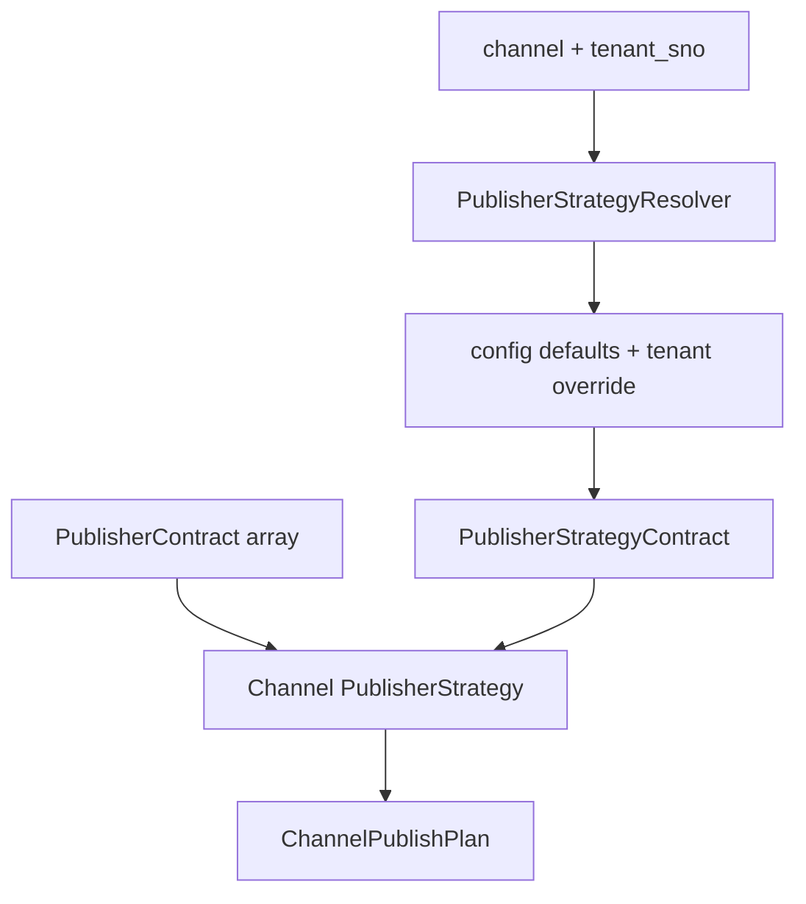

# BATS Publisher Strategy Contract (Phase 9-B-18)

## Phase 9-B-18 目的

在既有 BATS 架構中，於 **PublisherContract** 之後建立 **通道策略層（Publisher Strategy）** 的概念與契約定義。

本階段**只落地文件與 config example**，不實作正式 Strategy class、不接入 LINE webhook、不發送訊息。

```
SearchCondition
      ↓
Platform Mapping (RegionKeywordMapper)
      ↓
SearchUrlBuilder
      ↓
MultiSourceSearchUrlBuilder
      ↓
SourceSearchResultContract
      ↓
ResultToPublisherMapper
      ↓
PublisherContract                    ← 可發佈內容（channel-agnostic）
      ↓
PublisherStrategyContract          ← 通道發佈策略（本 Phase 定義）
      ↓
(未來) ChannelPublishPlan
      ↓
(未來) Line / Gemini / Web Chat / Telegram / APP Renderer
```

---

## PublisherStrategyContract 責任邊界

**PublisherStrategyContract** 回答：

> 在指定 **channel** 下，如何**裁剪、組版、限制**一批 `PublisherContract`，再交給下游 Renderer？

| 負責 | 不負責 |
|------|--------|
| `max_items`、文字長度、連結政策 | 商品搜尋、URL 組裝 |
| `message_mode`、fallback 行為 | LINE Flex JSON、Gemini Prompt |
| 租戶/channel 策略覆寫規則 | 實際 HTTP 發送、webhook 流程 |
| 指向未來 `payload_schema_version` | SQL、`.env`、Host B |

---

## 與 PublisherContract 的差異

| 層級 | 粒度 | 內容 |
|------|------|------|
| **PublisherContract** | 單筆商品 | `title`、`primary_url`、`actions`、`metadata` |
| **PublisherStrategyContract** | 單次發佈任務 | `channel`、`max_items`、`link_policy`、`fallback_policy` |

**PublisherContract** = **WHAT**（發什麼）。  
**PublisherStrategyContract** = **HOW**（在該通道怎麼發）。

同一筆 `PublisherContract` 可搭配不同 channel 的策略，產生不同 `ChannelPublishPlan`，無需修改商品中介內容。

---

## 與 ResultToPublisherMapper 的差異

| 元件 | 輸入 → 輸出 | 職責 |
|------|-------------|------|
| **ResultToPublisherMapper** | `SourceSearchResultContract` → `PublisherContract` | 搜尋結果 → 可發佈內容（固定 field mapping） |
| **PublisherStrategyContract** | 不轉換單筆商品欄位 | 定義**一批** PublisherContract 在通道上的處理規則 |

Mapper 在策略層**之前**；策略層**不**取代 Mapper，也**不**修改 Mapper 輸出 schema。

---

## PublisherStrategyContract Schema

| 欄位 | 必填 | 型別 | 說明 |
|------|------|------|------|
| `schema_version` | 否（預設 1） | int | 策略契約版本 |
| `channel` | **是** | string | `line` / `gemini` / `web_chat` / `telegram` / `app` |
| `strategy_name` | **是** | string | 策略 ID，供 config / resolver 查找 |
| `max_items` | **是** | int | 單次回覆最多商品數 |
| `message_mode` | **是** | string | 組版模式（見下表） |
| `link_policy` | **是** | object | 連結處理規則 |
| `text_format_policy` | **是** | object | 標題/摘要/metadata 裁剪 |
| `button_policy` | **是** | object | actions 數量與類型 |
| `fallback_policy` | **是** | object | 空結果、溢出、錯誤 |
| `payload_schema_version` | **是** | int | 下游 Renderer plan 版本 |
| `tenant_override_policy` | 否 | object | 租戶可覆寫鍵白名單 |

### message_mode 建議值

| channel | message_mode | 說明 |
|---------|--------------|------|
| line | `multi_message_short_text` | 多則短文字 |
| gemini | `structured_context_block` | 結構化 context 區塊 |
| web_chat | `card_list` | 卡片列表 |
| telegram | `markdown_message` | Markdown 單/少則 |
| app | `structured_json` | JSON payload plan |

### link_policy 子欄位

| 鍵 | 說明 |
|----|------|
| `mode` | `short_url_preferred` / `full_url` / `deep_link_preferred` |
| `max_url_length` | URL 顯示長度上限 |
| `allow_secondary_urls` | 是否帶 secondary_urls |

### text_format_policy 子欄位

| 鍵 | 說明 |
|----|------|
| `max_title_length` | 標題上限 |
| `max_summary_length` | 摘要上限 |
| `include_metadata_keys` | 允許帶入 metadata 的 key 列表 |
| `truncate_suffix` | 截斷後綴（如 `…`） |

### button_policy 子欄位

| 鍵 | 說明 |
|----|------|
| `mode` | `single_primary_action` / `multi_action` / `none` |
| `max_actions_per_item` | 每商品最多 actions |
| `allowed_action_types` | 如 `["open_url"]` |

### fallback_policy 子欄位

| 鍵 | 說明 |
|----|------|
| `on_empty_results` | 如 `send_keyword_search_link` |
| `on_item_overflow` | 如 `truncate_with_notice` |
| `overflow_notice` | 溢出提示模板 |

---

## 五通道策略差異

| 維度 | LINE | Gemini | Web Chat | Telegram | APP |
|------|------|--------|----------|----------|-----|
| **max_items** | 10 | 20~50 | 15 | 10 | 分頁 |
| **文字** | 短、多則 | 完整摘要 OK | 卡片標題+描述 | Markdown | structured fields |
| **連結** | 短網址優先 | 完整 URL | 完整 URL + 按鈕 | Markdown link | deep link |
| **按鈕** | 每項 ≤1 | 列 actions 即可 | 多 actions | inline keyboard plan | native actions |
| **輸出** | 短訊息 plan | context block plan | card list plan | markdown plan | JSON plan |

**重要：** 上表為**策略參數**差異，不是 LINE Flex / Gemini Prompt 本體。

---

## Config Driven 設計

策略由設定檔驅動，不硬編碼在 Builder / Mapper core。

```
config/examples/publisher_strategies.example.php   ← 本 Phase 範例
(未來) config/publisher_strategies.php             ← 正式載入
(未來) GCS tenant override                        ← 與 9-B-5 模式一致
```

### 解析優先序（未來 PublisherStrategyResolver）

```
1. defaults[channel]
2. merge tenants[tenant_sno][channel]（若 tenant_override_policy.enabled）
3. runtime channel 參數確認
```

範例設定見：`config/examples/publisher_strategies.example.php`

---

## Contract Driven 設計

Phase 9-B-18 以**文件 + JSON-like PHP array schema** 定義契約。

Phase 9-B-18.1 / 9-B-19 計畫：

- `PublisherStrategyContract.php` — 常數與 normalize
- `PublisherStrategyContractValidator.php` — 驗證
- `tests/product_sources/test_publisher_strategy_contract.php`

與 SearchCondition / PublisherContract 相同模式，保持可測試、可版本化。

---

## Adapter Driven 設計

未來介面（本 Phase **不實作**）：

```
PublisherStrategyInterface
    apply(PublisherContract[], PublisherStrategyContract): ChannelPublishPlan

BasePublisherStrategy
    共用 truncate / max_items / fallback

LinePublisherStrategy
GeminiPublisherStrategy
WebChatPublisherStrategy
TelegramPublisherStrategy
AppPublisherStrategy

PublisherStrategyResolver
    resolve(channel, tenant_sno): PublisherStrategyContract
    getAdapter(channel): PublisherStrategyInterface
```

---

## PublisherStrategyResolver 未來流程



1. 入口帶入 `channel`、`tenant_sno`、`PublisherContract[]`
2. Resolver 載入並 merge 策略設定
3. 驗證 `PublisherStrategyContract`（未來 Validator）
4. 選擇 channel-specific Strategy adapter
5. 產出 `ChannelPublishPlan`（仍非 LINE API payload）

---

## ChannelPublishPlan 未來概念

**ChannelPublishPlan** 是策略層輸出、Renderer 層輸入的中間結構（9-B-19+ 定義）。

| 屬性 | 說明 |
|------|------|
| `channel` | 目標通道 |
| `strategy_name` | 使用的策略 |
| `items` | 裁剪後的商品展示單元（含 truncated title/summary/url） |
| `layout` | `multi_message` / `card_list` / `context_block` 等 |
| `fallback_message` | 空結果或溢出提示 |
| `payload_schema_version` | Renderer 版本 |

**仍不包含：** LINE `type: bubble`、Gemini system prompt、Telegram `reply_markup` JSON。

---

## Phase 9-B-19 ~ 9-B-21 Roadmap

| Phase | 內容 | 產出 |
|-------|------|------|
| **9-B-18** | 文件 + config example | 本文件、`publisher_strategies.example.php` |
| **9-B-18.1** | `PublisherStrategyContract` + Validator + test | PHP contract 層 |
| **9-B-19** | `PublisherStrategyResolver` + `LinePublisherStrategy` skeleton | 第一個 channel adapter |
| **9-B-20** | `ChannelPublishPlan` + `LineRenderer` skeleton | plan → 仍不發 LINE |
| **9-B-21** | Mapper → Strategy → Plan 整合測試 | end-to-end plan pipeline |

---

## 安全限制與不觸碰範圍

Phase 9-B-18 **不得**修改：

| 範圍 | 原因 |
|------|------|
| `core/product_source/*` 既有 PHP | 已驗證 BATS core |
| SearchCondition / SearchUrlBuilder / Mapper | 穩定 baseline |
| LINE webhook 正式流程 | 非本 Phase 範圍 |
| `.env` / SQL | 環境與資料層保護 |
| `docs/LEGACY_WWW_RECOVERY_20260528.md` | 維持 untracked |

---

## 相關文件

| 文件 | Phase |
|------|-------|
| `docs/PUBLISHER_CONTRACT_PHASE9B16.md` | 9-B-16 |
| `docs/RESULT_TO_PUBLISHER_MAPPER_PHASE9B17.md` | 9-B-17 |
| `docs/SOURCE_SEARCH_RESULT_CONTRACT_PHASE9B15.md` | 9-B-15 |
| `config/examples/publisher_strategies.example.php` | 9-B-18 範例 |

## 範例設定

```powershell
# 本 Phase 僅供閱讀，未 wired 至 runtime
notepad C:\bbc-ai-bot\config\examples\publisher_strategies.example.php
```

---

## Phase 9-B-18.1 實作紀錄

本階段完成 **Contract + Validator + Test**，未接入 runtime、未建立 Strategy / Renderer。

| 檔案 | 說明 |
|------|------|
| `core/product_source/PublisherStrategyContract.php` | `fromArray()` / `toArray()` |
| `core/product_source/PublisherStrategyContractValidator.php` | `collectViolations()` / `validate()` |
| `tests/product_sources/test_publisher_strategy_contract.php` | 6 個測試案例 |

**留待後續 Phase：**

- `PublisherStrategyResolver`
- `ChannelPublishPlan`
- `LinePublisherStrategy` / 其他 channel adapter
- Renderer / LINE webhook 接入

### 測試

```powershell
C:\Web\xampp\php\php.exe C:\bbc-ai-bot\tests\product_sources\test_publisher_strategy_contract.php
```

---

## Phase 9-B-19 實作紀錄

本階段完成 **PublisherStrategyResolver** 與 **LinePublisherStrategy skeleton**，未建立 ChannelPublishPlan、Renderer、LINE API 整合。

| 檔案 | 說明 |
|------|------|
| `core/product_source/publisher_strategy/PublisherStrategyInterface.php` | `applyStrategy()` 介面 |
| `core/product_source/publisher_strategy/BasePublisherStrategy.php` | `truncateText` / `limitItems` / `applyFallback` |
| `core/product_source/publisher_strategy/LinePublisherStrategy.php` | LINE skeleton（array 輸出） |
| `core/product_source/publisher_strategy/PublisherStrategyResolver.php` | config 載入 + tenant merge + line only |
| `tests/product_sources/test_publisher_strategy_resolver.php` | resolver / strategy 測試 |

**尚未完成：**

- `ChannelPublishPlan` 正式 contract
- Renderer（LINE Flex / text / Gemini / Web Chat）
- LINE webhook 接入
- Gemini / Web Chat / Telegram / APP strategy class

### 測試

```powershell
C:\Web\xampp\php\php.exe C:\bbc-ai-bot\tests\product_sources\test_publisher_strategy_resolver.php
```
