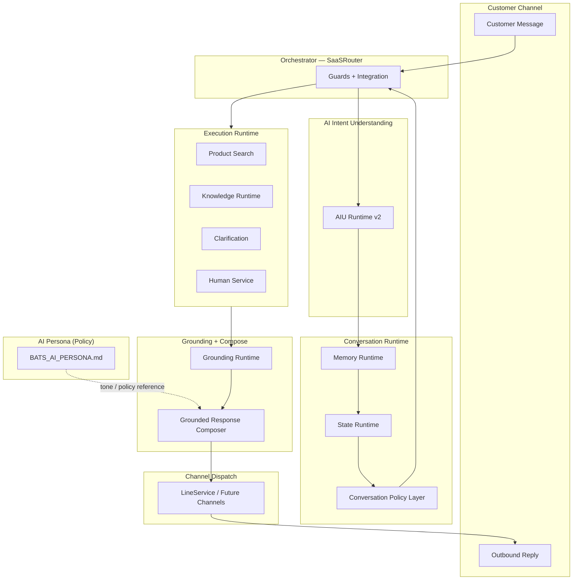
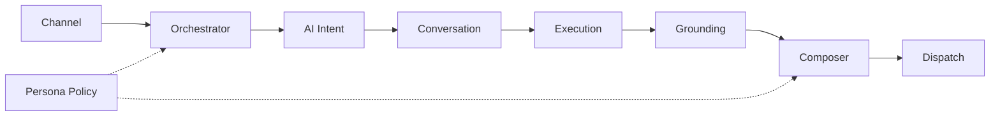
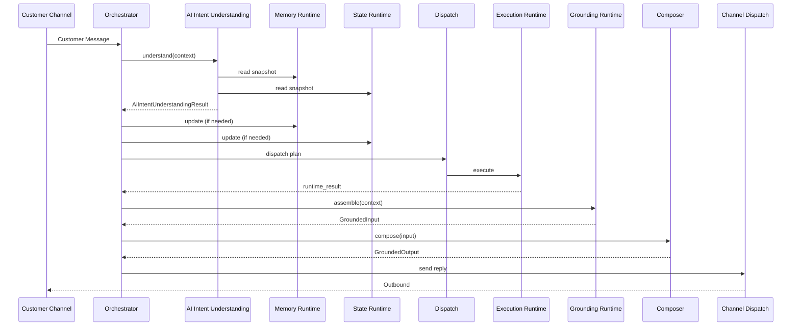
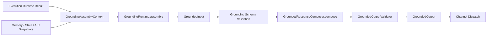
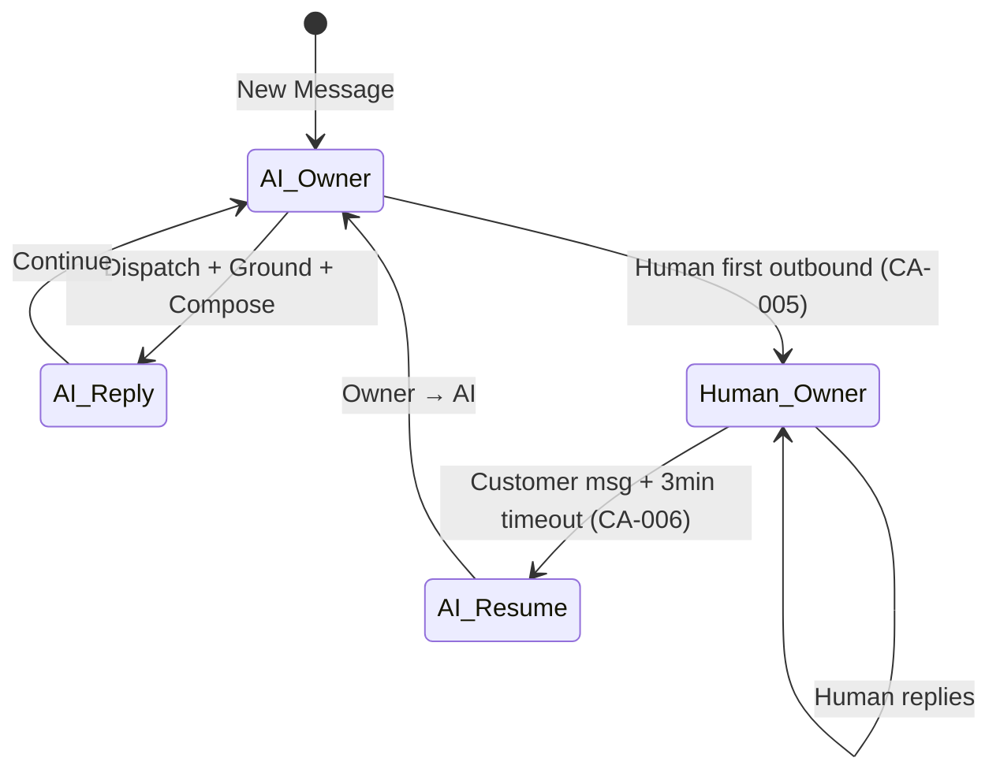
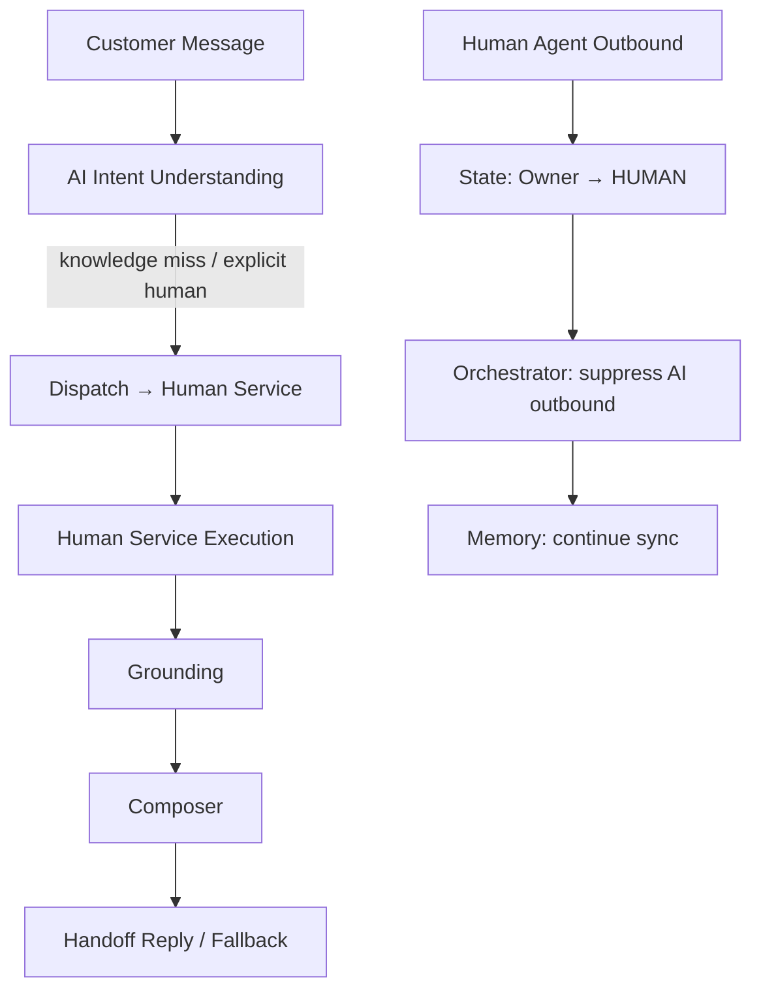

# BBC AI Runtime

**專案：** BBC AI SaaS / BATS  
**定位：** L1 架構 SSOT — **BBC AI Runtime** 最高層整合架構唯一正式依據  
**Version：** v1.1 Freeze（Architecture Refinement）  
**Status：** Architecture Freeze — Four-Core Doctrine 增補（Backward Compatible）  
**Layer：** L1 Architecture  
**主機參考：** 103.1.222.14（主機 A · `C:\bbc-ai-bot`）  
**Branch：** feature/api-gateway-mvp

> 本文件為 **BBC AI Runtime 最高層 L1 Architecture SSOT**。定義 Runtime 整合願景、層級關係、依賴規則、資料流、治理與演進路線。
>
> **本文件僅負責 Architecture Integration。** 不得在本文件重複定義任何 L2 / L3 Runtime 之契約、欄位表或實作細節；細節一律引用下層 SSOT。
>
> **衝突處理：**
> - BBC Core Principles → `BATS_AI_PERSONA.md` §0（最高設計原則）
> - 統一 Conversation Pipeline → `BATS_AI_CONVERSATION_ARCHITECTURE.md`（L2）
> - 各 Runtime 契約 → 對應 L3 SSOT（見 §18）
> - SSOT Authority → `BATS_AI_PERSONA.md` §0.7：SSOT 決策優先於程式現況

---

## 文件目錄

| 章節 | 標題 |
|------|------|
| §1 | Document Purpose |
| §2 | Architecture Vision |
| §3 | BBC AI Core Principles |
| §3.1 | AI × Runtime Four-Core Doctrine |
| §3.2 | L1 Operational Doctrine |
| §4 | BBC AI Runtime Overview |
| §5 | Runtime Layer Diagram |
| §6 | Runtime Dependency |
| §7 | Core Runtime Components |
| §8 | Runtime Responsibilities |
| §9 | Runtime Boundary |
| §9.4 | Gemini × Runtime Architecture Boundary |
| §10 | Runtime Sequence |
| §11 | Runtime Data Flow |
| §12 | Grounded Response Flow |
| §13 | Conversation Flow |
| §14 | Human Service Flow |
| §15 | Runtime Governance |
| §16 | Runtime Golden Rules |
| §17 | Architecture Freeze Decisions |
| §18 | Relationship with Existing SSOT |
| §19 | Runtime Evolution |
| §20 | Phase 3 Relationship |
| §21 | Phase 4 Relationship |
| 附錄 A | Cross-Reference Index |
| 附錄 B | L1 Freeze Checklist |

---

## 1. Document Purpose

### 1.1 定位

建立 **BBC AI Runtime v1.0** 的 L1 整合架構 SSOT，作為所有 L2 / L3 Runtime 文件之上、Orchestrator 與 Channel 之下的**唯一整合視圖**。

| 本文件負責 | 本文件不負責 |
|------------|--------------|
| Runtime 整合願景與層級關係 | 各 Runtime Public Contract |
| 跨 Runtime 依賴與禁止依賴 | 欄位表 / DTO 定義 |
| 端到端 Sequence / Data Flow | Coding / 檔案路徑 / Feature Flag 實作 |
| L1 Governance / Golden Rules / Freeze | Persona 話術 / 語意欄位 / NLG 規則 |
| Phase 2→3→4 演進定位 | 重複 L2 Conversation Model 細節 |

### 1.2 讀者

- 架構 Review / Freeze 簽核
- Runtime Owner 對齊邊界
- Phase 3 / Phase 4 規劃之整合基線

### 1.3 非目標

- 不新增 Runtime
- 不修改 L2 / L3 已 Freeze 之架構決策
- 不取代 `BATS_AI_RUNTIME_DESIGN.md`（L3 接入順序 Companion）

---

## 2. Architecture Vision

**BBC AI Runtime** 是一套 **Grounded、可治理、AI + Human 協作** 的多租戶對話 Runtime 整合架構。

```
Understand → Remember → Continue → Collaborate → Ground → Compose → Dispatch
```

| 信條 | 說明 |
|------|------|
| **Grounded Only** | 對外回覆僅來自已授權 Execution + Grounding 之事實 |
| **Understand Before Execute** | 意圖理解先於任何 Execution Runtime |
| **Single Owner Reply** | 任一時刻僅 Conversation Owner 可正式回覆客戶 |
| **Protect Before Extend** | 新能力以 Additive 接入；Legacy 保留 fallback |
| **SSOT Layered** | L1 整合、L2 Pipeline、L3 Runtime Contract 分層不重複 |

**Phase 2 收斂成果（v1.0 基線）：** AIU v2 Freeze、Conversation Architecture Adopt、Grounded Response Composer v1.0 Freeze、Grounding Layer v1.0/v1.1 Freeze + F-3 Validation PASS（travel_b pilot）。

---

## 3. BBC AI Core Principles

> **權威來源：** `BATS_AI_PERSONA.md` §0。本節為 L1 整合視圖之摘要；衝突時以 Persona §0 為準。

| Principle | L1 落地 |
|-----------|---------|
| **Grounded Only** | Execution → Grounding → Composer；無 grounded facts 不得對外 NLG |
| **Runtime First** | 先定 Runtime 邊界與 SSOT，再 Coding（DDD） |
| **Runtime Separation** | 理解 / 記憶 / 狀態 / 執行 / 組裝 / 組句 / 派送 分層 |
| **Single Responsibility** | 每 Runtime 單一職責；Orchestrator 只做整合與閘門 |
| **AI + Human Collaboration** | Owner 模型 + Takeover + Resume + Memory 連續性 |
| **Protect Before Extend** | Feature flag、Legacy path、Rollback playbook |
| **SSOT First** | L1→L2→L3 分層；不得因程式反向改 SSOT |
| **Document Driven Development（DDD）** | Architecture Freeze 後才 Coding |

**既有三條 Core Principles（Frozen，不得新增衝突原則）：**

1. **AI Intent Understanding Before Runtime**（L2 CA-009；L3 `BATS_AI_INTENT_UNDERSTANDING_V2.md`）
2. **Grounded Response Only**（L2 CA-008；L3 GRC + Grounding Layer）
3. **Protect Before Extend**（`BATS_AI_RUNTIME_DESIGN.md` §14）

### 3.1 AI × Runtime Four-Core Doctrine

> **定位：** L1 整合架構之 **Four-Core 分工表**；**非**新增 Persona Core Principle（Persona §0 三原則維持 Freeze）。詳細契約仍見各 L3 SSOT。

| Core | Owner | Responsibility |
|------|-------|----------------|
| **Understand** | **Gemini**（AI Intent Understanding v2） | 理解使用者真正意圖；Semantic / Context / Conversation / Intent / Entity / Clarification / Confidence |
| **Execute** | **BBC Runtime** | 執行 Product Runtime、Knowledge Runtime、Conversation Runtime、Human Runtime、Grounding Runtime |
| **Express** | **Gemini**（Grounded Response Composer） | 僅依 **Grounded Facts** 組織自然、多樣化回覆；**不**新增、**不**修改、**不**推測、**不**補充事實 |
| **Govern** | **BBC Runtime** | Business Rules、Grounded Safety、多租戶、安全治理、權限、Policy、Feature Flag |

**Cross-Reference：**

| Core | L3 SSOT |
|------|---------|
| Understand | `BATS_AI_INTENT_UNDERSTANDING_V2.md` §3.4 |
| Execute | L2 `BATS_AI_CONVERSATION_ARCHITECTURE.md` §13；L3 Execution / Grounding SSOT |
| Express | `BATS_AI_GROUNDED_RESPONSE_COMPOSER.md` §16 |
| Govern | 本文件 §15；`BATS_AI_PERSONA.md` §0；Grounding 附錄 C–E |

**設計信條（與 Core Principle #1 / #2 對映，非新 Principle）：**

```
Gemini: Understand + Express
BBC Runtime: Execute + Govern
Facts are Grounded. Language is Generative.
```

### 3.2 L1 Operational Doctrine

> **定位：** L1 **Operational Doctrine**（操作層設計紀律）；**不是** Persona Core Principle #4。與 IU-005「不新增 Core Principle」相容。

**能力集中原則：**

| 層 | 能力集中 |
|----|----------|
| **AI（Gemini）** | **Understand** + **Express** |
| **BBC Runtime** | **Execute** + **Govern** |

**新功能歸屬 Gate（Architecture Review 必答）：**

任何新功能上線前，**必須**先判定主要歸屬：

1. 屬於 **AI（Understand / Express）**？→ 走 AIU v2 / Grounded Composer / Gemini 路徑
2. 屬於 **Runtime（Execute / Govern）**？→ 走 Execution / Grounding / State / Policy / Orchestrator 路徑

**禁止：**

- 能力重疊（同一職責同時由 AI 與 Runtime 各做一套）
- Responsibility 混亂（Composer 查 Knowledge、Runtime 做 NLG Intent 等）
- Runtime 耦合（Gemini 直接控制 Dispatch / State）
- **Keyword Patch** 作為 AI Intent 終態（見 AIU v2 §3.4 Legacy Transition）

**Backward Compatible：** 本 Doctrine **不修改** F-1～F-5、L1-F-001～L1-F-008、Persona 三 Core Principles；僅補充 L1 整合視圖。

---

## 4. BBC AI Runtime Overview

BBC AI Runtime v1.0 由 **Orchestrator（SaaSRouter）** 串接下列邏輯 Runtime，形成端到端 Production Path：

| # | Runtime / Layer | L1 一句話 | SSOT 層級 |
|---|-----------------|-----------|-----------|
| 0 | **Customer Channel** | 客戶訊息入口（LINE OA / Web / Future） | Integration |
| 1 | **AI Persona** | 定義 AI 如何說話、邊界與品牌人格（非 Runtime 程式） | L0 Policy |
| 2 | **AI Intent Understanding** | 理解意圖並產出 dispatch 計畫（唯讀聚合） | L3 |
| 3 | **Conversation Runtime** | 記憶本次對話上下文 + 管理 Owner/Status/Resume | L2 |
| 4 | **Execution Runtime** | 執行 Product / Knowledge / Clarification / Human 等業務 | L2 + L3 |
| 5 | **Grounding Runtime** | 將 Execution 輸出組裝為 `GroundedInput` | L3 |
| 6 | **Grounded Response Composer** | 依 grounded facts 組句（NLG / Layout / Validation） | L3 |
| 7 | **Channel Dispatch** | 將 `GroundedOutput` 送至 Channel（LINE 等） | Integration |

> **L1 整合說明：** L2 CA-001 將 Conversation 拆分為 Memory Runtime + State Runtime + Policy Layer；L1 以 **Conversation Runtime** 統稱「記憶 + 狀態 + Lifecycle Policy」之整合職責，細節見 L2。Execution Runtime 在 L1 圖中不展開子 Runtime，避免與 L2 Dispatch 重複。

---

## 5. Runtime Layer Diagram



**ASCII 整合視圖（L1）：**

```text
Customer Channel
        │
AI Persona (Policy Reference)
        │
Orchestrator (SaaSRouter)
        │
AI Intent Understanding
        │
Conversation Runtime ── Memory + State + Policy
        │
Runtime Dispatch
        │
Execution Runtime ── Product / Knowledge / Clarification / Human
        │
Grounding Runtime
        │
Grounded Response Composer
        │
Channel Dispatch
```

---

## 6. Runtime Dependency

### 6.1 允許依賴（Downstream may consume Upstream output）



| 依賴方 | 可讀取 / 消費 | 方式 |
|--------|---------------|------|
| **Orchestrator** | Channel payload、Tenant Registry、Feature Flags | 入口整合 |
| **AI Intent Understanding** | Memory / State **snapshot**（唯讀） | 注入 Context |
| **Conversation Runtime** | Customer Message、Human Agent Events | 讀寫 Memory / State |
| **Execution Runtime** | Dispatch 結果、Tenant Context、Search Intent | 業務執行 |
| **Grounding Runtime** | Execution result、AIU projection、Memory/State snapshot | `GroundingAssemblyContext` 注入 |
| **Composer** | `GroundedInput` | **唯一** Consumer Input |
| **Dispatch** | `GroundedOutput` | Channel 傳輸 |

### 6.2 禁止依賴（硬性）

| 禁止 | 原因 | SSOT |
|------|------|------|
| **Grounding → Composer**（呼叫） | 單向：Grounding 產出 Input；不得反向 | Grounding §13 |
| **Composer → Knowledge Runtime**（直接查詢） | CA-008：Composer 不得查 Runtime | L2 CA-008 |
| **Composer → Product Runtime** | 同上 | L2 CA-008 |
| **Composer → AIU / Memory API** | 僅消費 GroundedInput | GRC §11 |
| **Grounding → 上游 Runtime API** | 組裝層；資料由 Orchestrator 注入 | Grounding §13 |
| **Execution → Conversation State 寫入** | State 唯一管理者 = State Runtime | L2 CA-010 |
| **AIU → State / Memory 寫入** | AIU 唯讀聚合 | AIU IU-002 |

### 6.3 Runtime Dependency Matrix

|  | Persona | AIU | Conversation | Execution | Grounding | Composer | Dispatch |
|--|---------|-----|--------------|-----------|-----------|----------|----------|
| **Persona** | — | ref | ref | — | — | ref | — |
| **AIU** | — | — | read snapshot | — | — | — | — |
| **Conversation** | — | — | internal | — | — | — | — |
| **Execution** | — | dispatch in | read | internal | — | — | — |
| **Grounding** | — | projection in | snapshot in | result in | — | **禁止 call** | — |
| **Composer** | ref | **禁止** | via Input | **禁止** | Input only | — | — |
| **Dispatch** | — | — | — | — | — | Output in | — |

---

## 7. Core Runtime Components

| Component | Role | Owner SSOT |
|-----------|------|------------|
| **Orchestrator** | Pipeline 整合、Guards（Human / FinalReply）、Feature Flag 路由 | `BATS_AI_RUNTIME_DESIGN.md` |
| **AI Intent Understanding Runtime** | L1 Decision Layer；`AiIntentUnderstandingResult` | `BATS_AI_INTENT_UNDERSTANDING_V2.md` |
| **Conversation Memory Runtime** | Customer Memory Card 讀寫 | `BATS_AI_CONVERSATION_MEMORY.md` |
| **Conversation State Runtime** | Owner / Status / Takeover / Resume / Maintenance | `BATS_AI_CONVERSATION_ARCHITECTURE.md` |
| **Conversation Policy Layer** | Completion / Recommendation Eligibility | L2 §12 |
| **Runtime Dispatch** | 路由至 Execution；不判斷意圖 | L2 §13 |
| **Product Search Runtime** | 語意搜尋、推薦 | `BATS_AI_SEMANTIC_SEARCH.md` + Runtime Design |
| **Knowledge Runtime** | Tenant Private / Industry Shared 知識解析 | `BATS_DATA_SYNC_POLICY.md` §Knowledge Levels |
| **Human Service Runtime** | 轉人工、fallback、handoff | L2 §8 + Data Sync Policy Level 4 |
| **Grounding Layer Runtime** | `GroundingRuntime::assemble()` → `GroundedInput` | `BATS_AI_GROUNDING_LAYER.md` |
| **Grounded Response Composer** | `compose(GroundedInput)` → `GroundedOutput` | `BATS_AI_GROUNDED_RESPONSE_COMPOSER.md` |
| **Channel Dispatch** | LINE outbound / webhook ingress | Webhook + `LineService` |

---

## 8. Runtime Responsibilities

> L1 摘要。詳細 Responsibilities / Out of Scope 見各 L3 SSOT。

| Runtime | Responsibilities（一句話） | Out of Scope（一句話） |
|---------|---------------------------|------------------------|
| **AI Persona** | 定義對外互動人格、安全邊界、Commerce 原則 | 不執行 Runtime、不組裝 facts |
| **AI Intent Understanding** | 理解意圖、產出 `dispatch_plan`（唯讀聚合） | 不搜尋、不組句、不寫 State |
| **Conversation Memory** | 維護 Customer Memory Card | 不決定 Owner、不 Dispatch |
| **Conversation State** | 唯一 State 管理者（Owner/Status/Takeover/Resume） | 不執行業務、不 NLG |
| **Conversation Policy** | Lifecycle 收尾、Recommendation Eligibility | 不取代 State Runtime |
| **Runtime Dispatch** | 依 dispatch 路由 Execution | 不判斷意圖、不管理 State |
| **Knowledge Runtime** | 解析並回傳 grounded knowledge facts | 不組句、不決定 Intent |
| **Product Search Runtime** | 語意搜尋與 product facts | 不組句、不管理 State |
| **Human Service Runtime** | 人工服務路徑與 handoff 事實 | 不取代 State Takeover 決策 |
| **Grounding Runtime** | 組裝完整 `GroundedInput` | 不 NLG、不呼叫上游 API |
| **Grounded Response Composer** | Grounded NLG + Layout + Validator | 不查 Runtime、不新增 facts |
| **Channel Dispatch** | 傳輸層 outbound | 不理解意圖、不組裝 Input |

---

## 9. Runtime Boundary

### 9.1 L1 Boundary 原則

| ID | 原則 |
|----|------|
| **L1-B-001** | L1 只定義**整合邊界**；元件邊界以 L2 / L3 為準 |
| **L1-B-002** | Orchestrator 為**唯一** Production Pipeline 串接點（SaaSRouter） |
| **L1-B-003** | Execution 與 Grounding **分離**：Execution 產 facts；Grounding 組 Input |
| **L1-B-004** | Composer **單向消費** Grounding 產出 |
| **L1-B-005** | Human Takeover：**Primary Guard = Orchestrator**；Composer Defense-in-Depth |

### 9.2 Ownership（L1 視圖）

| Artifact | Producer | Consumer | Contract SSOT |
|----------|----------|----------|---------------|
| `AiIntentUnderstandingResult` | AIU Runtime | Orchestrator / Dispatch | AIU v2 §5 |
| Customer Memory Card | Memory Runtime | AIU / Grounding（snapshot） | Conversation Memory |
| Conversation Owner/Status | State Runtime | Orchestrator Guards | L2 §6 |
| Execution `runtime_result` | Execution Runtime | Grounding（via Context） | L2 + L3 |
| `GroundedInput` | Grounding Runtime | Composer | GRC §8.5 + Grounding §14 |
| `GroundedOutput` | Composer | Dispatch | GRC §9.5 |

### 9.3 Relationship（L1）

```text
L1 BBC_AI_RUNTIME.md
  ├── integrates → L2 BATS_AI_CONVERSATION_ARCHITECTURE.md
  ├── references → L0 BATS_AI_PERSONA.md
  └── delegates contracts → L3 (AIU, GRC, Grounding, Semantic Search, …)
```

### 9.4 Gemini × Runtime Architecture Boundary

> **確認 Four-Core 硬邊界**（§3.1）。本節為 L1 摘要；實作細節見 AIU v2 §3.4、GRC §16。

**Gemini 負責：Understand、Express**

| Gemini 負責 | 說明 |
|-------------|------|
| Understand | AI Intent Understanding v2 — Semantic / Intent / Context / Conversation / Confidence |
| Express | Grounded Response Composer — 在 Grounded Facts 約束下生成自然語言 |

**Gemini 永遠不直接：**

| 禁止 | 歸屬 |
|------|------|
| 搜尋商品 / 查知識庫 | Execution Runtime |
| 決定 Business Rule / Policy | Govern（Orchestrator / State / Policy） |
| 控制 Runtime Dispatch / State 轉移 | BBC Runtime |
| 決定或發明 Grounded Facts | Execution + Grounding |

**BBC Runtime 負責：Execute、Govern**

| BBC Runtime 負責 | 說明 |
|------------------|------|
| Execute | Product / Knowledge / Conversation / Human / Grounding 業務執行 |
| Govern | Business Rules、Grounded Safety、多租戶、權限、Feature Flag、Validator Gate |

**BBC Runtime 永遠不直接：**

| 禁止 | 歸屬 |
|------|------|
| 理解自然語言（終態 Intent） | Gemini / AIU v2 |
| Keyword Patch 取代 AI Intent Understanding v2 | 禁止（Legacy Transition 除外，見 AIU §3.4） |
| Template 化 AI Response 作為長期 SSOT | Express 屬 Generative NLG（GRC §16.2） |

---

## 10. Runtime Sequence

### 10.1 Standard Message Sequence（Owner = AI）



### 10.2 Guard Insertion Points

| Guard | 位置 | 行為 |
|-------|------|------|
| **Human Primary Guard** | Orchestrator outbound 前 | `Owner=HUMAN` → 不送 AI reply |
| **Final Reply Gate** | LINE 送出前 | 最後一道 outbound 閘門 |
| **Composer Human Guard** | Composer 內 | Defense-in-depth suppress |

---

## 11. Runtime Data Flow

```text
Customer Message (raw text)
  → AIU: intent + dispatch_plan + entity projection + execution_hint (advisory)
  → Memory: Customer Memory Card (read/write)
  → State: owner, status, resume_context, last_human_message_at
  → Dispatch: runtime_type label
  → Execution: runtime_result { grounded_facts, product_list, … }
  → Grounding: GroundedInput { metadata, conversation_context, reply_policy, … }
  → Composer: GroundedOutput { reply_text, reply_type, … }
  → Dispatch: channel payload
```

**資料所有權（L1）：**

| 資料 | 權威來源 | 不得由誰發明 |
|------|----------|--------------|
| 客戶原文 | Channel → metadata.customer_query | Composer |
| 意圖 / 路由 | AIU dispatch_plan | Composer / Grounding |
| 對話記憶 | Memory Card | Composer |
| Owner / Status | State Runtime | Execution / AIU |
| 業務 facts | Execution runtime_result | Composer / Grounding |
| 組裝後 Input | Grounding | Composer mutate |
| 對外文案 | Composer | 不得超出 facts |

---

## 12. Grounded Response Flow



**L1 信條：** `Facts are assembled in Grounding. Language is composed in Composer.`

| 階段 | 產出 | SSOT |
|------|------|------|
| Execution | 原始 grounded facts | L2 / L3 Execution |
| Grounding | `GroundedInput` schema_version=1 | `BATS_AI_GROUNDING_LAYER.md` |
| Composer | `GroundedOutput` | `BATS_AI_GROUNDED_RESPONSE_COMPOSER.md` |
| Pilot Path | travel_b authoritative ON（F-3 PASS） | Grounding 附錄 C–E |

---

## 13. Conversation Flow



**L1 Conversation 整合要點：**

| 流程 | 觸發 | Runtime 參與 |
|------|------|--------------|
| **Normal AI Reply** | Owner=AI | AIU → Memory → State → Execution → Grounding → Composer |
| **Clarification** | Ambiguous / 缺槽 | Clarification Execution → Grounding → Composer |
| **Waiting Ack** | Policy / State | Waiting Execution → Grounding → Composer |
| **Maintenance Message** | State Runtime | State 發出；非 Owner 正式回覆（CA-007） |
| **Completion / Closing** | Policy Layer | Recommendation Eligibility（CA-012） |

---

## 14. Human Service Flow



**L1 Human 整合規則：**

| 項目 | 規格 | SSOT |
|------|------|------|
| **Automatic Takeover** | 真人首次 outbound → Owner=HUMAN | L2 CA-005 |
| **AI 行為** | 停止正式回覆；持續 Memory/State 同步 | L2 §8 |
| **Knowledge 四層 Fallback** | Tenant → Industry → Global → Human | Data Sync Policy |
| **Composer** | Human Guard 可 suppress | GRC F-GRC-5 |
| **Resume** | 3 分鐘 sliding timeout 後 AI 恢復 | L2 CA-004 / CA-006 |

---

## 15. Runtime Governance

### 15.1 Governance 層級

| 層級 | 內容 | SSOT |
|------|------|------|
| **L1** | 整合 Freeze、跨 Runtime 依賴、演進路線 | **本文件** |
| **L2** | Pipeline、Owner/Status、Dispatch、Grounding 定位 | Conversation Architecture |
| **L3** | Public Contract、Rollout、Validation | 各 Runtime SSOT |
| **Ops** | Feature Flag、Rollback、Acceptance | Grounding 附錄 C–E 等 |

### 15.2 Production Governance（Phase 2 收斂）

| 機制 | 說明 |
|------|------|
| **Feature Flags** | Shadow → Pilot → Expand → Global |
| **Protect Before Extend** | Legacy compose / path 保留 fallback |
| **Validation Gate** | F-3 production validation runner |
| **Rollback Playbook** | Flag OFF → Allowlist → Git Revert |
| **Existing Success Mode** | 未確認不得改 Production path |

### 15.3 Legacy Governance

- **BATS Runtime = 唯一主線**（RD-009）
- travel_a Legacy 僅 Migration / Regression / Rollback Reference
- 不得雙軌同步演進

---

## 16. Runtime Golden Rules

| ID | 規則 |
|----|------|
| **GR-L1-001** | **Grounded Only** — 無 facts 不 NLG |
| **GR-L1-002** | **Understand First** — AIU 先於 Execution |
| **GR-L1-003** | **State Single Owner** — State Runtime 唯一寫 State |
| **GR-L1-004** | **Grounding Single Producer** — Production `GroundedInput` 僅 Grounding |
| **GR-L1-005** | **Composer Consumer Only** — 不查 Runtime |
| **GR-L1-006** | **One Owner Reply** — 僅 Conversation Owner 正式回覆 |
| **GR-L1-007** | **Protect Before Extend** — Additive + Flag + Fallback |
| **GR-L1-008** | **SSOT Layered** — L1 不重定義 L2/L3 |
| **GR-L1-009** | **Tenant Independent** — 架構不得綁單一產業 |
| **GR-L1-010** | **Validation Before Expand** — Pilot PASS 後才 Expand |

---

## 17. Architecture Freeze Decisions

| ID | 決策 | 狀態 |
|----|------|------|
| **L1-F-001** | `BBC_AI_RUNTIME.md` 為 BBC AI Runtime **L1 唯一整合 SSOT** | ✅ Frozen |
| **L1-F-002** | L1 僅 Architecture Integration；**不重定義** L2/L3 Runtime | ✅ Frozen |
| **L1-F-003** | 統一 Pipeline 以 L2 CA-001 為準 | ✅ Frozen |
| **L1-F-004** | BBC Core Principles 以 Persona §0 為最高原則 | ✅ Frozen |
| **L1-F-005** | Grounding → Composer 單向；Composer 不得查 Knowledge | ✅ Frozen |
| **L1-F-006** | Phase 2 完成定義 BBC AI Runtime **v1.0 基線** | ✅ Frozen |
| **L1-F-007** | BATS Runtime 為唯一主線；Legacy 僅 Reference | ✅ Frozen |
| **L1-F-008** | Phase 3 / Phase 4 為 Enhancement / Platform；不修改 v1.0 Core 邊界 | ✅ Frozen |
| **L1-F-009** | **AI × Runtime Four-Core Doctrine**（§3.1）+ **L1 Operational Doctrine**（§3.2）+ **Gemini × Runtime Boundary**（§9.4） | ✅ Frozen（v1.1 Refinement） |

**Freeze 日期：** 2026-07-03（v1.0）；2026-07-04（v1.1 Refinement）  
**Freeze Phase：** BBC AI Runtime v1.1 Architecture Refinement（L1，Backward Compatible）

---

## 18. Relationship with Existing SSOT

### 18.1 SSOT 層級圖

```text
L0  Governance / Persona
      BATS_AI_PERSONA.md
      CO_WORK_POLICY.md
L1  BBC AI Runtime Integration  ← 本文件
L2  Conversation Architecture
      BATS_AI_CONVERSATION_ARCHITECTURE.md
L3  Runtime Contracts
      BATS_AI_INTENT_UNDERSTANDING_V2.md
      BATS_AI_CONVERSATION_MEMORY.md
      BATS_AI_GROUNDED_RESPONSE_COMPOSER.md
      BATS_AI_GROUNDING_LAYER.md
      BATS_AI_SEMANTIC_SEARCH.md
      BATS_AI_TRAVEL_CONSULTANT_POLICY.md
      BATS_AI_RUNTIME_DESIGN.md (接入 Companion)
      BATS_AI_BUSINESS_INTELLIGENCE.md (Phase 4 Analysis)
```

### 18.2 引用對照（不得在本文件重複定義）

| 主題 | SSOT | 本文件角色 |
|------|------|------------|
| Core Principles | `BATS_AI_PERSONA.md` §0 | 摘要 + 對映 |
| Four-Core Doctrine | **本文件 §3.1 / §3.2 / §9.4** | L1 整合 |
| Pipeline / CA-* | `BATS_AI_CONVERSATION_ARCHITECTURE.md` | 整合對齊 |
| AIU Contract | `BATS_AI_INTENT_UNDERSTANDING_V2.md` | 引用 |
| Memory Card | `BATS_AI_CONVERSATION_MEMORY.md` | 引用 |
| GroundedInput/Output | `BATS_AI_GROUNDED_RESPONSE_COMPOSER.md` §8.5/§9.5 | 引用 |
| Grounding assemble | `BATS_AI_GROUNDING_LAYER.md` | 引用 |
| Knowledge Levels | `BATS_DATA_SYNC_POLICY.md` | 引用 |
| Persona / Tone | `BATS_AI_PERSONA.md` | 引用 |
| Runtime 接入順序 | `BATS_AI_RUNTIME_DESIGN.md` | Companion |
| Grounding Rollout | `BATS_AI_GROUNDING_LAYER.md` 附錄 C–E | Ops 引用 |

---

## 19. Runtime Evolution

### 19.1 演進總覽

```text
Phase 2（Completed）
  AIU v2 + Conversation Architecture + GRC v1.0 + Grounding Layer
        ↓
BBC AI Runtime v1.0 Freeze  ← 本文件
        ↓
Phase 3 — Enhancement
  ├─ Grounded Response Enhancement（NLG / Experience / Validator 深化）
  ├─ Conversation Intelligence（Memory / Policy / Resume 智能化）
  └─ Runtime Optimization（效能 / 觀測 / Shadow / Parity）
        ↓
Phase 4 — AI Ecosystem / Platform
  ├─ Business Intelligence（Customer Memory Card 分析）
  ├─ Multi-Channel / Multi-Tenant Scale
  └─ Future Platform Services
```

### 19.2 分類

| 類別 | 內容 | Phase |
|------|------|-------|
| **Core Runtime** | AIU, Conversation, Execution, Grounding, Composer, Dispatch | Phase 2 → **v1.0 Freeze** |
| **Enhancement** | Generative NLG 深化、Experience Layer、Advanced Validation | Phase 3 |
| **Intelligence** | Conversation Policy 智能化、Recommendation 優化 | Phase 3 |
| **Optimization** | Shadow/Parity gates、效能、可觀測性 | Phase 3 |
| **Future Platform** | BI Dashboard、Ecosystem API、Cross-tenant Analytics | Phase 4 |

### 19.3 演進規則

- Phase 3 / 4 **不得**修改 v1.0 Core Runtime 邊界（Protect Before Extend）
- 新能力以 **Additive** 接入；需 SSOT 更新時先 L3 → 再 L2 → 最後 L1 整合摘要
- Legacy path 保留至 Sunset 計畫核准

---

## 20. Phase 3 Relationship

**Phase 3 定位：** Grounded Response Enhancement + Conversation Intelligence + Runtime Optimization。

| 工作流 | 與 v1.0 關係 | 主要 SSOT |
|--------|--------------|-----------|
| **Grounded Response Enhancement** | 深化 Composer（Generative NLG、Layout、Validator） | GRC Future / Phase 2-E 子階段 |
| **Conversation Intelligence** | 強化 Memory / Policy / Resume；不取代 State 唯一管理者 | L2 + Conversation Memory |
| **Runtime Optimization** | Shadow、Parity、Performance；不改 Architecture | Ops runners / Validation gates |
| **Grounding Expand** | Pilot → Expand → Global（附錄 C Stage 3–4） | Grounding 附錄 C–E |

**Phase 3 不做：** 重定義 `GroundedInput` / `GroundedOutput` 欄位表（除非正式 L3 Freeze 修訂）；不移除 Legacy fallback。

---

## 21. Phase 4 Relationship

**Phase 4 定位：** AI Ecosystem — 分析、平台化、多通道規模化。

| 工作流 | 與 v1.0 關係 | 主要 SSOT |
|--------|--------------|-----------|
| **Business Intelligence** | 分析 Customer Memory Card；**非**新 State Model | `BATS_AI_BUSINESS_INTELLIGENCE.md` |
| **Management Dashboard** | 報表 / KPI；非 Runtime | BI §11 |
| **AI Ecosystem** | 跨租戶、跨通道、API 平台化 | Future L1 修訂 |
| **Legacy Sunset** | 全 tenant 遷移後 | Runtime Design §13.5 |

**Phase 4 不做：** 在 BI 層重新定義 Conversation Model；不繞過 Grounding 直接 NLG。

---

## 附錄 A. Cross-Reference Index

| 主題 | SSOT |
|------|------|
| L1 Integration | **本文件** |
| Core Principles | `BATS_AI_PERSONA.md` §0 |
| Conversation Pipeline | `BATS_AI_CONVERSATION_ARCHITECTURE.md` |
| AIU Runtime | `BATS_AI_INTENT_UNDERSTANDING_V2.md` |
| Memory | `BATS_AI_CONVERSATION_MEMORY.md` |
| Composer | `BATS_AI_GROUNDED_RESPONSE_COMPOSER.md` |
| Grounding | `BATS_AI_GROUNDING_LAYER.md` |
| Semantic Search | `BATS_AI_SEMANTIC_SEARCH.md` |
| Travel Policy | `BATS_AI_TRAVEL_CONSULTANT_POLICY.md` |
| Runtime 接入 | `BATS_AI_RUNTIME_DESIGN.md` |
| Knowledge Levels | `BATS_DATA_SYNC_POLICY.md` |
| BI / Phase 4 | `BATS_AI_BUSINESS_INTELLIGENCE.md` |
| Grounding Validation | `var/ops/phase2f3_grounding_production_validation_runner.php` |

---

## 附錄 B. L1 Freeze Checklist

| ID | 決策 | 狀態 |
|----|------|------|
| **L1-FC-1** | L1 SSOT 文件建立 | ✅ |
| **L1-FC-2** | Runtime Layer Diagram | ✅ |
| **L1-FC-3** | Runtime Dependency 禁止矩陣 | ✅ |
| **L1-FC-4** | Sequence / Data Flow / Grounded Flow | ✅ |
| **L1-FC-5** | Conversation + Human Flow | ✅ |
| **L1-FC-6** | Governance + Golden Rules | ✅ |
| **L1-FC-7** | Phase 3 / Phase 4 Relationship | ✅ |
| **L1-FC-8** | 未重定義 L2/L3 Runtime | ✅ |

---

## Revision History

| Version | 日期 | Status | 說明 |
|---------|------|--------|------|
| **1.1** | 2026-07-04 | **Freeze（Refinement）** | Architecture Refinement：新增 §3.1 Four-Core Doctrine、§3.2 L1 Operational Doctrine、§9.4 Gemini × Runtime Boundary；L1-F-009。Backward Compatible；不修改 Persona 三 Core Principles、不修改 L2/L3 契約本體。 |
| **1.0** | 2026-07-03 | **Freeze** | BBC AI Runtime v1.0 L1 Architecture Freeze |

---

*本文件為 BBC AI Runtime 最高層 L1 Architecture SSOT（v1.1 Freeze）。不涉及程式實作。*
