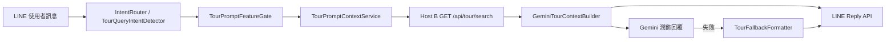

# 混合式聰明搜尋 — detail_url 與 LINE 回覆格式規劃

**專案根目錄：** `C:\bbc-ai-bot`  
**文件版本：** 2026-05-21  
**類型：** 規劃文件（僅文件；不變更正式流程程式、不變更 SQL schema）

**依據：** Host A（LINE / SaaS Router / Tour Prompt）、Host B（`GET /api/tour/search`）、bonusmee 前台唯讀調查（`cloud_store_tourdate.php`、`tourdate_dm.php`、`cloudCouponTourC_ajax.php`）。

**相關文件：**

- `docs/API_GATEWAY_MVP_TOUR_SEARCH_CONTRACT.md`
- `docs/API_GATEWAY_MVP_GEMINI_RETRY_AND_FALLBACK.md`
- bonusmee 前台路徑（主機 A XAMPP）：`C:\Web\xampp\htdocs\www\view\cloud\`

---

## 1. 文件目的

本文件定義「混合式聰明搜尋」**下一階段**的：

1. **Host A / Host B API 對接**最小欄位與責任邊界  
2. **`detail_url` 由 Host A 組裝**的規格（對齊既有 `tourdate_dm.php`）  
3. **`schLink` / `schLinkName`** 語意（維持既有欄位名，不 rename）  
4. **LINE 五筆行程 + 獨立 `search_url`** 的客人可見格式  
5. **`bs_CouponKeyword`（KEYWORD / LABEL）** 未來擴充節奏  

供後續實作、契約修訂與 Gemini prompt 調整使用；**本階段不實作程式、不修改資料庫**。

---

## 2. 混合式聰明搜尋目前架構



| 階層 | 現況（MVP 已上線能力） |
|------|------------------------|
| **意圖** | `TourQueryIntentDetector`：口語句 + **單一地名** → `tour_query`；`IntentRouter` 委派對齊 |
| **閘道** | `TourPromptFeatureGate`：依 `sno` allowlist 啟用 tour context |
| **搜尋** | Host B 回傳 items；Host A `pageSize=30` 取回、合併後 **最多 5 筆** 給 Gemini |
| **上下文** | `GeminiTourContextBuilder` 產中文區塊 + `search_url`（列表頁） |
| **回覆** | Gemini 成功 → 模型文字；失敗 → `TourFallbackFormatter` 結構化 fallback |
| **分隔線** | 行程間 `GeminiTourContextBuilder::LINE_TOUR_ITEM_SEPARATOR`（40×`=`） |

**混合式**在此指：**規則式 keyword / 意圖**（第一層）+ **Host B 結構化商品**（第二層）+ **Gemini 僅潤飾與排版**（第三層），不讓模型捏造 SQL 或 URL。

---

## 3. Host A / Host B 責任分工

| 項目 | Host B | Host A |
|------|--------|--------|
| 租戶解析（API） | `sno` → TenantResolver | `tenant_context_map`、TenantResolver（DB fallback） |
| 關鍵字搜尋 | `keyword`、`page`、`pageSize` | `TourQueryIntentDetector` 產 **核心 keyword** |
| 商品列欄位 | `couponNo`、`tourSeqNo`、`couponName`、`tourDate`、`price`、`departureStr`、`areaNames`、`schLink`、`schLinkName` 等 | 映射為 LINE / Gemini 用語 |
| **`search_url`（列表）** | 可選回傳；或由 Host A 組 | **`TourSearchService::buildSearchUrl()`**（`cloud_store_tourdate.php`） |
| **`detail_url`（內頁）** | **僅提供原始 ID 與連結欄位，不組 URL** | **組裝完整 `tourdate_dm.php` URL**（含 `encrypt(couponNo)`） |
| **cid 加解密** | **禁止**複製 bonusmee `encryptStr()` | 專用 builder（同源金鑰策略，見 §4） |
| **keywords / labels** | 第二階段 API 擴充（來自 `bs_CouponKeyword`） | 語意擴充、排序、寫入 Gemini context |
| Gemini / LINE | 不涉及 | `saas_router`、`AiPromptBuilder`、`TourFallbackFormatter` |

---

## 4. detail_url 組裝規則

### 4.1 路徑與 Query 模板（規範）

**Base（生產前台）：** `https://bonusmee.com/view/cloud/tourdate_dm.php`

**Query（與列表頁 JS 對齊，`srcPg=CDST` = Cloud Store Tourdate）：**

```http
/view/cloud/tourdate_dm.php
?openExternalBrowser=1
&red2Store=1
&srcPg=CDST
&sno={encrypted_storeNo}
&cid={encrypt(couponNo)}
&trsno={tourSeqNo}
&suld=1
```

**完整 URL 範例結構：**

```text
https://bonusmee.com/view/cloud/tourdate_dm.php?openExternalBrowser=1&red2Store=1&srcPg=CDST&sno=<encrypted_storeNo>&cid=<encrypted_couponNo>&trsno=<tourSeqNo>&suld=1
```

### 4.2 參數語意

| 參數 | 值 | 說明 |
|------|-----|------|
| `openExternalBrowser` | `1` | LINE 內建瀏覽器行為（沿用前台慣例） |
| `red2Store` | `1` | 返回商店語境（列表 JS 寫死） |
| `srcPg` | `CDST` | 來源頁：`cloud_store_tourdate.php`；DM 列表為 `CDDLT`（本規劃 LINE 預設 **CDST**） |
| `sno` | **加密後的 storeNo** | 與列表頁 `$("#sno").val()` 一致；**不是**明文 `storeNo` |
| `cid` | **`encrypt(couponNo)`** | 內頁 `chkEmpty(..., decrypt=true)` → `couponNo` |
| `trsno` | **`tourSeqNo` 明文** | 對應 `CouponTour_Get` 出團列；**不加密** |
| `suld` | `1` | 顯示 upper layer 資料（與營運慣例一致；特定商店亦強制 suld） |

### 4.3 組裝責任

1. **`cid` = encrypt(`couponNo`)** — 演算法與金鑰須與 bonusmee `Jack.php::encryptStr($str, constant("_DataKey"))` **結果相容**（實作時由 Host A 集中一處，**不**散落多份邏輯）。  
2. **`trsno` = 原始 `tourSeqNo`** — Host B 回傳欄位直接代入。  
3. **`detail_url` 應由 Host A 組裝** — 建議新增例如 `TourDetailUrlBuilder::build($tenantContext, $item)`，輸入 `sno`（或可加密之 `storeNo`）、`couponNo`、`tourSeqNo`。  
4. **Host B 不應複製 `encryptStr()`** — 避免雙邊金鑰漂移、安全邊界不清；Host B 只回 `couponNo`、`tourSeqNo` 等原始鍵值。

### 4.4 與前台調查之對應

- 列表點擊：`cloud_store_tourdate.php` JS 拼接 `tourdate_dm.php?...&cid=` + `ret.sData[p].cid` + `&trsno=` + `ret.sData[p].tourSeqNo`（`cid` 由 `cloudCouponTourC_ajax.php` 內 `encryptStr(couponNo)` 產生）。  
- 內頁載入：`tourdate_dm.php` 以 `cid` 解出 `couponNo`，以 `trsno` 載入 `CouponTour_Get`。

---

## 5. schLink / schLinkName 定義

| 欄位 | 定義 | 前台用法 |
|------|------|----------|
| **`schLink`** | 行程表／行程參考之 **完整 URL**（旅行社於後台上架，常為 Google Drive、PDF 靜態檔等） | 內頁 `<a href="{schLink}" target="_blank">`；列表表格「行程」欄 |
| **`schLinkName`** | 連結顯示名稱（多連結時） | 非 `couponAttr=99` 時由 `bs_CouponSchLink` 列表輸出 |

**約束（本計畫）：**

- **不修改**欄位名稱（維持 `schLink`、`schLinkName`）。  
- **不改** DB schema、不 rename。  
- Host B API 繼續使用同名欄位輸出即可。  

**語意澄清：** `schLink` **不是** `detail_url`；前者為「行程表檔案／外部參考連結」，後者為「商品出團內頁」。

---

## 6. LINE 五筆行程顯示格式

### 6.1 單筆模板（規劃目標）

```text
1. 📌 {couponName}
出團日期：{tourDateDisplay}
直售價：{priceDisplay}
出發地：{departureStr}
行程內頁：{detail_url}
行程表：{schLink}

========================================
```

- 第 2–5 筆同上編號遞增。  
- **最後一筆行程後**不再加分隔線，接著輸出 **`search_url` 區塊**（見 §7）。  
- 分隔線字元與現行 MVP 一致：`========================================`（40 個 `=`），與 `GeminiTourContextBuilder::LINE_TOUR_ITEM_SEPARATOR` 相同。

### 6.2 欄位填寫規則

| 顯示行 | 來源 | 備註 |
|--------|------|------|
| 📌 行程名稱 | `couponName` | 單行；勿改寫為分類式小標 |
| 出團日期 | `tourDate` | 建議 **MM/DD**；多日期合併用 `、`（沿用 builder 合併邏輯） |
| 直售價 | `price` | 格式 `NT$xx,xxx 起`（與現行 builder 一致） |
| 出發地 | `departureStr` | 缺省 → `出發地：未提供` |
| 行程內頁 | Host A 組裝之 **`detail_url`** | **必填**（有 `couponNo` + `tourSeqNo` 即應產生） |
| 行程表 | `schLink` | 有值才顯示該行；空則省略「行程表：」行或標示「未提供」— **實作時擇一並寫死於 prompt** |

### 6.3 與現行 MVP 差異

現行 `GeminiTourContextBuilder` 上下文 **尚未**包含 `detail_url`、`schLink` 獨立行；現行 LINE 回覆多為 Gemini 自由排版 + 列表 `search_url`。  
本節為 **下一階段目標版面**，實作時需同步更新：

- `GeminiTourContextBuilder` / `TourFallbackFormatter`  
- `AiPromptBuilder::appendTourContext` 規則  

---

## 7. search_url 與 detail_url 的差異

| 項目 | search_url | detail_url |
|------|------------|------------|
| **用途** | 商店 **列表搜尋頁**（多商品、可換頁） | **單一商品出團內頁**（單 `couponNo` + 單 `tourSeqNo`） |
| **前台檔案** | `cloud_store_tourdate.php` | `tourdate_dm.php` |
| **組裝方** | Host A（已存在 `TourSearchService::buildSearchUrl`） | Host A（**待實作** `TourDetailUrlBuilder`） |
| **keyword** | **僅核心 keyword**（`TourQueryIntentDetector` 產出，如 `東京`） | **不使用**自然語句全文（如「幫我找東京便宜的旅遊」） |
| **關鍵參數** | `sno`、`keyword`、`mode=1`、`clearParam=Y`… | `sno`、`cid`、`trsno`、`srcPg=CDST`、`suld=1`… |
| **與五筆關係** | **獨立區塊**，在 5 筆行程 **之後** 輸出 | 每筆行程各一條 **深連結** |

**`search_url` 現行模板（Host A）：**

```text
https://bonusmee.com/view/cloud/cloud_store_tourdate.php
  ?openExternalBrowser=1
  &UnCarousel=1
  &fromDMDetailFlag=1
  &clearParam=Y
  &mode=1
  &sno={tenant_public_sno}
  &keyword={core_keyword}
```

> **實作備註：** 現行 `buildSearchUrl` 使用 gateway 租戶 **`sno`（如 `e1fd133c7e8e45a1`）**；列表頁 hidden `sno` 則為 **`encryptStr(storeNo)`**。下一階段實作應驗證兩種 `sno` 在前台皆可用，或統一加密格式；**本文件不要求變更已上線 `search_url` 行為**，僅要求 **不要把整句使用者原文** 當 `keyword` 塞入（已透過 IntentDetector 緩解）。

**LINE 輸出順序（規劃）：**

```text
[開場白 1–2 句，可選]

1. 📌 …
…
5. 📌 …

完整搜尋結果：
{search_url}

[結語 可選]
```

---

## 8. keywords / labels 未來規劃

### 8.1 `bs_CouponKeyword` 的作用

| 欄位概念 | 說明 |
|----------|------|
| 表 | `bs_CouponKeyword`（`CouponKeywordDB.php`） |
| 關聯鍵 | `depID`、`storeNo`、`couponNo`、`aType` |
| 值 | `keyword` 文字 |

### 8.2 KEYWORD vs LABEL

| aType | 用途（前台） | 混合式搜尋建議 |
|-------|----------------|----------------|
| **KEYWORD** | 內頁 `#tag` 連結 → 列表 `?keyword=` | **第一階段後期**：Host B 回傳 `keywords[]`；用於 **tag search**、同義擴充 |
| **LABEL** | 活動標籤（`<span>` 展示） | **第二階段**：facet 篩選、Gemini 補充「賣點」；**不**與核心 `keyword` 混用 |

### 8.3 適用場景矩陣

| 能力 | 第一階段（下一實作） | 第二階段 |
|------|---------------------|----------|
| **keyword search**（核心詞） | ✅ `TourQueryIntentDetector` + Host B `keyword` | 優化口語剝離 |
| **tag search**（`#tag` 點擊同義） | ⏳ 需 API `keywords[]` | 與 storefront 一致 |
| **Gemini semantic ranking** | ⏳ 在 5 筆內重排 | 引入 LABEL + 標題語意 |
| **全文 / 模糊 DB 搜** | ❌ 不做 | 評估 ES / 搜尋引擎 |
| **labels 顯示在 LINE** | ❌ 可選少量 | 結構化賣點行 |

### 8.4 Host B API 擴充建議（契約草案）

```json
{
  "couponNo": 11651,
  "tourSeqNo": 175618,
  "couponName": "…",
  "tourDate": "2026-07-12",
  "price": 42800,
  "departureStr": "台北",
  "areaNames": "東京",
  "schLink": "https://…",
  "schLinkName": "行程表",
  "keywords": ["東京", "迪士尼"],
  "labels": ["保證出團", "早鳥"]
}
```

`keywords` / `labels` **不阻擋**第一階段 `detail_url` + LINE 格式上線。

---

## 9. Gemini 回覆格式建議

### 9.1 輸入（Host A 提供之 context）

- 區塊標題：`【旅遊產品搜尋結果】`  
- 每筆含：**編號、📌 名稱、日期、價格、出發地、`detail_url`、`schLink`（若有）**  
- 筆間分隔：`========================================`  
- 結尾：**完整搜尋結果：** + `search_url`（僅一行 URL）  
- **禁止**在 context 內放 `encrypt` 金鑰、SQL、內部 `depID` / `storeNo`

### 9.2 輸出約束（`AiPromptBuilder` 應新增／強化）

1. **逐字引用** context 內的 URL（`detail_url`、`schLink`、`search_url`），不得改寫網域或參數。  
2. **不得**自行拼接或猜測 `detail_url` / `cid` / `trsno`。  
3. 每筆必須保留「行程內頁：」「行程表：」（有 URL 時）標籤與現行「直售價：」「出發地：」一致。  
4. 維持 **最多 5 筆**；不得虛構第 6 筆。  
5. **最後一筆**與「完整搜尋結果」之間 **不加**分隔線。

### 9.3 Fallback

`TourFallbackFormatter` 應與 Gemini 使用 **同一 context 欄位** 解析，避免 503 fallback 時缺少 `detail_url` / `schLink`。

---

## 10. API 最小必要欄位

### 10.1 Host B `GET /api/tour/search` — items[]（每筆）

| 欄位 | 必要 | 用途 |
|------|------|------|
| `couponNo` | ✅ | `cid` 加密、`detail_url` |
| `tourSeqNo` | ✅ | `trsno`、`detail_url` |
| `couponName` | ✅ | LINE 標題 |
| `tourDate` | ✅ | 出團日期顯示／合併 |
| `price` | ✅ | 直售價 |
| `departureStr` | ✅ | 出發地 |
| `areaNames` | 建議 | 語意排序、目的地驗證 |
| `schLink` | 建議 | LINE「行程表」 |
| `schLinkName` | 選用 | 多連結顯示名 |
| `keywords[]` | 選用（二階段） | tag / 擴充搜尋 |
| `labels[]` | 選用（二階段） | 賣點、facet |

**Host B 不需回傳：** `detail_url`、`cid`（加密串）。

### 10.2 Host A 對外（LINE）最小產出

| 產出 | 必要 |
|------|------|
| 5 筆結構化行程（含 `detail_url`、條件式 `schLink`） | ✅ |
| 1 條 `search_url`（核心 keyword） | ✅ |
| Gemini 潤飾或 fallback 一致排版 | ✅ |

---

## 11. 不建議事項

1. **不修改**既有 **`schLink` / `schLinkName`** 欄位名稱（API、DB、前台皆維持）。  
2. **不在 Host B 複製 `encryptStr()`** 或持有 `_DataKey` 做 `cid` 產生。  
3. **不在第一階段實作全文搜尋**（自然語句直接進 SQL `LIKE` 全表）。  
4. **不直接把自然語句塞進 `search_url` 的 `keyword`**（應永遠用 IntentDetector 萃取之核心詞）。  
5. **不讓 Gemini 自行猜測 `detail_url`**（僅引用 Host A 預先組好之完整 URL）。  
6. **不將 `schLink` 改名為 `pdf_url`**（語意為連結欄位，非僅 PDF）。  
7. **不在未評估前把 `encrypt` 演算法暴露給外部 client**。

---

## 12. 下一階段實作建議

### 12.1 建議實作順序（Host A `bbc-ai-bot`）

| 序 | 工作項 | 檔案（建議） |
|----|--------|--------------|
| 1 | `TourDetailUrlBuilder`：`detail_url` 組裝 + 單元測試 | `core/tour_detail_url_builder.php`、`tests/…` |
| 2 | 擴充 `GeminiTourContextBuilder`：每筆加 `行程內頁`、`行程表` | `core/gemini_tour_context_builder.php` |
| 3 | 擴充 `TourFallbackFormatter` 解析上述行 | `core/tour_fallback_formatter.php` |
| 4 | 更新 `AiPromptBuilder` 規則 | `core/ai_prompt_builder.php` |
| 5 | 契約文件更新 Host B items 欄位 | `docs/API_GATEWAY_MVP_TOUR_SEARCH_CONTRACT.md` |

### 12.2 Host B 建議

- 確認 `schLink`、`schLinkName`、`areaNames` 在 staging `tour.search` **穩定回傳**。  
- 第二階段：`keywords[]` / `labels[]` 由 `bs_CouponKeyword` 查詢附加（唯讀 JOIN，**不改 schema**）。

### 12.3 驗收要點

- LINE 回覆 5 筆均可點擊 **行程內頁**（`tourdate_dm.php` 正常開啟）。  
- **行程表** 連結與前台手動上架 URL 一致。  
- **`search_url`** 之 `keyword` 為「東京」而非整句口語。  
- Gemini 503 時 fallback 仍含相同 URL 欄位。

---

## 附錄 A — 與現行程式對照

| 能力 | 現行檔案 | 本規劃 |
|------|----------|--------|
| 列表 search_url | `core/tour_search_service.php` | 維持；keyword 僅核心詞 |
| Gemini context | `core/gemini_tour_context_builder.php` | + detail_url、schLink 行 |
| Prompt 規則 | `core/ai_prompt_builder.php` | + URL 逐字引用 |
| Fallback | `core/tour_fallback_formatter.php` | 對齊新行 |
| 前台加密參考 | `www/obj/lib/Jack.php` `encryptStr` | 僅 Host A 實作相容層 |

---

## 附錄 B — 文件修訂紀錄

| 日期 | 說明 |
|------|------|
| 2026-05-21 | 初版：依 Host A/B 與 bonusmee 前台唯讀調查建立 |
