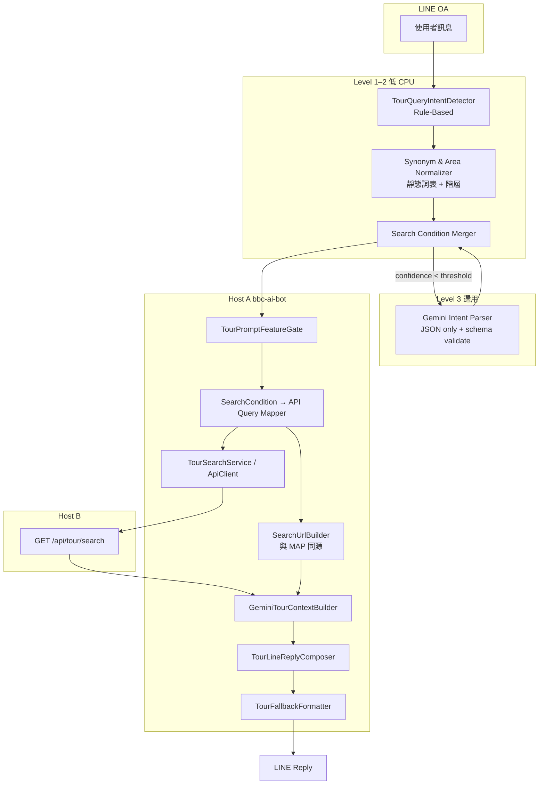

# Hybrid Smart Search — Phase 1 架構規劃（唯讀）

**主機：** 103.1.222.14（主機 A）  
**專案：** BBC AI SaaS — Hybrid Smart Search Phase 1  
**文件類型：** 唯讀規劃 / 架構設計 / Parser 設計  
**建立日期：** 2026-05-25  
**狀態：** 規劃基線（**不含程式實作**）

**前置已完成（MVP）：**

- LINE OA 商品查詢、`TourQueryIntentDetector`、API Gateway `tour.search`
- `GeminiTourContextBuilder`、`TourFallbackFormatter`（fixed formatter / Scheme C）
- `search_url` / 詳細內容 / Google 行程表短網址（Phase 1A / 1B-A / 1B-B）
- LINE OA 真人測試、`TourPromptFeatureGate`

**相關文件：**

- `docs/HYBRID_SMART_SEARCH_DETAIL_URL_AND_LINE_RESPONSE_PLAN.md`
- `docs/API_GATEWAY_MVP_TOUR_SEARCH_CONTRACT.md`
- `docs/LINE_FIXED_FORMATTER_FINAL_SIGNOFF_REPORT.md`
- `docs/SHORT_URL_CODE_LENGTH_STRATEGY.md`

---

## A. 目前架構分析

### A.1 LINE OA 商品查詢端到端流程（現況）

```text
LINE Webhook (callback.php → safe_gateway.php)
    → saas_router.php::handleLineEvent()
        → TenantResolver (DB: tenant_context_map)
        → IntentRouter::detect()          ← 含 TourQueryIntentDetector（tour_query）
        → TourService::fetchServiceData() ← 舊 DB 路徑（與 Host B 搜尋並行存在）
        → AiPromptBuilder::build()
        → TourPromptFeatureGate::isEnabled(sno, channelId)
        → TourPromptContextService::buildTourContextForPrompt()
              → TourQueryIntentDetector::detect(userText)
              → TourSearchApiClient::search(sno, keyword, page=1, pageSize=30)
                    → GET /api/gateway/tour/search.php
                    → TourSearchService → Host B GET /api/tour/search
              → GeminiTourContextBuilder::build(apiResult)
                    → merge 商品列、detail_url、schLink、search_url
        → AiPromptBuilder::appendTourContext()
        → TourLineReplyComposer::resolve()
              → 若有 tourContext：TourFallbackFormatter（fixed list）← **實機主要輸出**
              → 否則 callGemini($prompt)
              → Gemini 失敗再 TourFallbackFormatter
        → LineService::replyToLine()
```

| 階段 | 檔案 | 現況能力 | 缺口 |
|------|------|----------|------|
| 意圖路由 | `core/intent_router.php` | `tour_query` 委派 `TourQueryIntentDetector` | 無日期/區域/預算結構 |
| Rule Parser | `core/tour_query_intent_detector.php` | 口語剝除 → **單一 `keyword`**；裸地名 2–3 字；排除天氣/訂單等 | **無** `date_from/to`、`area`、`departure_city` |
| 搜尋編排 | `core/tour_search_service.php` | Host B HTTP、`mapItem()`、`buildSearchUrl(keyword)` | API query **僅 keyword** |
| Request Builder | `core/api_gateway/production/TourSearchRequestBuilder.php` | Allowlist 含 `destination/country/city/dateFrom/dateTo` | **未從 Intent 填入** |
| Context | `core/gemini_tour_context_builder.php` | 5 筆商品、MM/DD 出團、短網址 | 搜尋條件未寫入 context 摘要 |
| LINE 輸出 | `core/tour_fallback_formatter.php` | 解析 context → emoji 固定清單 | 不重新解析搜尋條件 |
| Gemini | `core/gemini_service.php` | 全訊息潤飾 | tour 路徑常 **不採用** Gemini 商品清單（Scheme C） |

### A.2 TourQueryIntentDetector（Rule-Based Parser）

**輸出契約（現行）：**

```php
[
  'is_tour_query' => bool,
  'keyword'       => string|null,  // 單一核心詞，如「東京」「歐洲」
  'confidence'    => float,        // 約 0.55–0.99
  'reason'        => string,       // bare_destination_name | tour_search_detected | ...
]
```

**處理管線：**

1. 排除非旅遊（天氣、護照、問候…）
2. 裸地名（2–3 漢字，無「行程/旅遊」尾綴）→ 高信心 keyword
3. 旅遊訊號評分（團、行程、幾日、幫我找…）
4. `extractKeyword()`：剝除 `PREFIX_NOISE`、`QUERY_MOOD_START`、`SUFFIX_NOISE`、`INLINE_NOISE`

**未涵蓋：** 六月三十、六月底、端午、出發地、預算、歐洲/東歐階層、親子/蜜月語意。

### A.3 Gemini Tour Context

| 元件 | 行為 |
|------|------|
| `TourPromptContextService` | `keyword` 空則不呼叫 API；`pageSize=30` 取回後 builder 合併 cap 5 筆 |
| `GeminiTourContextBuilder` | 產中文結構區塊 + instruction「請 Gemini…」；`search_url` 來自 API 或 `buildSearchUrl` |
| `TourFallbackFormatter` | **客人可見** 固定排版；URL 逐字來自 context |

**重點：** Context 是 **搜尋結果的呈現層**，不是 **查詢條件層**；Phase 1 需新增 **Search Condition JSON** 貫穿 Parser → API → `search_url`。

### A.4 search_url Builder

**函式：** `TourSearchService::buildSearchUrl($sno, $keyword)`

**長網址模板：**

`https://bonusmee.com/view/cloud/cloud_store_tourdate.php?openExternalBrowser=1&UnCarousel=1&fromDMDetailFlag=1&clearParam=Y&mode=1&sno={sno}&keyword={keyword}`

→ `ShortUrlService::toPublicShortUrl()`（`SHORT_URL_ENABLED`）

**缺口：** 前台若支援日期/區域 query，**目前未同步** 至 `search_url`（需對照 `cloud_store_tourdate.php` 唯讀 diff）。

### A.5 Host B API `tour.search`

| 項目 | 現況 |
|------|------|
| 路由 | `GET /api/tour/search` |
| Gateway allowlist（已實作於 Builder） | `sno`, `keyword`, `destination`, `country`, `city`, `dateFrom`, `dateTo`, `page`, `pageSize` |
| Host A 實際送出（`TourSearchApiClient`） | **`keyword` + 分頁**（經 `TourPromptContextService`） |
| 回傳 items | `couponName`, `tourDate`, `price`, `departureStr`, `areaNames`, `schLink`, `schLinks[]`, … |
| 契約 | `docs/API_GATEWAY_MVP_TOUR_SEARCH_CONTRACT.md` |

### A.6 keyword 查詢流程（現況）

```text
使用者：「幫我找高雄出發的東京親子團」
    → Rule：剝除口語 → keyword 可能殘留過長或過短（視規則命中）
    → API：GET ...?keyword={單一字串}
    → Host B：全文/欄位 LIKE 類搜尋（實作於 Host B，Host A 不組 SQL）
    → Context：列出前 5 筆 + search_url?keyword={同一字串}
```

### A.7 日期查詢流程（現況）

**無專用日期 Parser。** `tourDate` 僅來自 **搜尋結果列** 的顯示合併（`GeminiTourContextBuilder::formatDepartureDatesDisplay`），**不** 作為查詢條件傳入 Host B。

客人說「六月底出發」→ 現行多半只抽出地名/模糊 keyword，**不** 篩選 6/21–6/30 出團。

---

## B. 正式 Hybrid Smart Search 架構圖

### B.1 設計原則

| # | 原則 |
|---|------|
| 1 | **低 CPU 優先**：Rule → 同義詞表 → Gemini Intent（必要時）→ RAG（未來） |
| 2 | **Gemini 不產 SQL、不查 DB**；只產 **Search Condition JSON** |
| 3 | **Host B** 為唯一商品資料源；Host A 組 URL、加密、LINE 排版 |
| 4 | **search_url 與 API query 同源**（同一 `SearchCondition` 物件衍生） |
| 5 | **Multi-tenant**：條件解析可全域，搜尋執行必帶 `sno` |

### B.2 目標架構（Phase 1）



### B.3 Rule-Based 與 Gemini 分工

| 層級 | 名稱 | 責任 | CPU | 觸發 |
|------|------|------|-----|------|
| **L1** | Rule-Based Parser | 意圖、口語剝除、日期規則、出發地 regex、預算數字 | 極低 | 永遠先跑 |
| **L2** | 同義詞 / Area Normalizer | keyword/area/destination 對齊詞表；階層展開（歐洲→東歐） | 低 | L1 後 |
| **L3** | Gemini Intent Parser | 補 **free_text** 語意、多條件糾纏、低信心時結構化 | 中 | `confidence_rule < 0.75` 或多條件衝突 |
| **L4** | RAG（未來） | 租戶 FAQ、行程知識、政策；**不** 取代 tour.search | 中高 | 非商品搜尋或解釋型問題 |

**Gemini 禁止：** 直接回覆商品列表給客人（Scheme C 下由 `TourFallbackFormatter` 輸出）；捏造 `couponNo`；組 SQL。

---

## C. Parser Flow

```text
輸入: user_message, tenant{sno, channelId}, now=Asia/Taipei

Step 0  前置
        - normalize Unicode、全半形、空白
        - 若 TourPromptFeatureGate OFF → 不走商品搜尋管線

Step 1  Rule-Based（TourQueryIntentDetector 擴充版）
        - is_tour_query / exclusion
        - extract: keyword_raw, departure_city, budget_max, duration_days
        - date_parser_rules → date_from, date_to, date_precision
        - area_hints[]（關鍵片語比對）

Step 2  Synonym & Area Normalizer
        - keyword ← normalize(keyword_raw)
        - area, destination, country, city ← hierarchy lookup
        - travel_style[], special_tags[]

Step 3  Merge → SearchCondition JSON v1
        - confidence_rule, reasons[]
        - 若缺必填且 is_tour_query：降 confidence

Step 4  Gemini Intent（條件觸發）
        - 輸入：user_message + SearchCondition(draft) + allowed_schema
        - 輸出：僅 JSON patch（合併欄位，不得新增 allowlist 外 API 參數）
        - validate + clamp；失敗則捨棄 Gemini 部分

Step 5  API Query Mapper
        - SearchCondition → Host B query (allowlist)
        - 平行：SearchUrlBuilder → cloud_store_tourdate.php query

Step 6  Execute
        - TourSearchService.search / TourSearchApiClient
        - GeminiTourContextBuilder（帶入「搜尋條件摘要」可選）

Step 7  LINE Reply
        - TourLineReplyComposer → TourFallbackFormatter（維持 Scheme C）
```

---

## D. Search Condition JSON 設計

### D.1 正式 Schema（v1）

```json
{
  "schema_version": "1.0",
  "intent": "tour_search",
  "is_tour_query": true,
  "free_text": "高雄出發六月底東京親子團",

  "keyword": "東京",
  "area": "日本",
  "destination": "東京",
  "country": "日本",
  "city": "東京",

  "departure_city": "高雄",
  "date_from": "2026-06-21",
  "date_to": "2026-06-30",
  "date_precision": "range",
  "date_label": "六月底",

  "budget_max": 30000,
  "budget_currency": "TWD",

  "travel_style": ["親子"],
  "special_tags": ["迪士尼"],
  "duration_days": null,

  "api_query": {
    "keyword": "東京",
    "destination": "東京",
    "country": "日本",
    "city": "東京",
    "dateFrom": "2026-06-21",
    "dateTo": "2026-06-30",
    "page": 1,
    "pageSize": 30
  },

  "search_url_params": {
    "keyword": "東京",
    "dateFrom": "2026-06-21",
    "dateTo": "2026-06-30",
    "departureCity": "高雄"
  },

  "confidence": {
    "rule_based": 0.82,
    "synonym": 0.90,
    "gemini": 0.74,
    "overall": 0.85
  },
  "parser_path": ["rule", "synonym", "gemini_patch"],
  "reasons": ["tour_search_detected", "date_range_end_of_month"]
}
```

### D.2 欄位定義

| 欄位 | 類型 | 說明 |
|------|------|------|
| `keyword` | string | Host B 主搜尋字串；與前台 `keyword=` **一致** |
| `area` | string | 大區域語意（歐洲、東南亞、日本） |
| `destination` | string | 行銷目的地（東京、北海道） |
| `country` / `city` | string | 對應 Host B allowlist（若 Host B 支援） |
| `departure_city` | string | 出發地（高雄、台北） |
| `date_from` / `date_to` | ISO date | API 與 search_url 共用 |
| `date_precision` | enum | `single` \| `range` \| `month` \| `fuzzy` \| `holiday` |
| `travel_style` | string[] | 親子、蜜月、長輩、滑雪… |
| `special_tags` | string[] | 展開自同義詞（迪士尼、富士山） |
| `api_query` | object | **唯一** 送往 Host B 的 query 子集 |
| `search_url_params` | object | **唯一** 送往列表頁的 query 子集 |

### D.3 keyword / area / destination 關係

| 概念 | 用途 | 範例 |
|------|------|------|
| **area** | 區域行銷、模糊集合 | 歐洲、東南亞 |
| **destination** | 精準目的地（搜尋主軸） | 東京、札幌 |
| **keyword** | API + 前台列表 **實際 query 字串** | 優先 `destination`，次 area，再 special_tags 合併 |

**規則：**

- 客人說「歐洲」→ `area=歐洲`, `keyword=歐洲`（Host B 不支援 area 時）
- 客人說「東歐」→ `area=歐洲`, `destination=東歐`, `keyword=東歐`
- 客人說「東京親子」→ `destination=東京`, `keyword=東京`, `travel_style=[親子]`

---

## E. 日期解析規則表

**時區：** `Asia/Taipei`  
**參考日：** `now`（訊息處理當下）

### E.1 年份預設規則

| 規則 | 說明 |
|------|------|
| **Y0** | 客人**未寫年份** → 預設 **今年** |
| **Y1** | 若解析出的 `date_from` **早於 today**（已過）→ 改 **明年** 同月同日 |
| **Y2** | 客人明確寫「2027」→ 用明示年份 |
| **Y3** | 春節/端午等農曆節日 → 查 **節日表**（每年更新，Rule 表驅動） |

### E.2 單日（date_precision = single）

| 客人說法 | 解析 | 備註 |
|----------|------|------|
| 六月三十 / 6月30日 / 6/30 | `date_from=date_to=YYYY-06-30` | 無年 → Y0/Y1 |
| 六月三十出發 | 同上 | 「出發」不影響區間類型 |

### E.3 日期區間（date_precision = range）

| 客人說法 | date_from | date_to | 規則 ID |
|----------|-----------|---------|---------|
| 六月底 | 當月 21 日 | 當月最後一日 | `RANGE_MONTH_END` |
| 七月初 | 07-01 | 07-10 | `RANGE_MONTH_START` |
| 七月中 | 07-11 | 07-20 | `RANGE_MONTH_MID`（可調） |
| 6/1~6/15 | 明示起迄 | 明示起迄 | `RANGE_EXPLICIT` |

### E.4 月份（date_precision = month）

| 客人說法 | 區間 |
|----------|------|
| 六月 / 6月 | `YYYY-06-01` ~ `YYYY-06-30` |
| 2026年6月 | 固定 2026-06 全月 |

### E.5 節日 / 寒暑假（date_precision = holiday | fuzzy）

| 類型 | 範例 | 策略 |
|------|------|------|
| 國定連假 | 端午連假、中秋節 | 靜態表 `YYYY-MM-DD` ~ `YYYY-MM-DD`（每年維護） |
| 寒暑假 | 暑假、寒假 | 表驅動區間（北半球暑假約 7–8 月） |
| 農曆節日 | 過年 | 農曆→國曆對照表 + Y0/Y1 |

### E.6 模糊日期

| 客人說法 | 行為 |
|----------|------|
| 快出發 / 近期 | `date_from=today`, `date_to=today+45d` |
| 下個月 | 曆法下月 1 日～月末 |

### E.7 Parser 實作分層（建議）

| 順序 | 模組 | 方法 |
|------|------|------|
| 1 | `DateTokenRuleParser` | regex + 中文數字（六月三十） |
| 2 | `FuzzyPeriodLexicon` | 底/初/連假/暑假 |
| 3 | `LunarHolidayTable` | 端午、中秋、過年 |
| 4 | Gemini patch | 僅填 `date_*` + `date_label`（L3） |

---

## F. AREA 區域解析策略

### F.1 area 與 destination 差異

| 維度 | area | destination |
|------|------|-------------|
| 語意 | 大區、國家群、行銷區 | 具體目的地、城市、子區 |
| 階層 | 歐洲 ⊃ 東歐 ⊃ 捷克 | 日本 ⊃ 北海道 ⊃ 札幌 |
| API | 若 Host B 無 `area` 欄 → **併入 keyword** | 對應 `destination` / `city` allowlist |
| search_url | 可選 `area=`（需前台 diff） | 通常 `keyword=` |

### F.2 區域階層表（範例結構）

```yaml
歐洲:
  children: [西歐, 東歐, 北歐, 南歐, 中歐]
  keyword_aliases: [Europe, 歐洲行程]
東歐:
  parent: 歐洲
  keyword_aliases: [東歐團, 東歐旅遊]
日本:
  children: [關東, 關西, 北海道, 九州]
  destinations: [東京, 大阪, 札幌, 沖繩]
關東:
  parent: 日本
  keyword_aliases: [東京, 富士山, 迪士尼]
```

### F.3 模糊區域解析

| 客人說法 | area | destination | keyword |
|----------|------|-------------|---------|
| 有沒有歐洲的行程 | 歐洲 | null | 歐洲 |
| 有沒有東歐 | 歐洲 | 東歐 | 東歐 |
| 日本團 | 日本 | null | 日本 |
| 想去東京 | 日本 | 東京 | 東京 |

### F.4 轉 Host B API query

```text
IF host_b.supports(destination):
    api_query.destination = destination ?? keyword
IF host_b.supports(country/city):
    map from hierarchy
IF host_b.supports(dateFrom/dateTo):
    pass from SearchCondition
ELSE:
    api_query.keyword = join(keyword, area, destination, tags)
```

**現況：** `TourSearchRequestBuilder` **已 allowlist** `destination/country/city/dateFrom/dateTo` → Phase 1 Host A 實作 **Mapper** 即可，需 Host B 確認實際篩選邏輯。

### F.5 同步 search_url

```text
search_url = buildSearchUrl(sno, search_url_params)
search_url_params.keyword  MUST equal api_query.keyword（預設）
若有 dateFrom/dateTo → 追加 query（需 cloud_store_tourdate.php 支援）
若有 departureCity → 追加（需前台支援）
```

**Fallback：** 前台不支援的參數 → **只保留 keyword**，並在 context 加一行「搜尋條件：六月底出發」供客人理解（不影響 API）。

---

## G. 旅遊同義詞策略

### G.1 詞表類型

| 類型 | 檔案建議 | 範例 |
|------|----------|------|
| `destination_synonyms` | `config/synonyms/destinations.yaml` | 東京 ← 關東, 富士山, 迪士尼樂園 |
| `area_synonyms` | `config/synonyms/areas.yaml` | 歐洲 ← 歐洲行程, Europe |
| `style_synonyms` | `config/synonyms/travel_style.yaml` | 親子 ← 小孩, 家庭, 樂園 |
| `tag_expansion` | 同上 | 蜜月 ← 浪漫, 雙人 |

### G.2 模糊搜尋

| 技術 | Phase 1 | 未來 |
|------|---------|------|
| 精確詞表替換 | ✅ 主路徑 | |
| 編輯距離 / 拼音 | 選用 L2 | ✅ |
| 向量語意 | ❌ | RAG / embedding |

### G.3 normalize 管線

```text
keyword_raw → lower/全形半形 → strip noise
           → synonym_lookup → canonical_keyword
           → optional: expand special_tags（附加至 API keyword 或 Host B labels）
area phrase → hierarchy_resolver → area + destination + country + city
travel_style phrase → style_lexicon → travel_style[]
```

### G.4 旅行社特殊詞彙（範例）

| 類別 | 詞彙 |
|------|------|
| 產品 | 團體、自由行、包團、散團、系列團 |
| 價格 | 直售、同業、限時、早鳥 |
| 出發 | 北高出發、單程、來回、機票自理 |
| 主題 | 賞櫻、賞楓、滑雪、郵輪、親子樂園 |

---

## H. Gemini Fallback 策略

### H.1 四級模型

| Level | 名稱 | 輸出 | 失敗時 |
|-------|------|------|--------|
| **1** | Rule-Based | SearchCondition 草案 | → 非 tour_query，一般客服 |
| **2** | Rule + Synonym | 補全 area/destination/tags | → 僅用 L1 |
| **3** | Gemini Intent Parser | JSON patch + 自然語 `free_text` 理解 | → **捨棄 Gemini**，用 L2 |
| **4** | RAG（未來） | 知識片段注入 prompt，**不改** tour.search SQL | → 僅 FAQ 回答 |

### H.2 Gemini Intent 觸發條件

- `confidence.rule_based < 0.75`
- 訊息長度 > N 且含 **≥2** 維度（地+日期+出發地+預算）
- Rule 與 Synonym 的 `keyword` 衝突
- 含「順便」「然後」等多意圖（Phase 2）

### H.3 Gemini 輸入 / 輸出契約

**輸入：** system prompt + `user_message` + `search_condition_draft` + JSON schema

**輸出：** 僅 JSON；`responseMimeType: application/json`；schema validate

**禁止欄位：** sql, table, depID, storeNo, raw_url 改寫

### H.4 與 LINE 回覆的關係

| 元件 | 角色 |
|------|------|
| Gemini Intent Parser | **只解析查詢**（Phase 1 新增） |
| callGemini($prompt)（現行） | 潤飾全文；Scheme C 下 **商品清單以 formatter 為準** |
| TourFallbackFormatter | **最終客人可見**（維持） |

---

## I. API query / search_url 一致性策略

### I.1 單一來源物件

```text
SearchCondition (in-memory)
    ├─→ ApiQueryMapper → TourSearchRequestBuilder → Host B
    └─→ SearchUrlBuilder → TourSearchService::buildSearchUrl → ShortUrlService
```

**禁止：** `buildSearchUrl` 單獨再跑一套 `extractKeyword()` 與 API 不同步。

### I.2 一致性檢查清單

| 檢查 | 規則 |
|------|------|
| K1 | `api_query.keyword` === `search_url_params.keyword`（除非產品允許列表頁更寬） |
| K2 | 日期參數兩邊同有或同無 |
| K3 | `sno` 僅來自 tenant，不來自 Parser |
| K4 | 短網址化在 **long URL 確定後** 才呼叫 `ShortUrlService` |
| K5 | Context 內可選一行「搜尋條件：{date_label} {departure_city}」**僅顯示**，不改 URL |

### I.3 Host B 不支援 area 時

```text
api_query.keyword = merge(destination, area, join(special_tags))
api_query.destination = null  // 或不送
```

記錄 `reasons: ["area_fallback_to_keyword"]` 供分析。

---

## J. CPU / 效能控制建議

| 策略 | 說明 |
|------|------|
| **快徑優先** | 80%+ 查詢僅 L1+L2（<5ms 級 PHP） |
| **Gemini 限流** | 每 `sno` + `userId` 每分鐘 N 次 Intent 呼叫 |
| **快取** | 同義詞表 APCu/檔案快取；節日表年度版本 |
| **短路** | `is_tour_query=false` 不呼叫 Host B |
| **Host B pageSize** | 維持 30 取回、5 顯示；避免加大 |
| **Gemini 商品潤飾** | Scheme C 已關閉雙重生成；保留單次 Intent 即可 |
| **Trace 分級** | `parser_path` 寫 log，不寫完整 prompt |

| 指標 | 目標（Phase 1） |
|------|----------------|
| P95 Parser（L1+L2） | < 20ms |
| P95 含 Gemini Intent | < 2.5s（含網路） |
| Host B 逾時 | 維持 20s read（現行） |

---

## K. Multi-tenant SaaS 設計

| 層 | 隔離 |
|----|------|
| **租戶鍵** | 公開 `sno`；內部 `depID/storeNo` 僅 Host A |
| **TourPromptFeatureGate** | `ALLOWED_SNO` 白名單（現行 staging） |
| **同義詞** | Phase 1 全域表；Phase 2 `synonyms/{sno}.yaml` 覆寫 |
| **搜尋** | Host B TenantResolver 依 `sno` |
| **Usage / Rate** | `UsageTracker` 依 `sno` |
| **Channel** | LINE `destination` → `channelId` |

**原則：** Parser 規則可共用；**商品資料邊界** 完全由 `sno` 決定。

---

## L. 未來 RAG 插入點

```text
                    ┌─────────────────┐
  user_message ────►│ Intent Router   │
                    └────────┬────────┘
                             │
              tour_search    │    faq / policy / general
                    ▼        ▼
         SearchCondition     RAG Retriever
                    │        │
                    ▼        ▼
              tour.search   Context snippets
                    │        │
                    └────┬───┘
                         ▼
              GeminiTourContextBuilder
              （商品列 + 知識片段區塊分離）
                         ▼
              TourFallbackFormatter
```

| 插入點 | 用途 | 禁止 |
|--------|------|------|
| **L4a** | 租戶 FAQ、退改政策 | 取代 tour.search |
| **L4b** | 行程賣點文案補充 | 改寫 URL / 價格 |
| **L4c** | 同義詞動態擴充候選 | 未審核直接上線 |

**資料源候選：** `bs_CouponKeyword`、商品描述、外部 CMS（唯讀索引）。

---

## M. 未來 AI 自動學習 Roadmap

| 階段 | 內容 | 產出 |
|------|------|------|
| **M1** | 記錄 `SearchCondition` + 點擊 + 成交 proxy | 訓練資料集 |
| **M2** | 離線評估：Rule vs Gemini patch 準確率 | 閾值調整 |
| **M3** | 同義詞半自動挖掘（共現、點擊） | 詞表 PR 審核 |
| **M4** | 租戶級 rerank（仍走 Host B 召回） | 排序模型 |
| **M5** | 受控 A/B：Gemini Intent on/off | SaaS 儀表板 |

**原則：** 學習調整 **Parser / 排序**，不讓模型 **直接查 production DB**。

---

## 建議實作順序（Phase 1 工程）

| 序 | 項目 | 主要檔案（規劃） |
|----|------|------------------|
| 1 | `SearchCondition` DTO + validator | `core/search/search_condition.php` |
| 2 | `DateParser` + 節日表 | `core/search/date_parser.php` |
| 3 | 擴充 `TourQueryIntentDetector` → 委派子 parser | `core/tour_query_intent_detector.php` |
| 4 | `SynonymNormalizer` + YAML | `core/search/synonym_normalizer.php` |
| 5 | `ApiQueryMapper` / `SearchUrlBuilder` | `core/search/search_query_mapper.php` |
| 6 | `GeminiIntentParser`（L3，可 feature flag） | `core/search/gemini_intent_parser.php` |
| 7 | 接線 `TourPromptContextService` | `core/tour_prompt_context_service.php` |
| 8 | CLI 測試矩陣 | `tests/test_hybrid_search_*.php` |
| 9 | Host B / 前台 query diff | 契約文件更新 |

---

## 附錄：現行程式對照表

| 能力 | 現行檔案 | Phase 1 變更 |
|------|----------|--------------|
| Rule 意圖 | `core/tour_query_intent_detector.php` | 擴充；輸出 SearchCondition |
| Context | `core/gemini_tour_context_builder.php` | 可選顯示搜尋條件摘要 |
| search_url | `core/tour_search_service.php` | 改為接受 `search_url_params` |
| API allowlist | `core/api_gateway/production/TourSearchRequestBuilder.php` | 已就緒，接 Mapper |
| LINE 輸出 | `core/tour_fallback_formatter.php` | 預期不變（Scheme C） |
| 入口 | `core/saas_router.php` | 不變 |
| Keywords DB | `dbo.bs_CouponTopicKeyword` | Phase 2 對接 Host B |

---

## 修訂紀錄

| 版本 | 日期 | 說明 |
|------|------|------|
| v1 | 2026-05-25 | Phase 1 唯讀架構規劃初版 |

---

*本文件為 Hybrid Smart Search Phase 1 規劃基線；實作前需完成 `cloud_store_tourdate.php` 查詢參數 diff 與 Host B 篩選欄位確認。*
