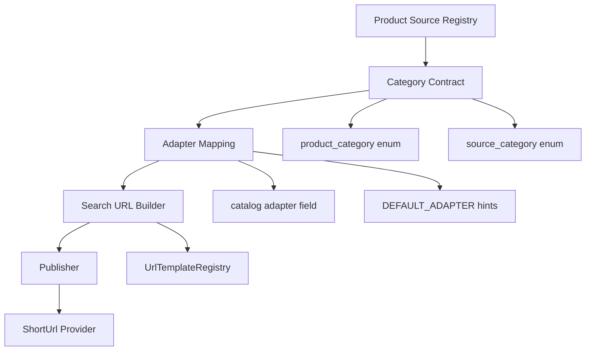

# Multi Product Source Category Contract

**代號：** `MULTI_PRODUCT_SOURCE_CATEGORY_CONTRACT`

**版本：** Phase 9-B-7

**前置 Commits：** `6456933`（Tenant GCS Provider Skeleton）、`16409ff`（Provider Contract Integration Test）

---

## 1. Purpose

BBC 旅業資料中心未來不只有 **團體行程（Group Tour）**。商品源 Registry 必須以 **Category Contract** 支援多商品類型，新增類型時只透過 **Registry / Config / Adapter** 擴充，**不修改** Hybrid Search、Gemini、Context Cache、Host B API、LINE OA 等核心流程。

---

## 2. Current State Analysis（Phase 9-B-7 前）

| 元件 | 既有 category 支援 | 缺口 |
|------|-------------------|------|
| `ProductSourceCatalogContract` | `product_categories` 6 值 enum | 缺 flight、cruise、visa、ticket、mini_group |
| `ProductSourceDefinition` | `product_categories[]`、`supportsProductCategory()` | 無 `source_category` |
| `ProductSourceCatalogValidator` | 驗證 `product_categories` enum | 依賴 CatalogContract enum |
| `ProductSourceRegistry` | `getEnabledSourcesByCategory($category)` | 已支援任意 category 字串過濾 |
| `TenantProductSourceLoader` | `default_category`、`product_categories` per source | 預設 `group_tour` |
| `MultiSourceSearchUrlBuilder` | category → URL param 硬編碼 map | **本階段不修改**（留待 adapter/template 擴充） |

**結論：** 資料模型已有 `product_categories`，但 enum 不完整。Phase 9-B-7 建立 **`ProductCategoryContract`** 作為 canonical enum，並保留 **`private_group` → `mini_group`** 向後相容。

---

## 3. Category Enum

### 3.1 `product_category`（商品類型）

| 值 | 說明 |
|----|------|
| `group_tour` | 團體行程 |
| `fit` | 自由行（FIT） |
| `flight` | 機票 |
| `hotel` | 飯店 |
| `mini_group` | 小包團 |
| `car_rental` | 租車 |
| `cruise` | 郵輪 |
| `visa` | 簽證服務 |
| `ticket` | 票券 |
| `other` | 其它 |

**Legacy alias（仍接受）：**

| 舊值 | 正規化為 |
|------|----------|
| `private_group` | `mini_group` |

**執行期：** `core/product_source/ProductCategoryContract.php`

---

### 3.2 `source_category`（商品源業務分組）

用於 Registry 分組、未來 UI / 路由，**不同於** catalog 的 `source_type`（host_b / storefront / external）。

| 值 | 涵蓋 product_category |
|----|----------------------|
| `tour` | group_tour, fit, mini_group |
| `transport` | flight, car_rental, cruise |
| `accommodation` | hotel |
| `service` | visa, ticket |
| `general` | other |

**對應表：** `ProductCategoryContract::PRODUCT_CATEGORY_TO_SOURCE_CATEGORY`

---

## 4. Adapter Mapping Design

Adapter mapping 為 **catalog 撰寫 / onboarding 提示**，非 runtime 硬連線。

| product_category | 預設 adapter hint |
|------------------|-------------------|
| group_tour | BbcshopsAdapter |
| fit | BbcTravelAdapter |
| mini_group | GrpAdapter |
| flight, hotel, car_rental, cruise, visa, ticket, other | StubProductSourceAdapter |

**正式 catalog 仍以每筆 source 的 `adapter` 欄位為準。**

新增商品類型流程：

```
1. ProductCategoryContract 加入 enum（若為全新類別）
2. catalog JSON 新增 source 列（product_categories + adapter + url_template_id）
3. 新增 Adapter 類別 + URL template config
4. tenant product_sources.json 啟用該 source_id
```

**不需修改：** `MultiSourceSearchUrlBuilder` 核心邏輯（由 adapter + template 承接）。

---

## 5. Backward Compatibility

| 項目 | 策略 |
|------|------|
| Phase 9-B-1b sample catalog | 仍有效（group_tour / fit / private_group） |
| `private_group` | 接受為 `mini_group` alias |
| `ProductSourceCatalogContract::isValidProductCategory()` | 委派至 `ProductCategoryContract` |
| `ProductSourceCatalogValidator` | 自動接受新 enum（透過 CatalogContract 委派） |
| `MultiSourceSearchUrlBuilder` | **未修改**；未知 category fallback 行為不變 |
| Tenant `default_category=group_tour` | 不變 |

---

## 6. Future Architecture



**文字版：**

```
Product Source Registry
        ↓
Category Contract（product_category / source_category）
        ↓
Adapter Mapping（catalog adapter + onboarding hints）
        ↓
Search URL Builder（template + adapter，不硬編 category）
        ↓
Publisher（short URL）
```

---

## 7. Files（Phase 9-B-7）

| 檔案 | 說明 |
|------|------|
| `core/product_source/ProductCategoryContract.php` | Canonical enum + mapping |
| `core/product_source/ProductCategoryContractException.php` | 驗證失敗例外 |
| `core/product_source/ProductSourceCatalogContract.php` | 最小委派更新 |
| `docs/MULTI_PRODUCT_SOURCE_CATEGORY_CONTRACT.md` | 本文件 |
| `tests/product_source/test_product_category_contract.php` | 契約測試 |

---

## 8. Test

```text
php tests/product_source/test_product_category_contract.php
```

驗證：10 種 product_category 合法、`private_group` alias、未知 category 失敗、source_category 解析、catalog validator 仍拒絕 invalid fixture。

---

## 9. Out of Scope（本階段）

- GCS 連線
- `.env` 變更
- SQL
- saas_router / Hybrid Search / Gemini / Context Cache / Host B API / LINE OA
- `product_source_catalog.schema.json` enum 更新（可於後續 schema sync 子階段）
- `MultiSourceSearchUrlBuilder` category map 擴充

---

## 附錄：修訂紀錄

| 版本 | 日期 | 說明 |
|------|------|------|
| 1.0 | 2026-05-30 | Phase 9-B-7 初版 |
