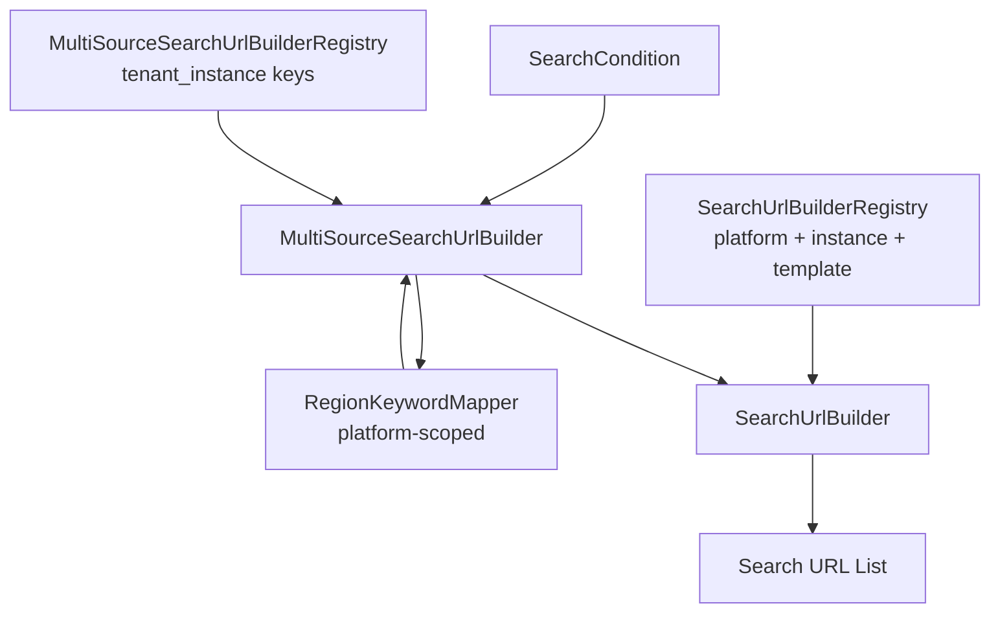

# Phase 9-B-14: Multi Source Search URL Builder

## 1. 目標

建立 **MultiSourceSearchUrlBuilder**，依 `SearchCondition` 與已註冊的 **Source Instance** 清單，產生多來源 **Search URL List**。

本階段**僅產生搜尋網址**，不搜尋商品、不抓網頁、不呼叫 API、不做 Gemini / LINE OA / Publisher / Host B。

```
SearchCondition
      ↓
Platform Mapper (RegionKeywordMapper)
      ↓
SearchUrlBuilder（逐筆 source instance）
      ↓
MultiSourceSearchUrlBuilder
      ↓
Search URL List
```

## 2. 架構圖



## 3. Builder Flow

1. 讀取 `MultiSourceSearchUrlBuilderRegistry` 中的 `tenant_instance` 清單
2. 若清單為空 → `MULTI_SOURCE_NO_SOURCE_INSTANCE`
3. 對每一個 source instance：
   - 自 `SearchUrlBuilderRegistry` 取得 `platform_id`
   - **委派** `RegionKeywordMapper` 依 `platform_code`  enrich（agenttour → RegionCode；其他 → keyword only）
   - 未知 agenttour 關鍵字 → 保留 keyword，不中止整批（略過 region mapping）
   - 呼叫 `SearchUrlBuilder::buildSearchUrl()`
4. 彙整為 `[{ platform, tenant_instance, search_url }, …]`

## 4. Registry Flow

| Registry | 管理對象 | 範例 |
|----------|----------|------|
| **MultiSourceSearchUrlBuilderRegistry** | Source Instance（租戶實例鍵） | `rechoice_agenttour`, `dayitravel_grp` |
| **SearchUrlBuilderRegistry** | Platform、Instance 設定、URL Template | `agenttour` + subdomain template |

Multi-source registry **不**管理 platform 定義；platform/template 仍由 SearchUrlBuilder 側設定檔驅動。

## 5. Source Instance Flow

```
tenant_instance: rechoice_agenttour
  → platform_id: agenttour
  → url_template_id: agenttour_group_tour_entry_v1
  → identifier_values + runtime region_code

tenant_instance: dayitravel_grp
  → platform_id: grp
  → keyword search URL（無 agenttour RegionCode）
```

未來新增 `hotel`、`fit`、`ticket` 等類別：擴充 instance/template 設定即可，**不修改** MultiSourceSearchUrlBuilder 核心迴圈。

## 6. 與 SearchCondition 關係

輸入範例：

```json
{
  "keyword": "東京",
  "product_category": "group_tour"
}
```

可選欄位（`destination`、`region_code`、`date_from` 等）會傳入單筆 `SearchUrlBuilder`；`region_code` 若已由上游指定，Mapper 不覆寫。

## 7. 與 SearchUrlBuilder 關係

- Multi-source **不**重複實作 URL 組裝邏輯
- 每筆 instance 呼叫既有 `SearchUrlBuilder`
- `SearchUrlBuilderRegistry` 注入平台、template、identifier 設定

## 8. 與 Platform Mapper 關係

**MultiSourceSearchUrlBuilder 不得**內建 `keyword → RegionCode`。

必須委派 **RegionKeywordMapper**（Phase 9-B-13）：

| platform | 策略 |
|----------|------|
| agenttour | RegionCode mapping（僅 agenttour.com.tw 對照表） |
| grp / bbctravel / tourcenter / 官方網站 / Trip.com | keyword search，不產生 agenttour 的 J/C/K |
| 未來其他平台自有地區碼 | 新增 **platform-scoped** mapping，不可共用 agenttour 表 |

## 9. 與未來 Publisher 關係

Publisher 可消費 Search URL List，將連結推送至 LINE / 網頁 / 其他通道。9-B-14 不實作 Publisher。

## 10. 與未來 Hybrid Smart Search 關係

Hybrid Search 可在取得 URL List 後並行或擇優抓取各平台結果。本階段只產 URL，不做爬蟲或評分。

## 11. 與未來 Gemini Intent Parser 關係

```
使用者輸入 → Gemini Intent Parser → SearchCondition
                                      ↓
                         MultiSourceSearchUrlBuilder
```

Intent Parser 負責抽取 `keyword` / 建議 `product_category`；地區碼仍由 platform-scoped Mapper 決定。

## 12. Phase 9-B-15 規劃

1. SearchCondition 驗證後自動進入 multi-source build
2. 租戶級 source instance 清單從 GCS / DB 設定載入（仍不寫死在 Builder）
3. 依 `product_category` 過濾 instance（hotel / fit / ticket…）
4. Publisher 與 LINE Flex 卡片串接
5. 與 BATS / Host B 橋接測試

## 檔案清單

| 檔案 | 說明 |
|------|------|
| `core/product_source/MultiSourceSearchUrlBuilder.php` | 多來源 URL 組裝 |
| `core/product_source/MultiSourceSearchUrlBuilderRegistry.php` | Source instance 清單 |
| `core/product_source/MultiSourceSearchUrlBuilderException.php` | 錯誤碼 |
| `tests/product_sources/test_multi_source_search_url_builder.php` | 測試 |

## 測試

```powershell
C:\Web\xampp\php\php.exe C:\bbc-ai-bot\tests\product_sources\test_multi_source_search_url_builder.php
```

### 測試案例

| Case | 條件 | 預期 |
|------|------|------|
| 1 | 東京 + rechoice_agenttour + dayitravel_grp | 2 筆 URL；agenttour `RegionCode=J` |
| 2 | 泰國 + 3 instances | 3 筆 URL |
| 3 | 空 registry | `MULTI_SOURCE_NO_SOURCE_INSTANCE` |
| 4 | 火星旅遊 | 整批不失敗，仍回傳多筆 URL |
| 5 | travel_b_grp / private / gcs | 3 筆；Builder 核心無固定平台名稱 |
