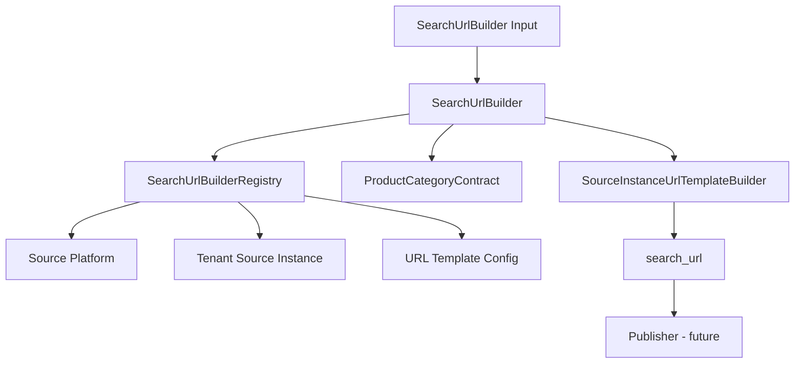

# Search URL Builder — Phase 9-B-11 Design

**代號：** `SEARCH_URL_BUILDER_PHASE9B11`

**版本：** Phase 9-B-11（Core only）

**前置 Commit：** `4d572d9`（agenttour URL Builder Integration Test）

---

## 1. 目標

建立 **`SearchUrlBuilder`**，作為 Product Source 架構中「搜尋 URL 組裝」的正式 Core 層。

由 **config-driven registry** 解析 `tenant_instance` → Platform + Instance + URL Template，委派 **`SourceInstanceUrlTemplateBuilder`** 產生 `search_url`。

**本階段不做：** Publisher、Gemini、LINE OA、Hybrid Search、API、Host B、keyword → region 映射實作。

---

## 2. 與 Phase 9-B-10 差異

| 項目 | Phase 9-B-10 | Phase 9-B-11 |
|------|----------------|--------------|
| 焦點 | 單一 agenttour 整合測試（手動串 contract + builder） | 正式 `SearchUrlBuilder` API |
| 輸入 | platform / instance / template 陣列 | `{ product_category, platform, tenant_instance, keyword, region_code }` |
| 輸出 | `entry_url` | `{ platform, tenant_instance, search_url, product_category }` |
| Registry | 測試內嵌 | `SearchUrlBuilderRegistry` 注入（支援 20~200 家） |
| keyword | 無 | 保留 `SearchKeywordMapperInterface`，尚未實作 |

**不修改** `SourceInstanceUrlTemplateBuilder` 既有邏輯。

---

## 3. 架構圖



```
Product Category Contract
        ↓
Source Platform (registry)
        ↓
Tenant Source Instance (registry)
        ↓
Source Instance URL Template Builder
        ↓
Search URL Builder  ← Phase 9-B-11
        ↓
Publisher（Phase 9-B-12+）
```

---

## 4. 輸入格式

```json
{
  "product_category": "group_tour",
  "platform": "agenttour",
  "tenant_instance": "rechoice_agenttour",
  "keyword": "東京",
  "region_code": "C"
}
```

| 欄位 | 必填 | 說明 |
|------|------|------|
| `tenant_instance` | ✅ | Registry lookup key |
| `platform` | 建議 | 須與 instance.platform_id 一致 |
| `product_category` | 選填 | 預設取自 instance 或 `group_tour` |
| `region_code` | 選填 | 執行期覆寫 instance identifier_values |
| `keyword` | 選填 | **保留**；9-B-11 不映射 RegionCode |

---

## 5. 輸出格式

```json
{
  "platform": "agenttour",
  "tenant_instance": "rechoice_agenttour",
  "search_url": "https://rechoice-travel.agenttour.com.tw/Index.aspx?...",
  "product_category": "group_tour"
}
```

---

## 6. 錯誤碼

| 錯誤碼 | 說明 |
|--------|------|
| `SEARCH_URL_BUILDER_INVALID_INPUT` | 缺 tenant_instance、platform 不一致等 |
| `SEARCH_URL_BUILDER_UNKNOWN_INSTANCE` | 找不到 tenant_instance 或 platform |

---

## 7. 核心類別

| 類別 | 路徑 |
|------|------|
| `SearchUrlBuilder` | `core/product_source/SearchUrlBuilder.php` |
| `SearchUrlBuilderRegistry` | `core/product_source/SearchUrlBuilderRegistry.php` |
| `SearchUrlBuilderException` | `core/product_source/SearchUrlBuilderException.php` |
| `SearchKeywordMapperInterface` | 同檔（保留介面） |

---

## 8. 測試

```text
php tests/product_sources/test_search_url_builder.php
```

| Case | 說明 |
|------|------|
| 1 | agenttour / rechoice_agenttour / region_code=C → 完整 URL |
| 2 | 缺 tenant_instance → INVALID_INPUT |
| 3 | 未知 tenant_instance → UNKNOWN_INSTANCE |

---

## 9. 未來 Phase 9-B-12 規劃

| 項目 | 內容 |
|------|------|
| Keyword Mapper | 實作 `SearchKeywordMapperInterface`（東京 → RegionCode=J 等） |
| Registry Loader | 從 GCS / JSON config 載入 20~200 家 instance |
| Publisher 整合 | search_url → ShortUrl / LINE reply |
| Host B / Hybrid | 僅消費 search_url，不修改 Builder 核心 |

---

## 附錄：修訂紀錄

| 版本 | 日期 | 說明 |
|------|------|------|
| 1.0 | 2026-05-30 | Phase 9-B-11 初版 |
