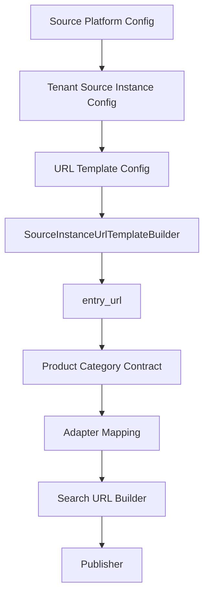

# Source Instance URL Template Builder

**代號：** `SOURCE_INSTANCE_URL_TEMPLATE_BUILDER`

**版本：** Phase 9-B-8 / 9-B-9

**前置 Commits：** `1327e3a`（Platform + Instance Contract）、`23a102e`（Category Contract）

---

## 1. Purpose

由 **Source Platform** + **Tenant Source Instance** + **URL Template Config** 產生 **base / search entry URL**。

**本階段：**

- 只產生入口 URL（不含 keyword、date、area 等搜尋參數）
- 不接 GCS、不抓網頁、不呼叫外部 API
- **Builder 核心不以 platform_id 分支**（agenttour、grp 等僅能出現在 config / test fixture）

---

## 2. Design Principles

| # | 原則 |
|---|------|
| 1 | 核心以 `identifier_type` 驅動：`subdomain` / `query_param` / `affiliate_param` / `fixed_url` / `custom` |
| 2 | URL 組裝 template-driven / config-driven |
| 3 | 新增平台理想路徑：Platform config + Instance config + Adapter mapping（**不改 Builder 核心**） |
| 4 | 參考平台僅作 onboarding / 測試範例 |

---

## 3. Input Contract

### 3.1 Platform（`SourcePlatformContract`）

至少包含：`platform_id`, `platform_domain`, `identifier_type`, `supported_categories`, `adapter`, `url_template_id`

### 3.2 Tenant Instance（`TenantSourceInstanceContract`）

至少包含：`source_instance_id`, `tenant_sno`, `platform_id`, `identifier_type`, `identifier_values`, `enabled`, `priority`

### 3.3 URL Template Config（注入 Builder）

| 欄位 | 說明 |
|------|------|
| `template_id` | 模板識別 |
| `identifier_type` | 必須與 platform / instance 一致 |
| `scheme` | 預設 `https`（subdomain / query_param） |
| `host_pattern` | 如 `{subdomain}.{platform_domain}`、`www.{platform_domain}` |
| `path` | 如 `/`、`/LIKEGO/sort.php` |
| `base_url` | affiliate / 完整 base（如 `https://www.trip.com/hotels`） |
| `query_param_keys` | query / affiliate 參數順序 |
| `url_pattern` | `custom` 型別完整 URL pattern |

---

## 4. Identifier Type Strategies

| identifier_type | 產 URL 方式 |
|-------------------|-------------|
| `subdomain` | `{scheme}://{subdomain}.{platform_domain}{path}` |
| `query_param` | `{scheme}://{host}{path}?{identifier_values...}` |
| `affiliate_param` | `{base_url}?Allianceid=...&SID=...` |
| `fixed_url` | 直接回傳 `identifier_values.url` |
| `custom` | 依 `url_pattern` 替換 placeholder |

---

## 5. Reference Examples（非 Builder 硬編碼）

| 場景 | 預期 entry URL |
|------|----------------|
| AgentTour subdomain | `https://rechoice-travel.agenttour.com.tw/` |
| GRP subdomain | `https://dayitravel.grp.com.tw/` |
| xinxin GetStore | `https://www.xinxin.com.tw/LIKEGO/sort.php?GetStore=XXN` |
| Trip.com Hotel affiliate | `https://www.trip.com/hotels?Allianceid=7921306&SID=297627198` |
| fixed_url | instance 指定 URL 原樣回傳 |

---

## 6. Future Architecture



---

## 7. API

```php
$builder = new SourceInstanceUrlTemplateBuilder();
$result = $builder->build($platform, $instance, $urlTemplate);
// $result['entry_url'], identifier_type, template_id, platform_id, source_instance_id
```

**執行期類別：** `core/product_source/SourceInstanceUrlTemplateBuilder.php`

---

## 8. Test

```text
php tests/product_source/test_source_instance_url_template_builder.php
```

---

## 9. Out of Scope

- saas_router / Hybrid Search / Gemini / Context Cache / Host B / LINE OA
- `.env` / SQL / GCS
- 搜尋參數（keyword、date、area）
- `MultiSourceSearchUrlBuilder` 修改

---

## 附錄：修訂紀錄

| 版本 | 日期 | 說明 |
|------|------|------|
| 1.0 | 2026-05-30 | Phase 9-B-9 初版 |
