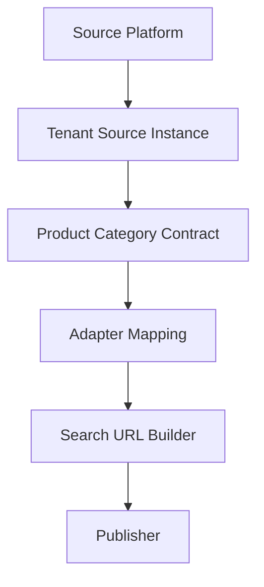

# Tenant Source Instance Contract

**代號：** `TENANT_SOURCE_INSTANCE_CONTRACT`

**版本：** Phase 9-B-8

**關聯文件：** [SOURCE_PLATFORM_CONTRACT.md](./SOURCE_PLATFORM_CONTRACT.md)

---

## 1. Purpose

**Tenant Source Instance** 表示：某旅行社（`tenant_sno`）在某 **Source Platform** 上的具體啟用設定與識別參數。

```
Platform: grp.com.tw
Instance: dayitravel.grp.com.tw  →  { subdomain: "dayitravel" }
```

**本 Contract 不執行搜尋**，僅定義資料形狀與驗證規則。

---

## 2. Instance Document

| 欄位 | 類型 | 必填 | 說明 |
|------|------|------|------|
| `source_instance_id` | string | ✅ | 實例穩定鍵；`^[a-z][a-z0-9_]{0,127}$` |
| `tenant_sno` | string | ✅ | 旅行社 sno |
| `platform_id` | string | ✅ | 對應 Platform |
| `identifier_type` | enum | ✅ | 須與 Platform 一致 |
| `identifier_values` | object | ✅ | §3 |
| `enabled` | boolean | ✅ | 是否啟用 |
| `priority` | integer | ✅ | 0–9999；租戶內排序 |

**執行期驗證：** `core/product_source/TenantSourceInstanceContract.php`

---

## 3. Identifier Values by Type

### 3.1 `subdomain`

```json
{
  "subdomain": "dayitravel"
}
```

**範例：** `rechoice-travel.agenttour.com.tw`、`dayitravel.grp.com.tw`

### 3.2 `query_param`

```json
{
  "GetStore": "XXN"
}
```

**範例：** `https://www.xinxin.com.tw/LIKEGO/sort.php?GetStore=XXN`

Platform 可定義 `identifier_param_keys: ["GetStore"]`。

### 3.3 `affiliate_param`

```json
{
  "Allianceid": "1234567",
  "SID": "8901234"
}
```

**範例：** Trip.com Hotel、Trip.com Things To Do

### 3.4 `fixed_url`

```json
{
  "url": "https://example.com/search"
}
```

### 3.5 `custom`

非空 key-value map，供非標準整合占位。

---

## 4. Validation Rules

| 規則 | 說明 |
|------|------|
| V1 | `platform_id` 須存在且與 Platform 定義一致（若提供 platform context） |
| V2 | `identifier_type` 須與 Platform 的 `identifier_type` 一致 |
| V3 | `identifier_values` 須符合 §3 各型別必填欄位 |
| V4 | `priority` 整數 0–9999 |
| V5 | `enabled` 為 boolean |

---

## 5. Example Instances

| 場景 | platform_id | identifier_type | identifier_values |
|------|-------------|-----------------|-------------------|
| AgentTour 子網域 | agenttour | subdomain | `{ "subdomain": "rechoice-travel" }` |
| GRP 子網域 | grp | subdomain | `{ "subdomain": "dayitravel" }` |
| xinxin GetStore | custom_website | query_param | `{ "GetStore": "XXN" }` |
| Trip.com 聯盟 | trip_com | affiliate_param | `{ "Allianceid": "...", "SID": "..." }` |
| 固定搜尋頁 | custom_website | fixed_url | `{ "url": "https://..." }` |

---

## 6. Future Architecture



---

## 7. Test

```text
php tests/product_source/test_tenant_source_instance_contract.php
```

---

## 附錄：修訂紀錄

| 版本 | 日期 | 說明 |
|------|------|------|
| 1.0 | 2026-05-30 | Phase 9-B-8 初版 |
